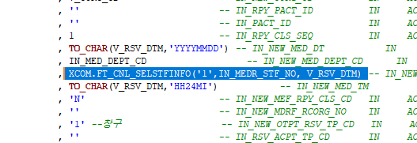

# 경찰트라우마 등록 화면 에러
## 첫번 째 에러 
데이터 삽입 시, 등록된 의사 일정이 없다는 오류가 난다. 
- 예약이 되질 않는다.
    - 


## 두번 째 에러
재강 책임님한테 말하고, 의사 일정 추가 후, 테스트 해도 오류가 떨어진다.
- 직원 번호가 삽입이 안된단다.
    - 
    
### 프로시저 확인
- 경찰트라우마와 남부해바라기가 같은 프로시저를 타는데, 확인해 보니 이 부분이다.

    - 사용 프로시저 : PC_ACP_RSV_POLICE_TRAUMA_REFER
        - 
        - 직원 번호와 진료일 만 보내면 된다.

    - 예약 사용 프로시저 : PC_ACP_COMMON_RSV_ACPPRODM
        - 
        - 
        ```sql
        V_ACPPRODM.MEDR_STF_NO   := CASE WHEN TRUNC(SYSDATE)>= TO_DATE('20170301', 'YYYYMMDD') THEN  (NVL(XCOM.FT_CNL_SELSTFINFO( '2', IN_NEW_MEDR_SID, TO_CHAR(TO_DATE(IN_NEW_MED_DT,'YYYYMMDD'),'YYYY-MM-DD'))
                                                                                                , XCOM.FT_CNL_SELSTFINFO( '2', IN_NEW_MEDR_SID, TO_CHAR(SYSDATE,'YYYY-MM-DD'))))
                                    ELSE (NVL(NVL(XCOM.FT_CNL_SELSTFINFO( '2', IN_NEW_MEDR_SID, '20170228')
                                                , XCOM.FT_CNL_SELSTFINFO( '2', IN_NEW_MEDR_SID, TO_CHAR(SYSDATE,'YYYY-MM-DD'))), XCOM.FT_CNL_SELSTFINFO( '2', IN_NEW_MEDR_SID, '20170301')))
                                    END;         --  진료의직원사번       -- 3월1일부터 다시 열기 
        ```

    - 사용 펑션 : FT_CNL_SELSTFINFO


### 로그 확인

- 로그 확인할 때 명령어
```
tail -f 20241008_POLICE_TRAUMA.txt
cat 20241008_POLICE_TRAUMA.txt

grep -r kimyongrok 20241008_POLICE_TRAUMA.txt
```


- 프로시저 중간에 작성환 코드
```sql
XBIL.PC_ACP_MAKE_LOG ('20241008_POLICE_TRAUMA.txt', V_RSV_DTM|| ' : '|| IN_MEDR_STF_NO);    
```


- 테스트 직원 번호 : 5F158 NP 전*훈


## 세번 째 에러

- 세션 서버 DB 배포? 라고 하는데

- 중간에 추가 에러, 패스
    - 

## 네번 째 에러


- tail -f POLICE_TRAUMA.txt


- 예약수정 화면에서 실행해 봤는데 뭐지? 남부해바라기가 문제인가?