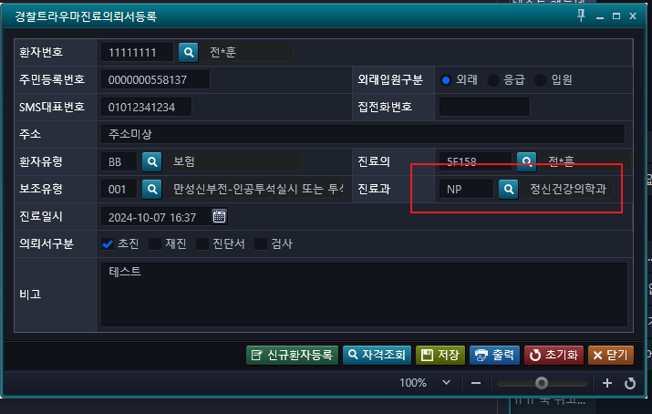
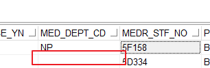

조회 화면에서 수정 시, 수정한 거 없이, 수정 버튼을 누르면, 진료과 정보가 들어가지 않는다.

- 
- 

-> 강제로 들어가게 선언해서 해결


## 갑자기 찾아온 문제
- 재강 책임님께 보낸 텔레 메세지
```sql
PC_ACP_RSV_ONESTOP_MEDICAL_REFER
;;;

select * from ACPPRODM     /* 예약 */
where pt_no in ('01165056' ,'01637365','01540361','01913007','01874080')
and substr(med_dt,0,2) ='24'
order by med_dt desc;


select * from ACPPROSD     /* onestop */
where pt_no in ('01165056' ,'01637365','01540361','01913007','01874080')
and substr(reg_dt,0,2) ='24'
order by fsr_dtm desc;
  

01540361 2024-10-07 오전 11:29:04  재진예약관리
01913007 2024-09-27 오후 1:24:46  재진예약관리
01874080 2024-09-25 오후 4:08:47  재진예약관리


01540361 2024-10-07 오전 10:46:00
01913007 2024-09-27 오후 12:39:00
01874080 2024-09-25 오후 3:12:00
```

예약이 안되고 있다. 그래서 재진예약관리에서 했다.
```sql
IN_JOBTYPE != 'D' AND IN_MED_DEPT_CD IN ('OGO2','ER')
```
이 조건 때문에 저 두 경우 만 예약이 되는데, NP는 안되는게 맞다고 한다?

남부해바라기 -> 성폭행/가정폭력 -> 정신과가 안된다???

모르겠는데 일단 패스


- 01741540 김용록