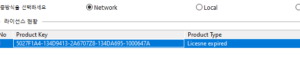

## 인수 코멘트 변경 시, 텔레 메세지
김요한 책임님 추가 COMMENT변경 요청드립니다

컬럼명: DOD_ID
- DODID -> 사망날짜ID

컬럼명: BGCHG_MTN_YN
- 변경이전산여부 -> 변경이전발의여부

```sql
COMMENT ON COLUMN HBIL.PCTPCPBM.DOD_ID IS '사망날짜ID';

COMMENT ON COLUMN HBIL.ACPPIHMD.BGCHG_MTN_YN IS '변경이전발의여부';
```

## 기영 데이터 기링 변경 시, 텔레 메세지
김요한 책임님
컬럼 데이터 길이 변경 요청드립니다.

```sql
ALTER TABLE HMED.MOOORALD MODIFY (DUR_OPNT_ORD_HH_MIS VARCHAR2(6));
```


## 라이센스 재등록 
- DA 라이센스 키?
    - 5027F3A5-134DA6A6-2A6708Z8-134FDF58-10006472

    - 만료된 거 확인
    - 


- Register 프로그램에서 라이센스 만 수정 후 인증 번튼 클릭
```
10855
보라매병원, 김용록
KIMYONGROK
ygreen0516@ezcaretech.com
5027F3A5-134DA6A6-2A6708Z8-134FDF58-10006472
```


## 원격 접속
- 접속 방법
    - 10.102.122.141 -145
    - port: 20202
    - 유저각각 da#1~da#5 
    - 패스:bora2024!!

- 저 pc 에 정식 라이센스 설치되어 있으니까
    - 은선:1
    - 기영:2
    - 인수:3
    - 용록:4
    - 상우:5

- 원격 서버
    - IP : 10.102.122.144:20202
    - ID : da#4
    - PASS : bora2024!!

- DATAWARE
    - ID : ez_kimyongrok
    - PASS : Ezcare12#

[Port 입력 방법 참고](https://m.blog.naver.com/ahtid/222888468057)


## 일정 정리

- 원무
    1. 나 : 환자관리 , 심사결과관리
    2. 인수 : 4개는 코멘트 만 하면 된다. + 1개 하는 중

    3. 번 외 : 심사관리 


원무는 파트장님께 신규 테이블 말씀드리고 해도, 월요일 중으로 끝날 수 있을 거 같은데