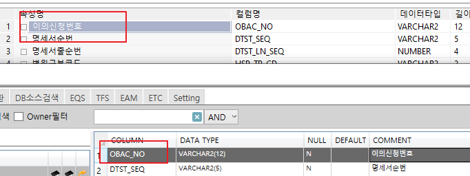
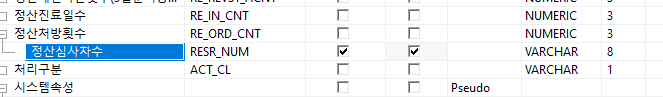

## 실수 코멘트 1 건

- [원무보험] DA 갭분석 작업, 컬럼 코멘트변경 요청드립니다.

```sql
COMMENT ON COLUMN HBIL.AIF0503T.RE_NDRG_TNMY_TOT IS '정산 신포괄요양급여비용 총액';
```


## 순서 변경 2 건
1. AIN1602T
    - 모델 : <strong style="color:red">OBAC_NO</strong>,DTST_SEQ,DTST_LN_SEQ,SNBK_CD
    - DB :          DTST_SEQ,DTST_LN_SEQ,SNBK_CD,<strong style="color:red">OBAC_NO</strong>
    - DB나 모델, 둘 다 첫 번째로 되어있어 문제가 없는데 Dataware에 나옵니다.
        - 

2. AIN0403T
    - 모델 :        RENTC_DTE,ACPTNO,DMD_NO,RQ_SEQ,RESEQ,RELST_SEQ,LST_SEQ,<strong style="color:red">RESR_NUM</strong>
    - DB : <strong style="color:red">RESR_NUM</strong>,RENTC_DTE,ACPTNO,DMD_NO,RQ_SEQ,RESEQ,RELST_SEQ,LST_SEQ
    - 정산처방횟수에 묶에서 움직일 수 없는 경우. 삭제 후 다시 만들어야 하나요?
        - 
    

    - 묶은 거 풀 수 있었음 Shift + tab
 