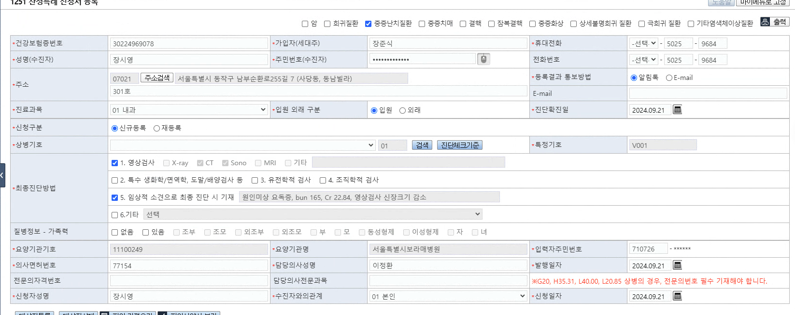
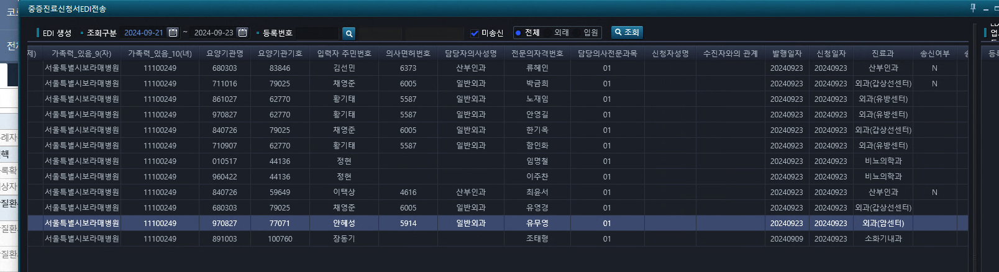

# EDI 전송


- AC_HIS.PA.AC.PI.PI.UI_/SeriousIllnessApplicationFormEDIReg


## 1.전화번호 공백 수정

```sql

id="HIS.PA.AC.PI.PI.SelSeriousIllnessApplicationFormEDIReg">

select
NVL  /* NVL1 시작 */
( REPLACE(DECODE /* DECODE1 시작 */
    ( SUBSTR ( XBIL.FT_TELNO_ADJUST ( F.SMS_TEL_NO ) , 1 , 3 ) 
        , '010' , DECODE
                     ( SUBSTR ( XBIL.FT_TELNO_ADJUST ( F.OHS_TEL_NO ) , 1 , 3 ) 
                         , '010' , ''
                         , '011' , ''
                         , '016' , ''
                         , '017' , ''
                         , '018' , ''
                         , '019' , ''
                         , XBIL.FT_TELNO_ADJUST ( F.OHS_TEL_NO ) ) 
        , '011' , DECODE
                     ( SUBSTR ( XBIL.FT_TELNO_ADJUST ( F.OHS_TEL_NO ) , 1 , 3 )  
                         , '010' , ''
                         , '011' , ''
                         , '016' , ''
                         , '017' , ''
                         , '018' , ''
                         , '019' , ''
                         , XBIL.FT_TELNO_ADJUST ( F.OHS_TEL_NO ) ) 
               
        , '016' , DECODE
                     ( SUBSTR ( XBIL.FT_TELNO_ADJUST ( F.OHS_TEL_NO ) , 1 , 3 )  
                         , '010' , ''
                         , '011' , ''
                         , '016' , ''
                         , '017' , ''
                         , '018' , ''
                         , '019' , ''
                         , XBIL.FT_TELNO_ADJUST ( F.OHS_TEL_NO ) ) 
        , '017' , DECODE
                     ( SUBSTR ( XBIL.FT_TELNO_ADJUST ( F.OHS_TEL_NO ) , 1 , 3 ) , 
                           '010' , ''
                         , '011' , ''
                         , '016' , ''
                         , '017' , ''
                         , '018' , ''
                         , '019' , ''
                         , XBIL.FT_TELNO_ADJUST ( F.OHS_TEL_NO ) ) 
        , '018' ,  DECODE
                     ( SUBSTR ( XBIL.FT_TELNO_ADJUST ( F.OHS_TEL_NO ) , 1 , 3 ) 
                         , '010' , ''
                         , '011' , ''
                         , '016' , ''
                         , '017' , ''
                         , '018' , ''
                         , '019' , ''
                         , XBIL.FT_TELNO_ADJUST ( F.OHS_TEL_NO ) ) 
        , '019' , DECODE
                     ( SUBSTR ( XBIL.FT_TELNO_ADJUST ( F.OHS_TEL_NO ) , 1 , 3 ) 
                         , '010' , ''
                         , '011' , ''
                         , '016' , ''
                         , '017' , ''
                         , '018' , ''
                         , '019' , ''
                         , XBIL.FT_TELNO_ADJUST ( F.OHS_TEL_NO ) ) 
        , XBIL.FT_TELNO_ADJUST ( F.MTEL_NO ) ),' ','')  /* DECODE1 끝 */                                                    
    , REPLACE(NVL ( XBIL.FT_TELNO_ADJUST ( A.HMPS_TEL_NO ) , XBIL.FT_TELNO_ADJUST ( F.MTEL_NO ) ),' ','') ) /* NVL1 끝 */
C6                                 
        

from 
ACPPRGHD a       

,XBIL.PCTPCPAV f
```


## 2. 컬럼 맞추기





- 11 : 이메일주소
- 26, 29, 36, 42, 43


- 암
```
ch0_1.Visibility = rdocncr.IsChecked == true ? Visibility.Visible : Visibility.Collapsed;
ch0_2.Visibility = rdocncr.IsChecked == true ? Visibility.Visible : Visibility.Collapsed;
ch0_3.Visibility = rdocncr.IsChecked == true ? Visibility.Visible : Visibility.Collapsed;
ch0_4.Visibility = rdocncr.IsChecked == true ? Visibility.Visible : Visibility.Collapsed;
ch0_5.Visibility = rdocncr.IsChecked == true ? Visibility.Visible : Visibility.Collapsed;
ch0_6.Visibility = rdocncr.IsChecked == true ? Visibility.Visible : Visibility.Collapsed;
ch0_7.Visibility = rdocncr.IsChecked == true ? Visibility.Visible : Visibility.Collapsed;
ch0_8.Visibility = rdocncr.IsChecked == true ? Visibility.Visible : Visibility.Collapsed;
ch0_9.Visibility = rdocncr.IsChecked == true ? Visibility.Visible : Visibility.Collapsed;
```


- 희귀난치
```
ch1_1.Visibility = rdocfsc.IsChecked == true ? Visibility.Visible : Visibility.Collapsed;
ch1_2.Visibility = rdocfsc.IsChecked == true ? Visibility.Visible : Visibility.Collapsed;
ch1_3.Visibility = rdocfsc.IsChecked == true ? Visibility.Visible : Visibility.Collapsed;
ch1_4.Visibility = rdocfsc.IsChecked == true ? Visibility.Visible : Visibility.Collapsed;
ch1_5.Visibility = rdocfsc.IsChecked == true ? Visibility.Visible : Visibility.Collapsed;
ch1_6.Visibility = rdocfsc.IsChecked == true ? Visibility.Visible : Visibility.Collapsed;
ch1_7.Visibility = rdocfsc.IsChecked == true ? Visibility.Visible : Visibility.Collapsed;
ch1_8.Visibility = rdocfsc.IsChecked == true ? Visibility.Visible : Visibility.Collapsed;
ch1_9.Visibility = rdocfsc.IsChecked == true ? Visibility.Visible : Visibility.Collapsed;
ch1_10.Visibility = rdocfsc.IsChecked == true ? Visibility.Visible : Visibility.Collapsed;
ch1_11.Visibility = rdocfsc.IsChecked == true ? Visibility.Visible : Visibility.Collapsed;
```


## 3. EDI 생성해서 올렸을 때, 암은 발행일과 신청일이 안 올라간다.


## 4. 파키슨병 기타에 69, 55 들어가게