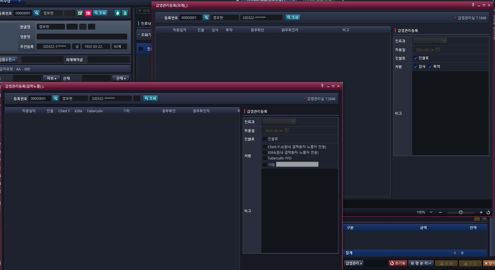

# 감염관리 연결

## 텔레그램 대화 내용
> 김 재강, [9/24/24 5:08 PM]
책임님

> 김 재강, [9/24/24 5:08 PM]
간단한거

> 김 재강, [9/24/24 5:08 PM]
하나만...

> 김 재강, [9/24/24 5:08 PM]
외래진료비수납화면에

> 김 재강, [9/24/24 5:09 PM]


> 김 재강, [9/24/24 5:09 PM]
밑에 버튼 보여요? 감염관리

> 김 재강, [9/24/24 5:09 PM]
저걸 누르면 열려있는 두개중에 위에꺼 열리는데

> 김 재강, [9/24/24 5:09 PM]
밑에것도

> 김 재강, [9/24/24 5:09 PM]
버튼 하나 만들어야돼요

> 록 용, [9/24/24 5:09 PM]
네네 감염관리 버튼 보여요

> 록 용, [9/24/24 5:09 PM]
어떤 버튼을 만들어야 해요?

> 김 재강, [9/24/24 5:10 PM]
화면 두개

> 김 재강, [9/24/24 5:10 PM]
결핵노출있고

> 김 재강, [9/24/24 5:10 PM]
(외래)있잖아요

> 김 재강, [9/24/24 5:10 PM]
외래는 이미 달려있는거고

> 김 재강, [9/24/24 5:10 PM]
결핵노출은 안달려있어요

> 김 재강, [9/24/24 5:10 PM]
저거 달아야돼요

> 록 용, [9/24/24 5:12 PM]
아아

> 록 용, [9/24/24 5:12 PM]
괄호 안에 내용을 수정해야해요?

> 김 재강, [9/24/24 5:12 PM]
ㄴㄴㄴㄴ


### 추가 텔레 내용(화면 정보)
- PopUpBase pop = OnLoadPopupMenu("AC_HIS.PA.AC.PE.PS.UI_/InsertInfcMgmtTbExpo.xaml", PT_NO,PT_NM,SSN1,PACT_TP_CD);

- 파라미터 
    - PT_NO : 환자번호
    - PT_NM : 환자명
    - SSN1 : 주민번호 -> 앞자리 여섯개만 조회할 거임 형식은 앞자리 6개만 존재하면 됨
    - PACT_TP_CD:  수진구분  (O,I,E)


## 이건 어떤가

```xaml
<HMenuItem Header="감염관리" Name="InfcMgmtOtptMenu" Click ="InfcMgmtOtptMenu_Click">
    <HMenuItem Header="BSJTEST" Name="menuTopMenu1Sub1"  Tag="HIS.PA.AC.PC.OS.UI;/BSJTEST.xaml"/>
    <HMenuItem Header="소급유형변경조회" Name="menuTopMenu1Sub2"  Tag="HIS.PA.AC.PC.AM.UI;/SelReadBckPattChg.xaml"
    />
</HMenuItem>
```


## 

```cs
PopUpBase pop = OnLoadPopupMenu("AC_HIS.PA.AC.PE.PS.UI_/InsertInfcMgmtTbExpo.xaml", PT_NO,PT_NM,SSN1,PACT_TP_CD);
```

xaml에 넣어야 할 부분
```html
<HButton ButtonTyped="None" ButtonStyleType="Link" Click="btnPop_InfcMgmtOtpt" Content="감염관리" DockPanel.Dock="Left" Margin="0,0,5,0" VerticalAlignment="Center" x:Name="btn_InfcMgmtOtpt1"/>
<HButton ButtonTyped="None" ButtonStyleType="Link" Click="btnPop_InfcMgmtOtpt" Content="감염관리(결핵)" x:Name="btn_InfcMgmtOtpt2" DockPanel.Dock="Left" Margin="0,0,5,0" VerticalAlignment="Center"/>
```


cs에 넣어야 할 부분
```cs
/// <summary>
/// name         : 감염관리(외래) 화면 오픈
/// desc         : 감염관리(외래) 화면 오픈
/// author       : 신동명 
/// create date  : 2024-07-23
/// update date  : 2024-07-23
/// </summary>
/// <param name="sender"></param>
/// <param name="e"></param>
private void btnPop_InfcMgmtOtpt(object sender, RoutedEventArgs e)
{
    PopUpBase pop = new PopUpBase();
    
    if(sender.Equals(btn_InfcMgmtOtpt1))
    {
        if (string.IsNullOrEmpty(uc_ptno.model.SelectPatientInfoOutObj.PT_NO))
        {
            pop = base.OnLoadPopupMenu("AC_HIS.PA.AC.PE.PS.UI_/InsertInfcMgmtOtpt.xaml");
        }
        else
        {
            pop = base.OnLoadPopupMenu("AC_HIS.PA.AC.PE.PS.UI_/InsertInfcMgmtOtpt.xaml", uc_ptno.model.SelectPatientInfoOutObj.PT_NO, uc_ptno.model.SelectPatientInfoOutObj.PT_NM, uc_ptno.model.SelectPatientInfoOutObj.PT_RRN);
        }
    }
    else if(sender.Equals(btn_InfcMgmtOtpt2))
    {
        if (string.IsNullOrEmpty(uc_ptno.model.SelectPatientInfoOutObj.PT_NO))
        {
            pop = base.OnLoadPopupMenu("AC_HIS.PA.AC.PE.PS.UI_/InsertInfcMgmtTbExpo.xaml");
        }
        else
        {
            pop = base.OnLoadPopupMenu("AC_HIS.PA.AC.PE.PS.UI_/InsertInfcMgmtTbExpo.xaml", uc_ptno.model.SelectPatientInfoOutObj.PT_NO, uc_ptno.model.SelectPatientInfoOutObj.PT_NM, uc_ptno.model.SelectPatientInfoOutObj.PT_RRN);
            /*
            OnLoadPopupMenu("AC_HIS.PA.AC.PE.PS.UI_/InsertInfcMgmtTbExpo.xaml", 

            PT_NO,
            PT_NM,
            SSN1,
            PACT_
            TP_CD);
            */
        }
    }
    pop.WindowStartupLocation = WindowStartupLocation.CenterScreen;
    pop.Owner = Window.GetWindow(this);
    pop.Show();
}

```


## 

```

```