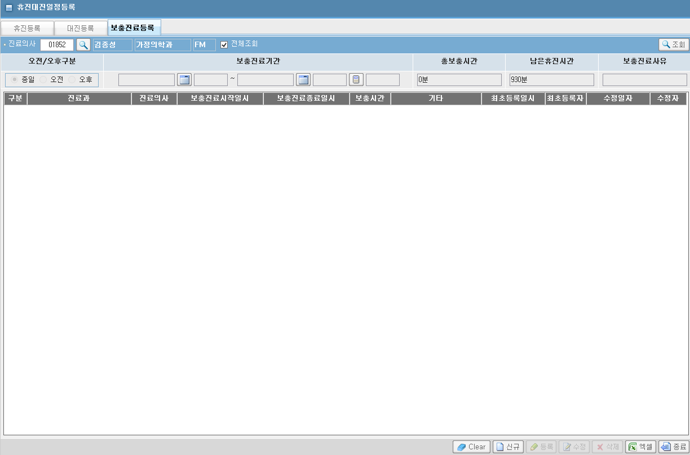
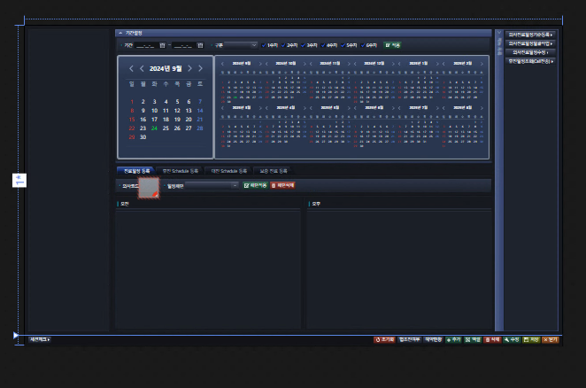

# 의사진료일정등록(보충진료등록) 화면


## ASIS 경로
[ASIS URL](http://app14.brmh.org/EMR/CCO/CCOMAN/EmrMain.aspx?PID=Nur&LOGIN=N&CHK=N)
- 휴진대진일정등록 / 보충진료등록
- ACDPCSPD 의사보충일정정보
- BIL/ACC/PTRS/SCHDR/MANAGENOTMEDICAL.ASPX



- 패키지 정보 : pkg_bil_schdr
    - pc_ap_ins_apaddscht : 수정/등록/삭제
        - 등록/수정할 때, 체크로직 있는데 -> EQS로 하라고 하기도 하고, 어차피 테이블 하나 만 바라보길래 안 만들었다.


        - 등록

        ```SQL
        if    in_crud_typ = 'C' then
           
        ------------------------------------------------------------------------
        --보충진료등록 Insert
        ------------------------------------------------------------------------
        begin
            v_apaddscht.dr_add_sch_no     := pkg_bil_seque.FC_DrAddSchNo_Create;  -- 보충진료일정번호 채번
            insert into apaddscht values v_apaddscht;
        
        exception
             when others then
                  raise_application_error(-20500,'pc_ap_ins_apaddscht: 보충진료 신규 등록중 에러 발생했습니다.' || chr(13) || sqlcode || chr(13) || sqlerrm);
                  return;
        end;
        ```
        - pkg_bil_seque.FC_DrAddSchNo_Create
            - 이 부분이 이해가 안 가는데, 결국 그 테이블 하나에 들어간다.

    - pc_ap_apaddcht_select : 조회(날짜 기간도 있는데 화면에 없음)

    ```sql
    /***********************************************************************************
     *    서비스이름  : pc_ap_apaddcht_select
     *    최초 작성일 : 2015.09.11
     *    최초 작성자 : 김선화
     *    Description : 보충진료의사조회
     ***********************************************************************************/
    procedure pc_ap_apaddcht_select(  in_meddept                 in   varchar2
                                   ,  in_meddr                   in   varchar2   
                                   ,  in_from_dte                in   varchar2
                                   ,  in_to_dte                  in   varchar2                               
                                   ,  out_cursor                 out  returncursor)

    is
        wk_cursor returncursor;
    begin
        open wk_cursor for

       			select  /*+ pkg_bil_schdr.pc_ap_apaddcht_select */  
       					 DR_ADD_SCH_NO  									   DR_ADD_SCH_NO
    	       		  ,  Decode(a.AMPM_TYP, '1', '오전'
    	                                  , '2', '오후'
    	                                  ,      '종일')    					ampm_typ
    	              ,  a.med_dept  ||'['|| b.dept_nm ||']'        			med_dept
    	              ,  a.meddr_id  ||'['|| c.wk_nm ||']'          			meddr_id
    	              ,  to_char(a.ADD_FROM_DTM,'yyyy-mm-dd hh24:mi:ss')        from_dte
    	              ,  to_char(a.ADD_TO_DTM,  'yyyy-mm-dd hh24:mi:ss')        to_dte
    	              ,  a.ADD_MED_TIME ||'분'   								add_med_time
    	              ,  a.RMK 													rmk
                      ,  to_char(a.FSTINST_DTM,'yyyy-mm-dd hh24:mi')         	fstinst_dtm
                      ,  pkg_bil_common.FC_UserNameSel(a.FSTINST_ID)        	fstinst_nm
                      ,  to_char(a.EDIT_DTM,'yyyy-mm-dd hh24:mi')            	edit_dtm
                      ,  pkg_bil_common.FC_UserNameSel(a.EDIT_ID)        		edit_nm
               from  apaddscht a
                  ,  ccdepart b
                  ,  ccusermt c
                where  	a.meddr_id  	= nvl(in_meddr  ,a.meddr_id)
                and  	a.med_Dept   	= b.dept_cd
    			and  	a.meddr_id	  	= c.wk_id  
    			and  	a.cncl_dtm   	is null     
    			and     trunc(a.add_from_dtm) >=  nvl(in_from_dte,a.add_from_dtm)    
    			and     trunc(a.add_to_dtm)   <= nvl(in_to_dte,a.add_to_dtm)
              order  by
                     5 desc  ;


        out_cursor := wk_cursor;

        exception
            when others then
                raise_application_error(-20500,'pc_ap_apaddcht_select: select 하면서 오류가 발생하였습니다' || chr(13) || sqlcode || chr(13) || sqlerrm);

    end pc_ap_apaddcht_select;    
    ```
    


## TOBE 경로
- HIS.PA.AC.PE.SC.UI.MedDoctorScheduleRegistration
    
    - 네번째 탭
    - 필요한 기능 : 조회
        - 진료의ID
    - 필요한 기능 : 추가/수정/삭제
        - (종일,오전,오후)/보충진료기간(From/To)/총보충시간/남은휴진시간/보충진료시사유

    - 화면 컬럼 : 
        /* 1.구분 */
        /* 2.진료과 */
        /* 3.진료의사 */
        /* 4.보충진료시작일시 */
        /* 5.보충진료종료일시 */
        /* 6.보충시간 */
        /* 7.기타 */
        /* 8.최초등록일시 */
        /* 9.최초등록자 */
        /* 10.수정일자 */
        /* 11.수정자 */

    - ASIS
        - pkg_bil_schdr.pc_ap_aaclnmst_dr_select
        - pkg_bil_schdr.pc_ap_apopscht_insert
        - pkg_bil_schdr.pc_ap_apopscht_delete


## 조회쿼리
- 조회 쿼리 짜다가 발견한 이상한 값

```sql
select
   dr_stf_no                                    as stf_no
   ,FT_STF_INF(dr_stf_no,'STF_NM')               as stf_nm
  ,apy_str_dtm
  ,apy_end_dtm
  ,case when substr(to_char(trunc((apy_end_dtm- apy_str_dtm)*24*60)),-1,1) = '9'
           then to_char(round(trunc((apy_end_dtm- apy_str_dtm)*24*60),-1))
           else to_char(trunc((apy_end_dtm- apy_str_dtm)*24*60))
      end     as bbb
  ,SPLM_MED_TM
from acdpcspd
where case when substr(to_char(trunc((apy_end_dtm- apy_str_dtm)*24*60)),-1,1) = '9'
           then to_char(round(trunc((apy_end_dtm- apy_str_dtm)*24*60),-1))
           else to_char(trunc((apy_end_dtm- apy_str_dtm)*24*60))
      end
      != SPLM_MED_TM
order by to_number(to_char(apy_str_dtm,'yyyymmdd')) desc
```


## 신규/수정/삭제 쿼리
- 저번에 알려준 함수로 짜보기

- DTO
    - MedDoctorScheduleRegistration_PlusWork_INOUT.cs
    - MedDoctorScheduleRegistration_PlusWork_UPDATE.cs


```cs
private String dr_sid;  // 1.구분 
private String dept_nm;  // 2.진료과 
private String stf_nm;  // 3.진료의사 
private String apy_str_dtm;  // 4.보충진료시작일시 
private String old_apy_str_dtm;  // 4-0.보충진료시작일시(update)
private String apy_emd_dtm;  // 5.보충진료종료일시 
private String old_apy_emd_dtm;  // 5-0.보충진료종료일시(update)
private String splm_med_tm;  // 6.보충분(테이블)
private String splm_med_tm2;  // 6-0.보충분(end-str)
private String splm_med_hh;  // 6-1.보충시간(테이블) 
private String splm_med_hh2;  // 6-2.보충시간(end-str) 
private String sup_memo;  // 7.기타 
private String fsr_dtm;  // 8.최초등록일시 
private String fsr_stf_no;  // 9.최초등록자 
private String lsh_dtm;  // 10.수정일자 
private String lsh_stf_no;  // 11.수정자
private String sum_splm_med_tm;  // 12.남은휴진분
private String sum_splm_med_tm2;  // 12-0.남은휴진시간
   

/// <summary>
/// name : 의사직원사원번호
/// </summary>
[DataMember]
public String MEDR_STF_NO
{
    get { return this.medr_stf_no; }
    set { if (this.medr_stf_no != value) { this.medr_stf_no = value; this.OnPropertyChanged("MEDR_STF_NO", value); } }
}
```


## 쿼리 이름 정리
의사진료일정등록(보충진료등록) 화면 신규 쿼리 생성
- HIS.PA.AC.PE.SC.InsertDoctorPlusWork
- HIS.PA.AC.PE.SC.SelectDoctorPlusWork
- HIS.PA.AC.PE.SC.UpdateDoctorPlusWork
- HIS.PA.AC.PE.SC.UpdateCnlDoctorPlusWork