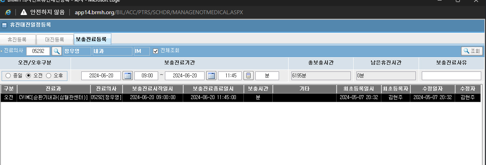
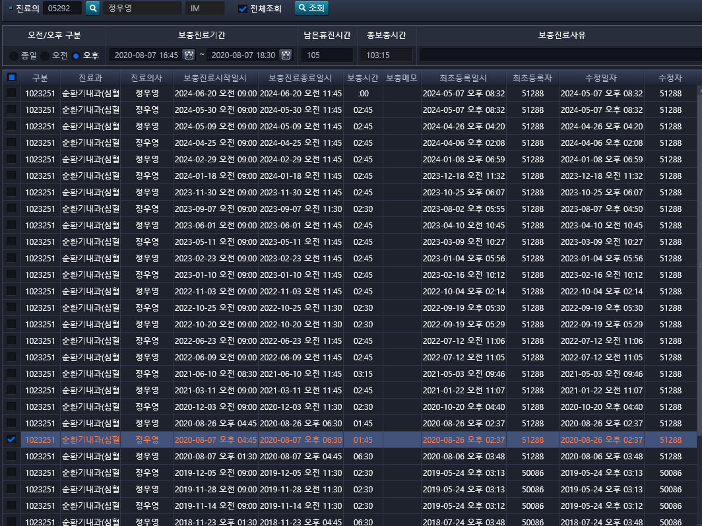

# 보충진료 수정 요청사항



두 화면을 아에 같게 해달라?

- 프로그램
    - 체크박스 날리고 -> 이 부분 안했네##################
    - 총보충시간, 구분,보충시간 -> 다 바꿨는데 총보충시간 확인해야함
    - 사이드바 나오게 -> 21일 해결
    - 계산 버튼 

        ```xml
        <HButton Name="btnTimeDiff" Style="{StaticResource CommonButtonCalculationStyle}" Width="25" DockPanel.Dock="Left" Click="btnTimeDiff_Click"/>
        ```
        -> 추가 완료 및 기능 구현 완료
    - 오전/오후 눌렀을 대, 종일(9 18), 오전(9 13), 오후(13 18) 시간 대로 세팅 -> 21일 해결

- 쿼리 수정
    - 진료의사 이름으로,수정자 이름으로 , 전체조회 조건(보츙시간이 없는 애들로) -> 완료 2024-10-21 11시30분

- 남은휴진시간 계산시간 차이 찾기 -> 없음, 그냥 안 사용하는 거 같음/ 선생님한테 물어보는게 나을 듯


## 쿼리 이름 정리
의사진료일정등록(보충진료등록) 화면 신규 쿼리 생성
- HIS.PA.AC.PE.SC.InsertDoctorPlusWork
- HIS.PA.AC.PE.SC.SelectDoctorPlusWork
    - exec :IN_DR_STF_NO := '05292';  --운영  -- 05292     -- 01920 
    - exec :IN_DR_STF_NO := '01815';  --스테이징

- HIS.PA.AC.PE.SC.UpdateDoctorPlusWork
- HIS.PA.AC.PE.SC.UpdateCnlDoctorPlusWork

## 


## EQS

```sql
<sql id="HIS.PA.AC.PE.SC.SelectDoctorPlusWork">
<!--
    Clss :  text
    Desc : 휴진대진일정등록 화면(보충진료등록 조회)
    Author : 김용록
    Create date : 2024-09-25
    Update date : 2024-09-25 
    as-is : pkg_bil_schdr
-->

SELECT /*+ HIS.PA.AC.PE.SC.SelectDoctorPlusWork */
    DR_SID		                                   AS DR_SID                     /* 1.구분 */
   ,FC_GET_DEPT_NM(MED_DEPT_CD)                  AS DEPT_NM                    /* 2.진료과 */
   ,FT_STF_INF(DR_STF_NO,'STF_NM')               AS STF_NM                     /* 3.진료의사 */
   ,TO_CHAR(APY_STR_DTM,'YYYY-MM-DD AM HH12:MI') AS APY_STR_DTM                /* 4.보충진료시작일시 */
   ,TO_CHAR(APY_STR_DTM,'YYYYMMDDHH24MI')        AS OLD_APY_STR_DTM            /* 4-0.보충진료시작일시(update) */
   ,TO_CHAR(APY_END_DTM,'YYYY-MM-DD AM HH12:MI') AS APY_END_DTM                /* 5.보충진료종료일시 */
   ,TO_CHAR(APY_END_DTM,'YYYYMMDDHH24MI')        AS OLD_APY_END_DTM            /* 5-0.보충진료종료일시(update) */

   ,SPLM_MED_TM                                  AS SPLM_MED_TM                /* 6.보충분(테이블) */
   ,CASE WHEN SUBSTR(TO_CHAR(TRUNC((APY_END_DTM- APY_STR_DTM)*24*60)),-1,1) = '9'
              THEN TO_CHAR(ROUND(TRUNC((APY_END_DTM- APY_STR_DTM)*24*60),-1))
              ELSE TO_CHAR(TRUNC((APY_END_DTM- APY_STR_DTM)*24*60))
    END                                          AS SPLM_MED_TM2               /* 6-0.보충분(end-str) */
   ,CASE WHEN FLOOR(TO_NUMBER(SPLM_MED_TM)/60)<10
              THEN '0'||TO_CHAR(FLOOR(TO_NUMBER(SPLM_MED_TM)/60))
              ELSE TO_CHAR(FLOOR(TO_NUMBER(SPLM_MED_TM)/60))
    END
    ||':'||
    CASE WHEN (TO_NUMBER(SPLM_MED_TM)-FLOOR(TO_NUMBER(SPLM_MED_TM)/60)*60)> 0
              THEN TO_CHAR(TO_NUMBER(SPLM_MED_TM)-FLOOR(TO_NUMBER(SPLM_MED_TM)/60)*60)
              ELSE '00'
    END                                          AS SPLM_MED_HH                 /* 6-1.보충시간(테이블) */
   ,CASE WHEN FLOOR((APY_END_DTM- APY_STR_DTM)*24) < 10 THEN '0'||TO_CHAR(FLOOR((APY_END_DTM- APY_STR_DTM)*24))
                                                        ELSE TO_CHAR(FLOOR((APY_END_DTM- APY_STR_DTM)*24))
    END
    ||':'||
    CASE WHEN ((APY_END_DTM- APY_STR_DTM)*24*60) - (FLOOR((APY_END_DTM- APY_STR_DTM)*24)*60) > 0
             THEN TO_CHAR((CASE WHEN SUBSTR(TO_CHAR(TRUNC((APY_END_DTM- APY_STR_DTM)*24*60)),-1,1) = '9'
                                     THEN ROUND(TRUNC((APY_END_DTM- APY_STR_DTM)*24*60),-1)
                                     ELSE TRUNC((APY_END_DTM- APY_STR_DTM)*24*60)
                           END ) - (FLOOR((APY_END_DTM- APY_STR_DTM)*24)*60))
             ELSE '00'
     END                                          AS SPLM_MED_HH2               /* 6-2.보충시간(end-str) */


   ,SUP_MEMO                                      AS SUP_MEMO                   /* 7.기타 */
   ,TO_CHAR(FSR_DTM,'YYYY-MM-DD AM HH12:MI')      AS FSR_DTM                    /* 8.최초등록일시 */
   ,FSR_STF_NO                                    AS FSR_STF_NO                 /* 9.최초등록자 */
   ,TO_CHAR(LSH_DTM,'YYYY-MM-DD AM HH12:MI')      AS LSH_DTM                    /* 10.수정일자 */
   ,LSH_STF_NO                                    AS LSH_STF_NO                 /* 11.수정자 */

   ,TO_CHAR(SUM(TO_NUMBER(SPLM_MED_TM)) OVER (PARTITION BY :IN_DR_STF_NO))
                                                  AS SUM_SPLM_MED_TM            /* 12.남은휴진분 */
   ,CASE WHEN FLOOR((SUM(TO_NUMBER(SPLM_MED_TM)) OVER (PARTITION BY :IN_DR_STF_NO))/60)<10
              THEN '0'||TO_CHAR(FLOOR((SUM(TO_NUMBER(SPLM_MED_TM)) OVER (PARTITION BY :IN_DR_STF_NO))/60))
              ELSE TO_CHAR(FLOOR((SUM(TO_NUMBER(SPLM_MED_TM)) OVER (PARTITION BY :IN_DR_STF_NO))/60))
    END
    ||':'||
    CASE WHEN ((SUM(TO_NUMBER(SPLM_MED_TM)) OVER (PARTITION BY :IN_DR_STF_NO))-FLOOR((SUM(TO_NUMBER(SPLM_MED_TM)) OVER (PARTITION BY :IN_DR_STF_NO))/60)*60)> 0
              THEN TO_CHAR((SUM(TO_NUMBER(SPLM_MED_TM)) OVER (PARTITION BY :IN_DR_STF_NO))-FLOOR((SUM(TO_NUMBER(SPLM_MED_TM)) OVER (PARTITION BY :IN_DR_STF_NO))/60)*60)
              ELSE '00'
    END                                          AS SUM_SPLM_MED_TM2             /* 12-0.남은휴진시간 */
   ,NVL2(CNCL_DT,'Y','N')                        AS CNCL_DT                      /* 13.취소날짜 */
   ,TM_UNIT_CD                                   AS TM_UNIT_CD                   /* 14.오전오후구분 */
FROM ACDPCSPD
WHERE (NVL2(:IN_CHECK_ALL,NULL,CNCL_DT) IS NULL)
  AND DR_STF_NO = :IN_DR_STF_NO
ORDER BY OLD_APY_STR_DTM DESC

</sql>
```