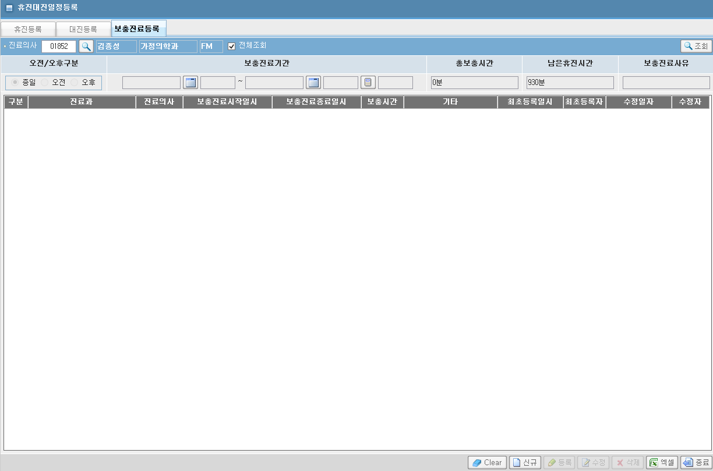
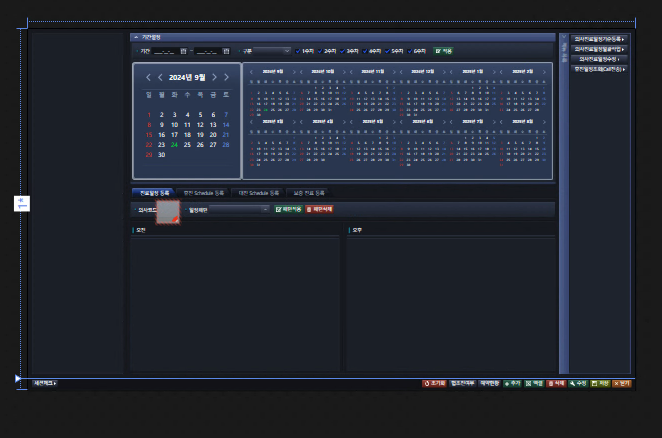

# 휴진대진일정등록


## ASIS 경로
[ASIS URL](http://app14.brmh.org/EMR/CCO/CCOMAN/EmrMain.aspx?PID=Nur&LOGIN=N&CHK=N)
- ACDPCSPD 의사보충일정정보
- BIL/ACC/PTRS/SCHDR/MANAGENOTMEDICAL.ASPX




## TOBE 경로
- HIS.PA.AC.PE.SC.UI.MedDoctorScheduleRegistration
    
    - 네번째 탭
    - 필요한 기능 : 조회
        - 진료의ID
    - 필요한 기능 : 추가/수정/삭제
        - (종일,오전,오후)/보충진료기간(From/To)/총보충시간/남은휴진시간/보충진료시사유

    - 화면 컬럼 : 
        /* 1.구분 */
        /* 2.진료과 */
        /* 3.진료의사 */
        /* 4.보충진료시작일시 */
        /* 5.보충진료종료일시 */
        /* 6.보충시간 */
        /* 7.기타 */
        /* 8.최초등록일시 */
        /* 9.최초등록자 */
        /* 10.수정일자 */
        /* 11.수정자 */

    - ASIS
        - pkg_bil_schdr.pc_ap_aaclnmst_dr_select
        - pkg_bil_schdr.pc_ap_apopscht_insert
        - pkg_bil_schdr.pc_ap_apopscht_delete


## 조회쿼리
- 조회 쿼리 짜다가 발견한 이상한 값

```sql
select
   dr_stf_no                                    as stf_no
   ,FT_STF_INF(dr_stf_no,'STF_NM')               as stf_nm
  ,apy_str_dtm
  ,apy_end_dtm
  ,case when substr(to_char(trunc((apy_end_dtm- apy_str_dtm)*24*60)),-1,1) = '9'
           then to_char(round(trunc((apy_end_dtm- apy_str_dtm)*24*60),-1))
           else to_char(trunc((apy_end_dtm- apy_str_dtm)*24*60))
      end     as bbb
  ,SPLM_MED_TM
from acdpcspd
where case when substr(to_char(trunc((apy_end_dtm- apy_str_dtm)*24*60)),-1,1) = '9'
           then to_char(round(trunc((apy_end_dtm- apy_str_dtm)*24*60),-1))
           else to_char(trunc((apy_end_dtm- apy_str_dtm)*24*60))
      end
      != SPLM_MED_TM
order by to_number(to_char(apy_str_dtm,'yyyymmdd')) desc
```


## 신규/수정/삭제 쿼리
- 저번에 알려준 함수로 짜보기

- DTO
    - MedDoctorScheduleRegistration_PlusWork_INOUT.cs
    - MedDoctorScheduleRegistration_PlusWork_UPDATE.cs


```cs
private String dr_sid;  // 1.구분 
private String dept_nm;  // 2.진료과 
private String stf_nm;  // 3.진료의사 
private String apy_str_dtm;  // 4.보충진료시작일시 
private String old_apy_str_dtm;  // 4-0.보충진료시작일시(update)
private String apy_emd_dtm;  // 5.보충진료종료일시 
private String old_apy_emd_dtm;  // 5-0.보충진료종료일시(update)
private String splm_med_tm;  // 6.보충분(테이블)
private String splm_med_tm2;  // 6-0.보충분(end-str)
private String splm_med_hh;  // 6-1.보충시간(테이블) 
private String splm_med_hh2;  // 6-2.보충시간(end-str) 
private String sup_memo;  // 7.기타 
private String fsr_dtm;  // 8.최초등록일시 
private String fsr_stf_no;  // 9.최초등록자 
private String lsh_dtm;  // 10.수정일자 
private String lsh_stf_no;  // 11.수정자
private String sum_splm_med_tm;  // 12.남은휴진분
private String sum_splm_med_tm2;  // 12-0.남은휴진시간
   

/// <summary>
/// name : 의사직원사원번호
/// </summary>
[DataMember]
public String MEDR_STF_NO
{
    get { return this.medr_stf_no; }
    set { if (this.medr_stf_no != value) { this.medr_stf_no = value; this.OnPropertyChanged("MEDR_STF_NO", value); } }
}
```


