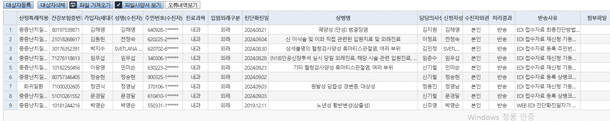

## 19~20일 반송된 EDI 현석 책임님께 보고 내용 
01891858 박연화
- 조회일자 : 2024-09-16
- 병명 : 파키슨병
- 반송 사유 :  WEB EDI 진단확진일자가 재등록 기간과 맞지않음
산정특례 재등록은 "최초 등록일의 만료일(2024-10-20일)"의 3개월 전부터 가능한데, 
확진일자가 (2024-06-26)이라 너무 빠른 확진일자 때문에 안됩니다.

01990548 신경선
- 조회일자 : 2024-09-19
- 병명 : 암
- 반송 사유 : 신청접수구분이 상이하다는 
환자 조회 시, 신정특례가 (2024-09-13)에 등록되어 있습니다.
재등록으로 진행해야 하는지 확인이 필요합니다.

00820359 전지운
- 조회일자 : 2024-09-19
- 병명 : 암
- 반송 사유 : EDI 점수자료 등록 특정기호가 상이함
이 환자도 (2024-09-19)에 산정특례이 등록되어 있습니다. 이 환자도 확인이 필요합니다.

## 21~23일 반송된 EDI 비교

## 현석 채임님께 텔레그램 보고 내용
00542380 박영순
- 조회일자 : 2024-09-23
- 병명 : 신주영/안과/노년성 황반변성(삼출성)
- 반송 사유 :  WEB EDI 진단확진일자가 재등록 기간과 맞지않음
확진일자가 (2019-12-11)으로 등록되어 있는데, 최초 확진일자로 입력하신 거 같습니다.
재확진 일자로 변경이 필요합니다.

01275836 김해영
- 조회일자 : 2024-09-23
- 병명 : 김지영/소화기내과/궤양성 번결장염
- 반송 사유 :  
최종확진진단방법 기타에 체크하고 내용이 없는데 확인 필요합니다.

01557744 SVETLANA ZASLAVSKA
- 조회일자 : 2024-09-23
- 병명 : 김민정/루마티스내과/루마티스관절염
- 반송 사유 :  성명이나 주민번호가 상이하다는 오류
외국인이라 외국인등록증이나 주민등록증에 등록된 성명과 주민번호가 
HIS에 등록된 정보와 맞는지 확인이 필요합니다.

2. 기등록자
00823278 전정숙  : (2024-09-21) 등록자라 확인이 필요합니다.
00628732 임무섭 : (2024-09-21) 등록자라 확인이 필요합니다.
01123358 정영남 : (2024-09-21) 등록자라 확인이 필요합니다.
01532633 정승현 : (2024-09-21) 등록자라 확인이 필요합니다.
00563876 안미순 : (2024-09-19) 등록자라 확인이 필요합니다.

3. 이미 신청됐다는 알림(조회했을 땐 없었음)
01650594 문경달  : 신기철/루마티스내과 , 확인이 필요합니다.
만기 날짜 : 2024-10-20

## 23일 반송된 EDI 수정사항
진하림 선생님께서 보내줬다는 내용

- 00542380-  
    - 박영순-  
    - 확진일자 신청일자로 수정해서 재전송
- 01275836-  
    - 김해영-  
    - 차세대 기타값 전산 누락 아닌가요? 산특상병 필수검사항목 체크 필수검사 6번 기타 검사 번호 있습니다. 해당환자 03으로 청구되어야함
- 01557744-  
    - SVETLANA ZASLAVSKA- 
    - 성명 :ZASLAVSKA SVITLANA 수정 재전송
- 01532633-  
    - 정승현-  
    - 기등록자 대상 환자번호와 환자명 불일치로 조회불가-이명준 환자로조회됨
- 00563876-  
    - 안미순
    - 기등록자 대상 환자번호와 환자명 불일치로 조회불가-김종기 환자로 조회됨
- 01650594-  
    -  문경달
    -  10월21일에 전송해야함(상병 4번째 자리 달라 종료후 공단 전송가능)

