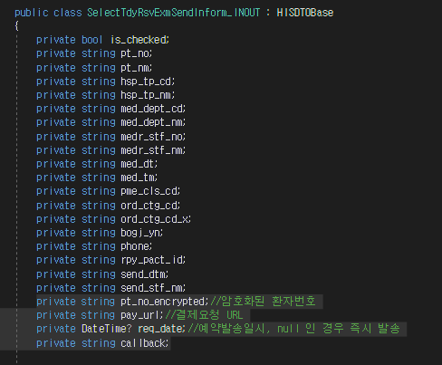

## 알림톡 참고 1
1. 조회 화면에 알림톡(모버일 하이패스)
private void SendAlramTalk()
        {
            HipassMobileApprovalMng_OUT selectedRow = grdList.SelectedItem as HipassMobileApprovalMng_OUT;
            
        }


2. 참고 HIS.PA.AC.PE.PS
    - SelectHiPassUnclAskPaymentSMSBL
    - SelectHiPassUnclAskPaymentSMSDL


## 알림톡 참고2 
- HIS.PA.AC.PE.AP / TdyRsvExmSendInform

    - xmal 버튼 스타일
        - Style="{StaticResource CommonButtonSmsStyle}"

    - F12가 안돼서 확인 불가
        - this.RegisterCloseBusyIndicator();

    - DTO
        - 

```cs
private void Send()
        {
            btnSend.IsEnabled = false;

            this.RegisterShowBusyIndicator("처리중 입니다.");

            if (model.OUT_TDY_OTPT_RSV_LIST == null || model.OUT_TDY_OTPT_RSV_LIST.Count <= 0)
            {
                MsgBox.Display("알림톡 발송대상이 없습니다.", MessageType.MSG_TYPE_INFORMATION, Owner: this.OwnerWindow);

                this.RegisterCloseBusyIndicator();

                btnSend.IsEnabled = true;

                return;
            }

            try
            {
                Int64 i64 = Convert.ToInt64(txtCallBackNumber.Text.Replace("-", ""));

                if (txtCallBackNumber.Text == null || txtCallBackNumber.Text.Length > 15 || txtCallBackNumber.Text.Length < 8)
                {
                    MsgBox.Display("콜백 번호가 유효하지 않습니다.", MessageType.MSG_TYPE_INFORMATION, Owner: this.OwnerWindow);

                    this.RegisterCloseBusyIndicator();

                    btnSend.IsEnabled = true;

                    return;
                }
            }
            catch
            {
                MsgBox.Display("콜백 번호가 유효하지 않습니다.", MessageType.MSG_TYPE_INFORMATION, Owner: this.OwnerWindow);

                this.RegisterCloseBusyIndicator();

                btnSend.IsEnabled = true;

                return;
            }

            if (dpRsvDt.SelectedDate != null)
            {
                if (chkRsvCheck.IsChecked != null && chkRsvCheck.IsChecked == true)
                {
                    if (Convert.ToInt64(((DateTime)dpRsvDt.SelectedDate).ToString("yyyyMMdd")) < Convert.ToInt64(DateTime.Today.ToString("yyyyMMdd")))
                    {
                        MsgBox.Display("발송예약일시는 과거일 수 없습니다.", MessageType.MSG_TYPE_INFORMATION, Owner: this.OwnerWindow);

                        this.RegisterCloseBusyIndicator();

                        btnSend.IsEnabled = true;

                        return;
                    }

                    if (Convert.ToInt64(((DateTime)dpRsvDt.SelectedDate).ToString("yyyyMMdd")) != Convert.ToInt64(((DateTime)dpRsvMedDt.SelectedDate).ToString("yyyyMMdd")))
                    {
                        MsgBox.Display("발송예약일시는 진료 당일만 가능합니다.", MessageType.MSG_TYPE_INFORMATION, Owner: this.OwnerWindow);

                        this.RegisterCloseBusyIndicator();

                        btnSend.IsEnabled = true;

                        return;
                    }
                }
                else
                {
                    if (Convert.ToInt64(DateTime.Today.ToString("yyyyMMdd")) != Convert.ToInt64(((DateTime)dpRsvMedDt.SelectedDate).ToString("yyyyMMdd")))
                    {
                        MsgBox.Display("즉시 발송은 진료 당일만 발송가능합니다.", MessageType.MSG_TYPE_INFORMATION, Owner: this.OwnerWindow);

                        this.RegisterCloseBusyIndicator();

                        btnSend.IsEnabled = true;

                        return;
                    }
                }
            }
            else if (chkRsvCheck.IsChecked != null && chkRsvCheck.IsChecked == true)
            {
                MsgBox.Display("발송예약일시가 없습니다.", MessageType.MSG_TYPE_INFORMATION, Owner: this.OwnerWindow);

                this.RegisterCloseBusyIndicator();

                btnSend.IsEnabled = true;

                return;
            }

            if (dpRsvTm.SelectedHour != null && dpRsvTm.SelectedMinute != null)
            {
                if (chkRsvCheck.IsChecked != null && chkRsvCheck.IsChecked == true && (Convert.ToInt64(((DateTime)dpRsvDt.SelectedDate).ToString("yyyyMMdd")) <= Convert.ToInt64(DateTime.Today.ToString("yyyyMMdd"))) && ((int)dpRsvTm.SelectedHour) <= DateTime.Now.Hour && ((int)dpRsvTm.SelectedMinute) <= DateTime.Now.Minute + 5)
                {
                    MsgBox.Display("발송예약일시는 5분 이상 미래이어야 합니다.", MessageType.MSG_TYPE_INFORMATION, Owner: this.OwnerWindow);

                    this.RegisterCloseBusyIndicator();

                    btnSend.IsEnabled = true;

                    return;
                }
            }
            else if (chkRsvCheck.IsChecked != null && chkRsvCheck.IsChecked == true)
            {
                MsgBox.Display("발송예약일시가 없습니다.", MessageType.MSG_TYPE_INFORMATION, Owner: this.OwnerWindow);

                this.RegisterCloseBusyIndicator();

                btnSend.IsEnabled = true;

                return;
            }


            int iCnt = 0;

            foreach (SelectTdyRsvExmSendInform_INOUT item in model.OUT_TDY_OTPT_RSV_LIST)
            {
                if (item.IS_CHECKED)
                {
                    item.CALLBACK = txtCallBackNumber.Text;

                    item.PT_NO_ENCRYPTED = EncryptPT_NO(item.PT_NO);


                    // 2023.01.30 김민지(SR 202301-00901/레몬 url 변경)
                    //if (HIS.Core.ConfigManager.Config.SystemEnv == HIS.Core.SystemEnv.PROD) //운영기
                    //{
                    //    item.PAY_URL = "https://channel.lemonhc.com/web-ui/payment/payments/11100079?patientId=" + item.PT_NO_ENCRYPTED + "&treatCls=O"; //나중에 반드시 운영 URL 확인해서 반영할 것.
                    //}
                    //else //개발기
                    //{
                    //    item.PAY_URL = "https://dev.lemonhc.com/web-ui/payment/payments/11100079?patientId=" + item.PT_NO_ENCRYPTED + "&treatCls=O";
                    //}

                    if (HIS.Core.ConfigManager.Config.SystemEnv == HIS.Core.SystemEnv.PROD) //운영기
                    {
                        item.PAY_URL = "https://channel-ui.lemonhc.com/web-ui/payment/payments/11100079?patientId=" + item.PT_NO_ENCRYPTED + "&treatCls=O"; //나중에 반드시 운영 URL 확인해서 반영할 것.
                    }
                    else //개발기
                    {
                        item.PAY_URL = "https://common-dev.lemonhc.com:18001/web-ui/payment/payments/11100079?patientId=" + item.PT_NO_ENCRYPTED + "&treatCls=O";
                    }

                    if (chkRsvCheck.IsChecked != null && chkRsvCheck.IsChecked == true)
                    {
                        item.REQ_DATE = ((DateTime)dpRsvDt.SelectedDate).Date;
                        item.REQ_DATE = ((DateTime)item.REQ_DATE).AddHours((double)dpRsvTm.SelectedHour);
                        item.REQ_DATE = ((DateTime)item.REQ_DATE).AddMinutes((double)dpRsvTm.SelectedMinute);
                    }
                    else
                    {
                        item.REQ_DATE = DateTime.Today;

                        item.REQ_DATE = ((DateTime)item.REQ_DATE).AddYears(2999 - (DateTime.Today).Year); //2999.12.31 일자는 SYSDATE 로 바로 발송하도록 함.
                        item.REQ_DATE = ((DateTime)item.REQ_DATE).AddMonths(12 - (DateTime.Today).Month);
                        item.REQ_DATE = ((DateTime)item.REQ_DATE).AddDays(31 - (DateTime.Today).Day);
                    }

                    iCnt++;
                }
                else
                {
                    item.PT_NO_ENCRYPTED = string.Empty;
                    item.PAY_URL = string.Empty;
                }
            }

            if (iCnt <= 0)
            {
                MsgBox.Display("알림톡 발송대상이 없습니다.", MessageType.MSG_TYPE_INFORMATION, Owner: this.OwnerWindow);

                this.RegisterCloseBusyIndicator();

                btnSend.IsEnabled = true;

                return;
            }

            Result_OUT result = (Result_OUT)UIMiddlewareAgent.InvokeBizService(this, BIZ_CLASS, "SaveTdyRsvExmSendInform", model.OUT_TDY_OTPT_RSV_LIST);

            if (result.IsSucess)
            {
                MsgBox.Display("정상적으로 알림톡 발송되었습니다.", MessageType.MSG_TYPE_INFORMATION, Owner: this.OwnerWindow);
            }
            else
            {
                MsgBox.Display("알림톡 발송중 문제가 발생하였습니다.", MessageType.MSG_TYPE_ERROR, Owner: this.OwnerWindow);
            }

            this.RegisterCloseBusyIndicator();

            btnSend.IsEnabled = true;

            SelectData(null);
        }
```


## 알림톡 참고3 재강 책임님
- 템플릿 코드랑 공백, 이런 거 하나라도 틀리면 안 보내진다. 
    - -> 병원쪽에서 요청해야 한다.
- 기능 만 만들고 보고해야한다.(기능은 퇴원계산서발행 화면 참고)
    - DischargeBillPrinting.xaml
        - ```cs
            // 2024.08.12 김재강 알림톡 전송 : 
            SendMessenger_IN SMSobj = new SendMessenger_IN();  // PA.CORE.DTO
            SMSobj.IN_PT_NO = ucPtNo.SelectedTextCode;
            SMSobj.IN_GUBUN = "1";
            SMSobj.IN_DUMMY1 = model.Data_Grid1[0].RPY_PACT_ID;
            SMSobj.IN_DUMMY2 = RstamtOutobj.RSTAMT;
            SMSHelper.SendMessenger(SMSobj);                   // PA.CORE.UCHELPER.UI (Utility)
            MsgBox.Display("전송되었습니다.", MessageType.MSG_TYPE_INFORMATION, Owner: this.OwnerWindow, messageButton: MessageBoxButton.OK);
        ```
    - PC_ACP_SEND_MESSENGER


## EAM
- 알림톡은 안될 거 같아서 보류하고 배포와 EAM 등록을 우선 진행했다.

    - 원무 / 진료비관리 / 진료비관리(외래/응급)

- 작성 내용
    - 외래예약금미정산환자내역조회
    - AC_HIS.PA.AC.PC.OP.UI_/OtpStorageAmountNonCompletePaymentAsk
    - HIS.PA.AC.PC.OP.UI
    - /OtpStorageAmountNonCompletePaymentAsk.xaml
