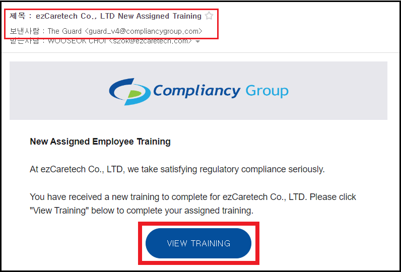

## 정보보안팀 / 최우석 메일 내용

안녕하세요.  정보보안팀 최우석 책임입니다.

2024년 HIPAA 감사 시기가 도래하여 온라인 교육을 위한 메일이 순차적으로 발송되고 있습니다.

전사 임직원 및 외부인력 분들께서는 차주 10. 18.(금) 까지 모든 교육을 이수하여 주시기 바랍니다.

올해는 온라인 교육을 위한 로그인 Portal이 존재하지 않으며,
수신하신 안내 메일의 링크로만 교육 사이트 접속이 가능합니다.

전년도 대비 교육 과정이 상당 부분 변경되어, 반드시 첨부된 교육 가이드를 참고하여 주시기 바랍니다.

1. 대상 : 임직원(휴직자 포함),  외부직원(협력업체, 프리랜서)

2. 메일 발송인 : The Guard <guard_v4@compliancygroup.com>
    - 

3. 진행방법 : 수신한 메일 내 링크('VIEW TRAINING')를 통해 HIPAA Annual Training 교육 이수
   ※ 첨부파일 참고 : 2024년 HIPAA 온라인 교육 가이드.pdf

4. 이수기한 : `24. 10. 18.(금) 18:00

5. 관련 문의
  5.1. 교육 안내 메일을 수신받지 못한 경우
    > 정보보안팀 수신 메일로 성함(한글, 영문), 부서명, 메일주소를 발송

  5.2. 교육 이수기한 조정 또는 교육 간 이슈 문의
    > 김보경 책임 (해외사업 영업/기획팀)

