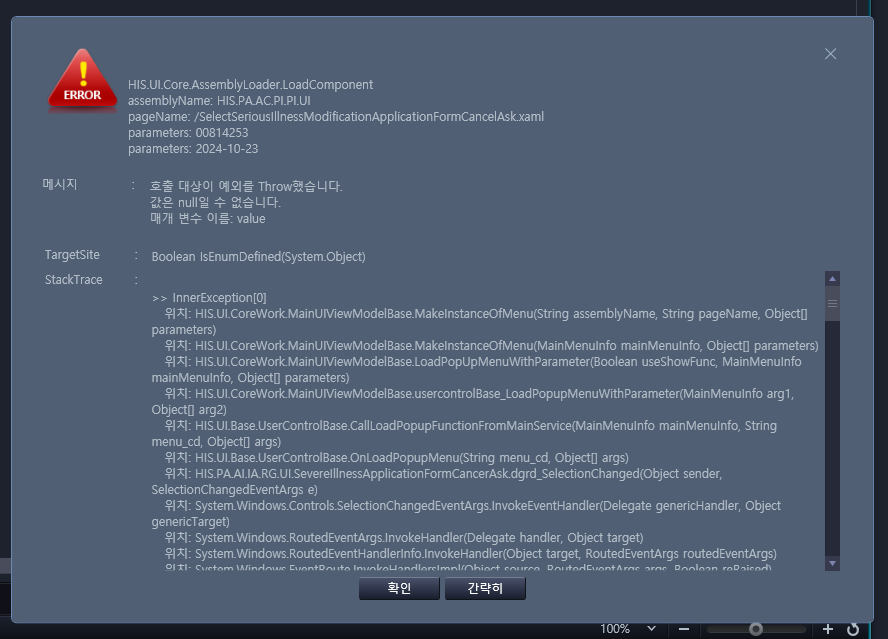

# 목요일까지
- 중증신청서(암)조회 화면에 버튼 만들어서 연결해라

    - AI_HIS.PA.AI.IA.RG.UI_/SevereIllnessApplicationFormCancerAsk.xaml

    - 필요한 파라미터
        - 환자번호
        - 신청월
    - -> 2024-10-22 오전에 연결

- 중증변경신청서 화면은 유형에 급여/보험이 나와야 하고, 내원구분에 외래입원이 나와야 함
    - EQS에서 값은 불러 옴 INS_CLS 와 CTH_TP

- pc.am : 입원처방내역조회 화면에 색깔별 설명 있음 -> 2024-10-22 오전에 붙여넣었다.

## 중증신청서(암)조회 수정
- AI_HIS.PA.AI.IA.RG.UI_/SevereIllnessApplicationFormCancerAsk.xaml
    - 청구심사관리

exportvalue

- 이건데 AC_HIS.PA.AC.PI.PI.UI_/SelectSeriousIllnessModificationApplicationFormCancelAsk
    - 그냥은 호출되는 거 확인

- 그럼 값을 보내야 하는데

## 10월 22일 배포 오류
1. 오류 1
    
    - 파라미터 값은 정확했는데 받는 부분에서 문제가 생긴 거 같다.

    - 이거랑 똑 같이 짠 거 같은데
        

2. 오류 2
    
    - 어딘지 안다 십 새기