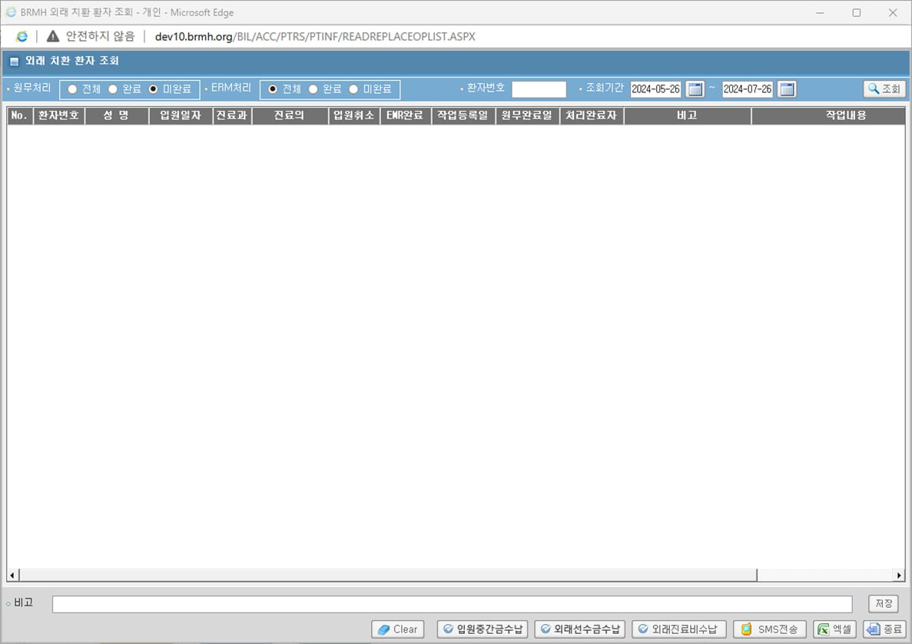

# 외래 치환환자 조회 신규화면
## 동명 책임님께서 주신 정보
- 파일 경로 : D:\HISSolutions\HIS.PA\HIS.PA.AC.PE\UI\HIS.PA.AC.PE.AP.UI\SelectOtptReplacePatientAsk.xaml

    - 

- [ASIS 들어갈 수 있는 URL](http://app14.brmh.org/EMR/CCO/CCOMAN/login.aspx)


- PE가 안들어가진다고 했더니 "HIS.PA.AC.PI.PS.UI"도 가능하다고 했음
```sql
select * -- tobe 운영기
  from ACPPRITD
;;

select *     -- asis 개발기에서
  from APREPLOPT@DLO_BMIS1

;;;
XBIL.pkg_bil_toemr2.pc_wk_apchklst_insert
;;;


SELECT *
  FROM ALL_SOURCE
 WHERE UPPER(TEXT) LIKE '%APREPLOPT%'
;;
```

외래 치환환자는 외래로 왔는데, 이 새-기 상태 왜이래 입원 각인데? -> 외래 치환

간혹 가다가 입원에서 외래로 치환되는 경우가 있는데, 6시간 미만으로 입원한 경우에 자동 치환

그러니 프로시저를 만들고, 자동으로 타는 건, 동명 책임님이 찾는다고 했음

조회는 EQS, 삽입/수정은 Prosudure


- 마감 : 다다음 주 배포?


## 쿼리 만들기

