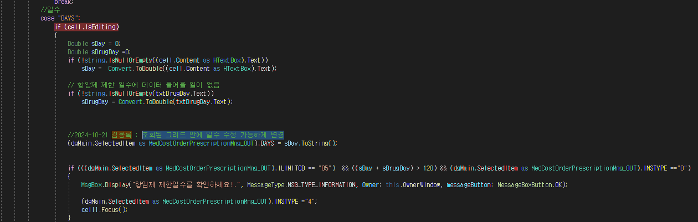

# 진료비처방입력(입원) 화면
- AC_HIS.PA.AC.PC.AM.UI_/MedCostOrderPrescriptionMng
- 급여환자로 , 그리드 화면에서 수정 시 값이 안 들어간다.

- 현석,형준 책임님이랑 대화하고 있길래 가니까 아직 하지 말고 기다려라


## 다시 
- 2024-10-21 17시 20분 가능하면 내일까지

- 스테이징 테스트 입원 환자 찾는 쿼리
    
    ```sql
    select *
      from ACPPRAAM--acppraam
    where sihs_yn = 'Y'
      and apcn_dtm is null --취소를 안함
    --  and PME_CLS_CD LIKE 'E%'
    order by ads_dtm desc
    ```


- 테스트 환자번호 : 04890703   01453462
- 수가 : Y83N1
- 재료구분 : 기술료(가산않음)


수가입력단위코드


## 체크인

-  // 2024-10-21 김용록 : 일수 수정 가능하게 수정
    model.MEDCOSTORDERPRESCRIPTIONMNG_05OBJ[i].IN_ORD_DYS                      = (dgMain.Items[i] as MedCostOrderPrescriptionMng_OUT).DAYS == "-1" ? "-1":(dgMain.Items[i] as MedCostOrderPrescriptionMng_OUT).DAYS;

일단 이런 식으로 두 곳 해결을 해놨다. -> 근데 이 부분은 확실하지 않다.


- 아 이거 아니다 ㅅㅄㅄㅄㅄㅄ


## 다시 찾아 체크인 



