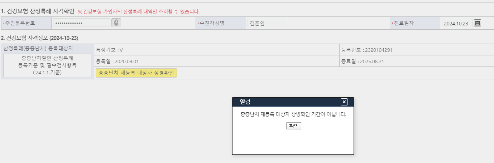
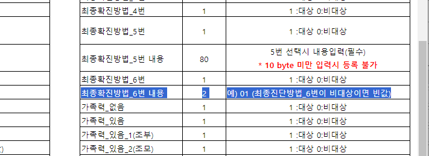
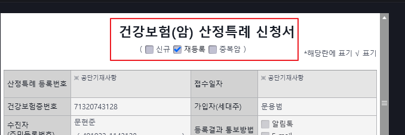
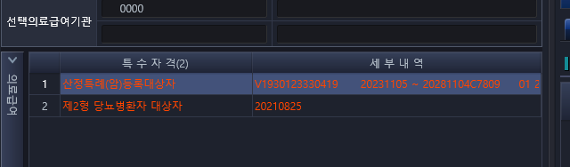
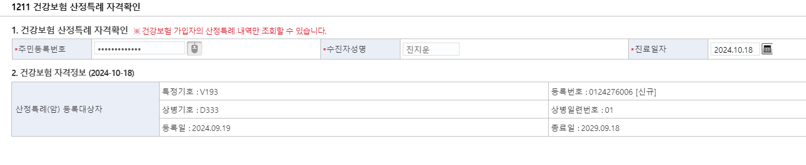
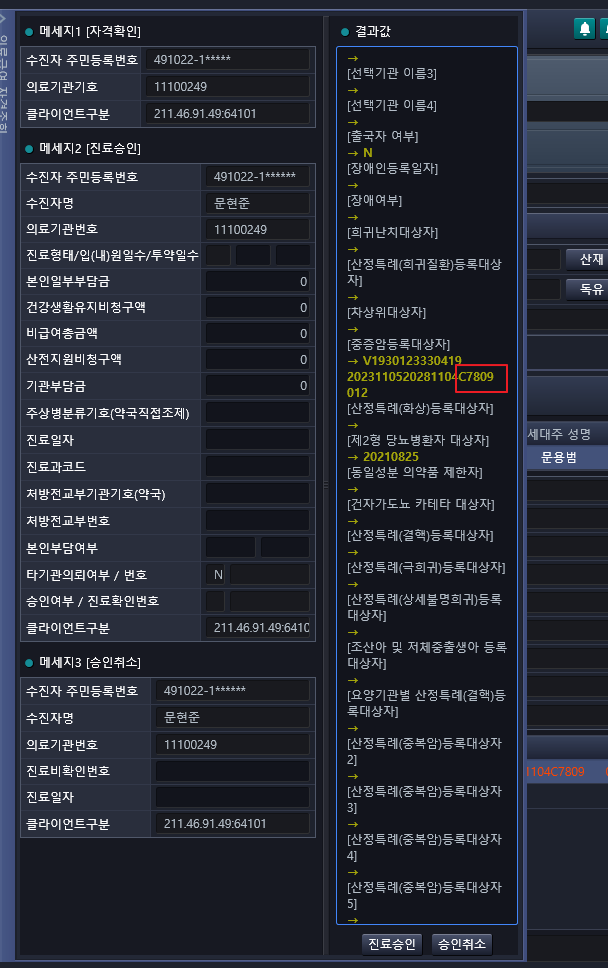

# 24년 10월 22,23일
## 암
01725167 박영민
- 신청일 : 2024-10-22
- 병명 :이정훈 / 비뇨의학과 / 암(C61)
- 반송사유 : 의료급여 기등록건>지사로 문의
- 특이사항 : (2023-12-28)부터 암(C089)으로 받고있습니다. 

## 희귀
01993420 김준열
- 신청일 : 2024-10-21
- 병명 : 김률 / 신경과 / 파킨슨병
- 반송사유 : EDI 접수자료 재신청 기등록자임

(2020-09-01)부터 (2025-08-31)까지 받는 산전특례가 있는데, 희귀는 재등록 기간부터 상병기호를 확인할 수 있어, 보라매 병원 이전 진료 기록도 없고, 확인 부탁드립니다.

## 프로그램 문제
 

- 희귀, 파킨슨병 최종진단이 화면에 69 값은 가지고 있는데, 올리면 인식이 안된다.

- 위 두명 다 , 한 명 만 등록하려 했을 때, 등록이 안됨

## 성준 책임님

2024-10-01 결핵에 변철호 환자 누락됐다.

## 24일 성준 책임님 문의

01744625 문현준
C7809
4910221143128

신청구분이 2면
재등록으로 해주셨는데, 중복암이 신 거 같아서

- 
    - 
    - 
- 베스트케어에서 상병 확인 방법
    - 
    - 

희귀는 재등록 기간에 만 이전 상병 확인 가능하고 암 신청할 때 재등록인지 중복암인지 확인해야 해서 상병이 보여야 하잖아요

EDI 전송 화면에서 신청구분이 2면 재등록인데 