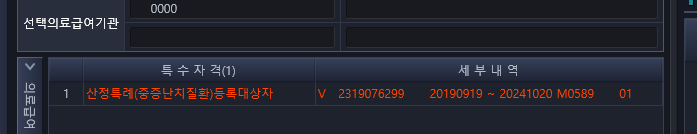
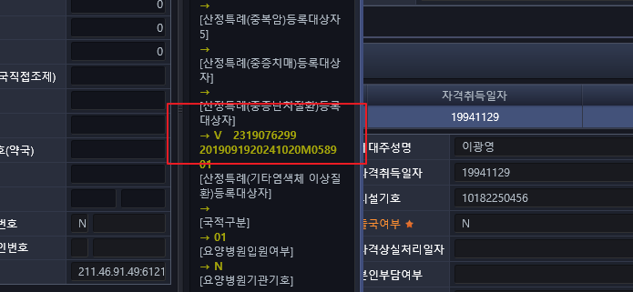
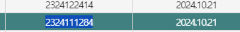

# 금일 EDI 반송 정리
## 9월 20일 보고 내용(9월 16일 ~ 9월 20일)
```
01891858 박연화
- 조회일자 : 2024-09-16
- 병명 : 파키슨병
- 반송 사유 :  WEB EDI 진단확진일자가 재등록 기간과 맞지않음
산정특례 재등록은 "최초 등록일의 만료일(2024-10-20일)"의 3개월 전부터 가능한데, 
확진일자가 (2024-06-26)이라 너무 빠른 확진일자 때문에 안됩니다.


01990548 신경선
- 조회일자 : 2024-09-19
- 병명 : 암
- 반송 사유 : 신청접수구분이 상이하다는 
환자 조회 시, 신정특례가 (2024-09-13)에 등록되어 있습니다.
재등록으로 진행해야 하는지 확인이 필요합니다.


00820359 전지운
- 조회일자 : 2024-09-19
- 병명 : 암
- 반송 사유 : EDI 점수자료 등록 특정기호가 상이함
이 환자도 (2024-09-19)에 산정특례이 등록되어 있습니다. 이 환자도 확인이 필요합니다.
``` 
> 두 명은 이미 신청되어 있고, 반연화 만 확인하면 되는데
> 박연화 환자는 24일에 안미순 환자의 경우와 동일하다.


## 9월 24일 보고 내용(9월 21일 ~ 9월 23일)
```
00542380 박영순
- 조회일자 : 2024-09-23
- 병명 : 신주영/안과/노년성 황반변성(삼출성)
- 반송 사유 :  WEB EDI 진단확진일자가 재등록 기간과 맞지않음
확진일자가 (2019-12-11)으로 등록되어 있는데, 최초 확진일자로 입력하신 거 같습니다.
재확진 일자로 변경이 필요합니다.


01275836 김해영
- 조회일자 : 2024-09-23
- 병명 : 김지영/소화기내과/궤양성 번결장염
- 반송 사유 :  
최종확진진단방법 기타에 체크하고 내용이 없는데 확인 필요합니다.


01557744 SVETLANA ZASLAVSKA
- 조회일자 : 2024-09-23
- 병명 : 김민정/루마티스내과/루마티스관절염
- 반송 사유 :  성명이나 주민번호가 상이하다는 오류
외국인이라 외국인등록증이나 주민등록증에 등록된 성명과 주민번호가 
HIS에 등록된 정보와 맞는지 확인이 필요합니다.


2. 기등록자
00823278 전정숙  : (2024-09-21) 등록자라 확인이 필요합니다.
00628732 임무섭 : (2024-09-21) 등록자라 확인이 필요합니다.
01123358 정영남 : (2024-09-21) 등록자라 확인이 필요합니다.
01532633 정승현 : (2024-09-21) 등록자라 확인이 필요합니다.
00563876 안미순 : (2024-09-19) 등록자라 확인이 필요합니다.

3. 이미 신청됐다는 알림(조회했을 땐 없었음)
01650594 문경달  : 신기철/루마티스내과 , 확인이 필요합니다.
만기 날짜 : 2024-10-20
```


### 24일 추가 보고 내용
```
00794529 염병수
- 조회일자 : 2024-09-24
- 병명 : 전용진/간암
- 반송 사유 : 자격상실 자료
조회 시, 사망한 사람으로 나오는데 확인 부탁드립니다.
```
- 정말 사망자인 거 같다.


### 진하림 선생님께서 알려주신 반송 처리 방법
```
환자번호-  환자명-  수정사항
- 00542380-  박영순-  확진일자 신청일자로 수정해서 재전송
    - EDI 접수자료 등록 신청일자가 상이함(신청일부터 전산등록일이 14일 경과)
- 01275836-  김해영-  차세대 기타값 전산 누락 아닌가요? 산특상병 필수검사항목 체크 필수검사 6번 기타 검사 번호 있습니다. 해당환자 03으로 청구되어야함
- 01557744-  SVETLANA ZASLAVSKA-  성명 :ZASLAVSKA SVITLANA 수정 재전송

- 01532633-  정승현-  기등록자 대상 환자번호와 환자명 불일치로 조회불가-이명준 환자로조회됨
    - 조회안됨
- 00563876-  안미순-  기등록자 대상 환자번호와 환자명 불일치로 조회불가-김종기 환자로 조회됨
- 01650594-   문경달-  10월21일에 전송해야함(상병 4번째 자리 달라 종료후 공단 전송가능)

```

- 01632633 정승현 -> 후 신청되어있네
- 00563875 안미순 
    - 이 환자 같은 경우 아래 사진처럼 24년 10월 20일에 만료다. 그러나 번호를 확인해보면 
        - 

    - 아래와 같이 다른 것을 확인할 수 있다.
        - 
        - 


## 9월 30일 보고내용(9월 27일 ~ 9월 30일)
```
00524981 고석율
- 조회일자 : 2024-09-27
- 의사명 : 신기철/루마티스내과
- 병명 : V140
- 반송 사유 :  재신청 기등록자


00805793 노희순
- 조회일자 : 2024-09-27
- 의사명 : 최인실/혈액종양내과
- 반송 사유 :  신청 구분이 상이하다. (중증암)
공단 조회 시, (2024-06-24)부터 중증암 산정특례를 이미 받는 분인데,
암 부위 별(암+중증암+중증암...)로 신청해야 하는 지, 
한 번만(암+중증암) 신청하면 되는 지,
확인이 필요합니다.
```

- 노희순 환자 만 확인하면 되는데


## 10월 08일 금일 보고내용(암)
01557191 정민수
- 의사명 : 문현종/흉부외과
- 병명 : 암
- 반송 사유 : 첨부파일 필요

