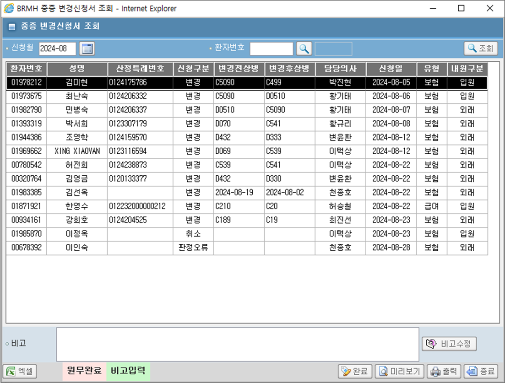

# 중증변경신청서조회
## 재강책임님 보내주신 거.
- [ASIS 경로](http://app14.brmh.org/BIL/ACC/PTRS/SRIMD/READRAREDISEASEAPP.ASPX)
    - 
- HIS.PA.AC.PI.PI.UI.SelectSeriousIllnessModificationApplicationFormCancelAsk


    - 늦게 해도 된다.
## 필요한 컬럼
- EQS : HIS.PA.AC.PI.SelectSeriousIllnessModificationApplicationFormCancelAsk
- OUT
    ```sql

        private string PT_NO; /* 환자번호 */
        private string PT_NM; /* 성명 */
        private string CFSC_NO; /* 산정특례번호 */
        private string APLC_TP; /* 신청구분 */
        private string CHG_FMR_SKNS; /* 변경전상병 */
        private string CHG_AFT_SKNS; /* 변경후상병 */
        private string ASDR_NM; /* 담당의사 */
        private string REG_DT;/* 신청일 */
        private string INS_CLS; /* 보험유형 */
        private string CTH_TP; /* 내원구분 */
        private string RMK; /* 비고 */
        private string RMK_EN; /* 비고유무 */
        private string CMPL_EN; /* 완료유무 */

    ```

- IN
    ```sql

        private string in_pt_no;   /* 환자번호 */
        private string in_reg_dt;  /* 신청일 */
        private string in_cmpl_tp; /* 완료구분(완료 시 변경되어야 할 부분) */

    ```

## 테스트 쿼리

- HIS_PA_CORE_UI:PAPtInsuranceQualificationAsk에서 산전특례 번호 따오기

```sql
SELECT 
    '01632633'      AS PT_NO; /* 환자번호 */
   , AS PT_NM; /* 성명 */
   , '2324104461'   AS CFSC_NO; /* 산정특례번호 */
   , AS APLC_TP; /* 신청구분 */
   , AS CHG_FMR_SKNS; /* 변경전상병 */
   , AS CHG_AFT_SKNS; /* 변경후상병 */
   , AS ASDR_NM; /* 담당의사 */
   , AS REG_DT;/* 신청일 */
   , AS INS_CLS; /* 보험유형 */
   , AS CTH_TP; /* 내원구분 */
   , AS RMK; /* 비고 */
   ,'Y' AS RMK_EN; /* 비고유무 */
   ,'N' AS CMPL_EN; /* 완료유무 */
FROM  


```


## EAM
- 환자정보관리 / 의뢰서/동의신청서
    - 중증변경신청서조회
    - AC_HIS.PA.AC.PI.PI.UI_/SelectSeriousIllnessModificationApplicationFormCancelAsk
    - HIS.PA.AC.PI.PI.UI
    - /SelectSeriousIllnessModificationApplicationFormCancelAsk.xaml
