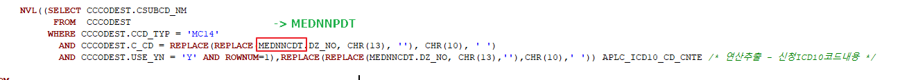
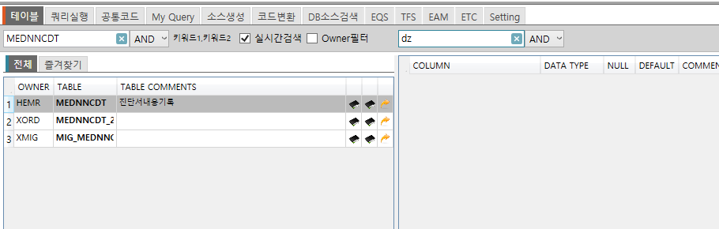
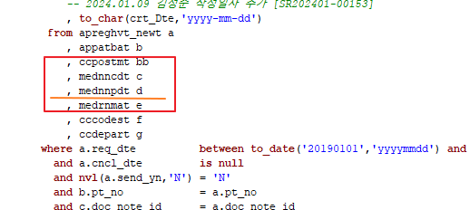
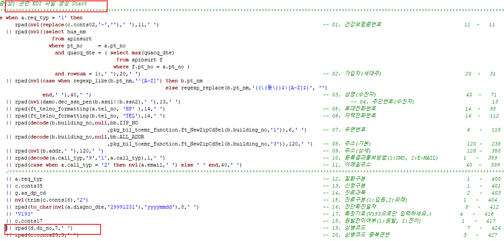
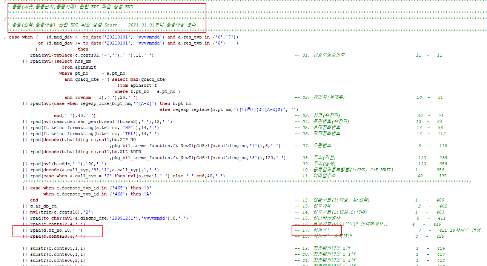

- 




- PACKAGE BODY XBIL.PKG_BIL_SRIMD_NEW 기반으로 마이그 작성했다.





TOBE로 마이그 할 때, MDIC_ID에 ASIS에선 '53055704'로 안 묶여있던 거 같습니다


```sql
SELECT

   (   SELECT
          ccc.CSUBCD_NM
         FROM  CCCODEST ccc
        WHERE ccc.CCD_TYP = 'MC14'
          AND ccc.C_CD = REPLACE(REPLACE(ddd.DZ_NO, CHR(13), ''), CHR(10), ' ')
          AND ccc.USE_YN = 'Y'
          AND ROWNUM=1
         )  as cd
    , ddd.*

FROM (
   SELECT
        MEDNNCDT.DZ_NO
      , APREGHVT_NEWT.*
       --MEDNNCDT.*
   FROM
      APREGHVT_NEWT
   LEFT OUTER JOIN  ((
                       SELECT MEDNNCDT.*
                            , MEDNNPDT.DZ_NM
                            , MEDNNPDT.DZ_NO
                            , MEDNNPDT.DR_NM
                            , MEDNNPDT.LIC_NO
                            , MEDNNPDT.INHSP_DTE
                         FROM MEDNNCDT MEDNNCDT
                            , MEDNNPDT MEDNNPDT
                        WHERE MEDNNPDT.DOC_NOTE_ID = MEDNNCDT.DOC_NOTE_ID(+)
                          AND MEDNNPDT.RLS_NO      = MEDNNCDT.RLS_NO(+)
                     )) MEDNNCDT

     ON APREGHVT_NEWT.DOC_NOTE_ID = MEDNNCDT.DOC_NOTE_ID
    AND APREGHVT_NEWT.RLS_NO = MEDNNCDT.RLS_NO
    )  ddd

 WHERE --ddd.PT_NO       = '00776940'
   --AND
   ddd.DOC_NOTE_ID = '53055704'
   --AND ddd.RLS_NO      = '1'
```