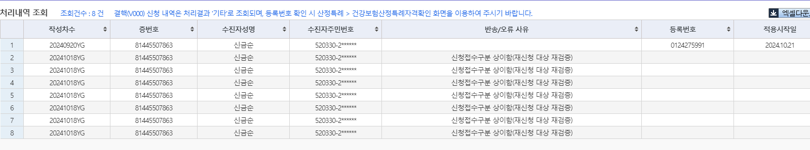

## 16일 현석 책임님께 보낼 내용 정리
01625243 이용운
- 2024-10-14
- 담당의 : 유상준/비뇨의학과/암
- 반송사유 : 첨부파일 필요
- 특이사랑 : 암으로 받는 산정특례 (2024-11-04)에 만료, 재등록 환자. 
> 신청완료 <strong style="color:red">2024-10-17</strong>

01993356 손선진아기
- 2024-10-14
- 담당의 : 정지은/소아청소년과/호흡보조필요
- 반송사유 : 주민등록번호 상이


01651572 문세연
기면증
v234

> 처리

## 아기들 처리 방법
성준 책임님께서 문의


- 메세지 내용
    ```
    책임님 혹시 아기환자분들같은경우는 주민번호가 없어서 신청보류하는걸로 알고있습니다. AS-IS때는 주민번호가 환자정보에 기입된경우 해당주민번호로 재신청했었는데 TO_BE에서도 동일하게 되어있는게 맞을까요?  동일하게되어있다고한다면 주민번호가들어왔을때 책임님께 말씀드려서 재신청을 요청드려야할까요?
    ```
- 정리
    - 아기 환자 분들같은 경우는 주민번호가 없어서 신청 보류
    - AS-IS때는 주민번호가 환자정보에 기입된경우 해당주민번호로 재신청했었다.
    - 동일하게되어있다고한다면 주민번호가들어왔을때 책임님께 말씀드려서 재신청을 요청드려야할까요?


- 메세지 내용2
    ```
    선생님도 대부분 아기환자분들은 어처피 자격없어서 안보내지는거 알고있어서 확진일기준으로 한달지나기전까지는 매일 점검쿼리로 확인해서 주민번호 들어왔는지 보고 한달지나면 어떻게수정해서보내야하는지 여쭤보고 수정 후 전송 / 한달 이전내역은 신청일자 수정해서 전송했습니다.
    ```
- 정리
    - 그니까 아기 환자들은 선생님들이 한달이 지나기 전에 주민번호가 들어오는 지 확인해서 보낸다는 건데, 아래는 9월 7일 오픈 이후, 온 아기 환자들
        - 01993356	81319325921	손선진	손선진아기
        - 01993952	11111111111	이수연	이수연아기
        - 01992633	81402468771	오은빈	오은빈아기
        - 01992618	81329255890	손예주	손예주아기
        - 01992353	60019616967	한솔하	한솔하아기
        - 01990810	11111111111	김원빈	김도아


## 17일 반송 정리

01598621 노경희

 6402012067649
> 처리 완료


## 18일 반송 정리

80481653771 박진희
중증치매
EDI접수자료 등록 특정기호가 상이

> G310으로 들어와 있는데, G3100으로 넣었음
01877655
> 재증명관리에서 확인해 보니. G31.00이네 시발
5206172397121


### 암
00452102 심금순 
- 신청일자 : 2024-10-17
- 반송사유 : 기등록자
- 심금순 환자 (2024-09-19)일에 신청했던 분이 또 올라와 있는데, 확인부탁드립니다.



### 희귀/중증희귀
01191274 이순금
- 신청일자 : 2024-10-17
- 병명 : 이지영/ 신경과 / 파키슨병
- 반송사유 : 의료급여 기등록건>지사로 문의


### 잠복결핵
01925431 최애란
- 신청일자 : 2024-10-17
- 병명 : 잠복결핵
- 특이사항 : (2024-07-12)에 산정특례 만료가 된 환자인데, 확진일자를 (2024-07-14)로 주셨습니다.
- 반송사유 : 접수자료 등록 기등록자