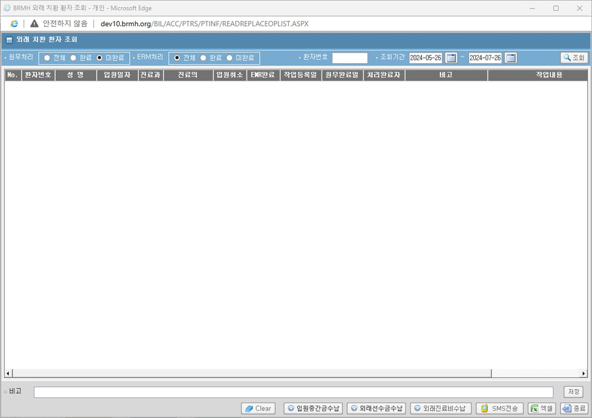

# 외래 치환환자 조회 신규화면
## 동명 책임님께서 주신 정보
- 파일 경로 : D:\HISSolutions\HIS.PA\HIS.PA.AC.PE\UI\HIS.PA.AC.PE.AP.UI\SelectOtptReplacePatientAsk.xaml

    - 

- [ASIS 들어갈 수 있는 URL](http://app14.brmh.org/EMR/CCO/CCOMAN/login.aspx)


- PE가 안들어가진다고 했더니 "HIS.PA.AC.PI.PS.UI"도 가능하다고 했음
```sql
select * -- tobe 운영기
  from ACPPRITD
;;

select *     -- asis 개발기에서
  from APREPLOPT@DLO_BMIS1

;;;
XBIL.pkg_bil_toemr2.pc_wk_apchklst_insert
;;;


SELECT *
  FROM ALL_SOURCE
 WHERE UPPER(TEXT) LIKE '%APREPLOPT%'
;;
```

외래 치환환자는 외래로 왔는데, 이 새-기 상태 왜이래 입원 각인데? -> 외래 치환

간혹 가다가 입원에서 외래로 치환되는 경우가 있는데, 6시간 미만으로 입원한 경우에 자동 치환

그러니 프로시저를 만들고, 자동으로 타는 건, 동명 책임님이 찾는다고 했음

조회는 EQS, 삽입/수정은 Prosudure


- 마감 : 다다음 주 배포?


- 2024-10-21에 PI.PS로 화면 옮겼음
D:\HISSolutions\HIS\Deploy\Client\Core\HIS.UI.CoreWork.dll
## 쿼리 만들기

- 조회 : pkg_bil_ptinf.pc_ap_apreplopt_select

    ```sql
    /***********************************************************************************
     *    서비스이름  : pc_ap_apreplopt_select
     *    최초 작성일 : 2018.12.18
     *    최초 작성자 : 고훈선
     *    Description : 외래 지환 환자 리스트 조회
     ***********************************************************************************
     *    변경 이력   :
     ***********************************************************************************/
    procedure pc_ap_apreplopt_select(  in_pt_no             in   varchar2  		-- 환자번호
                                   	,  in_from_dte          in   varchar2  		-- 시작일자 
                                   	,  in_to_dte           	in   varchar2  		-- 종료일자
                                   	,  in_endyn             in   varchar2 	    -- 원무완료 
                                   	,  in_emryn             in   varchar2 	    -- EMR완료	
                                   	,  out_cursor           out  returncursor)
    is                         
    	v_from_dte    	date;
    	v_to_dte      	date;  
        wk_cursor returncursor;
    begin

        --**조회기간 필수!!
        v_from_dte := to_date(in_from_dte,'yyyy-mm-dd');
       	v_to_dte   := to_date(in_to_dte,'yyyy-mm-dd');
    
        if v_from_dte is null or v_to_dte is null then
        	raise_application_error(-20999,'조회기간은 필수 입니다.|▒|');
        end if;

        if in_pt_no is null and v_to_dte - v_from_dte > 90 then
            raise_application_error(-20999,'환자번호 없이 조회 시 조회기간은 90일을 초과 할 수 없숩니다.|▒|');
        end if;

        begin
           	open wk_cursor for	 
    			select 	rownum    									as NO			--00.No.
    					, a.pt_no               					as pt_no		--01.환자번호
    					, b.pt_nm									as pt_nm		--02.환자명
    					, to_char(c.adm_dte, 'yyyy-mm-dd')			as adm_dte		--03.입원일자 
    					, d.med_dept								as med_dept		--04.진료과	
    					, pkg_bil_common.FC_UserNameSel(nvl(d.spc_dr_id,spc_dr2_id))|| '(' ||nvl(d.spc_dr_id,spc_dr2_id)||')'				
    																as med_dr		--05.진료의 
    					, decode(d.cncl_dte, null, 'N', 'Y')		as cncl_yn		--06.취소상태
    					, nvl(c.emr_work_yn, 'N')					as emr_yn		--07.EMR작업완료여부
    					, to_char(a.wk_dtm, 'yyyy-mm-dd')   		as wk_dtm 		--08.작업시작일시  
    					, to_char(a.fin_dtm, 'yyyy-mm-dd')  		as fin_dtm		--09.원무완료일시  					
    					, pkg_bil_common.FC_UserNameSel(a.fin_id)  	as fin_id		--10.처리완료자  					
    					, c.rmk           							as rmk			--11.비고  
    					, a.chk_contents        					as chk_contents	--12.체크리스트 내용  
    				from  apchklst  a   --체크리스트
    					, appatbat 	b   --환자기본정보
    					, APREPLOPT c   --입원취소외래치환   
    					, apiplist 	d 	--입원접수
    				where a.chk_cls = '23' --체크유형(23 :입원->외래치환)
    					and (
    	                        (a.pt_no = in_pt_no)
    	                    or	(nvl(in_pt_no,'*') = '*')  
    	                    )
    					and wk_dtm between v_from_dte and v_to_dte + .99999
    					and a.pt_no 	= b.pt_no
    					and c.pt_no 	= a.pt_no
    					and c.pt_chk_no = a.pt_chk_no -- **환자체크번호
    					and d.pt_no		(+)= c.pt_no
    					and d.adm_dte	(+)= c.adm_dte
    					and (
    	                        (in_endyn = 'Y' and a.fin_dtm  is not null)
    	                    or  (in_endyn = 'N' and a.fin_dtm  is null)
    	                    or  (nvl(in_endyn,'*') = '*')  
    	                    )
    	                and (
    	                        (nvl(c.emr_work_yn, 'N') = in_emryn)
    	                    or  (nvl(in_emryn,'*') = '*')  
    	                    )    
    	            order by a.wk_dtm         
    				;	
    		out_cursor := wk_cursor ;   
    	exception
    	    when others then
    	        raise_application_error(-20500,'pc_ap_apreplopt_select : 조회중 오류가 발생하였습니다' || chr(13) || sqlcode || chr(13) || sqlerrm);    
     	end;
    
    
    end pc_ap_apreplopt_select;
    ```

### 
컬럼 작성

as NO			--00.No.
as pt_no		--01.환자번호
as pt_nm		--02.환자명
as adm_dte		--03.입원일자 
as med_dept		--04.진료과	

as med_dr		--05.진료의 
as cncl_yn		--06.취소상태
as emr_yn		--07.EMR작업완료여부
as wk_dtm 		--08.작업시작일시  
as fin_dtm		--09.원무완료일시  					
as fin_id		--10.처리완료자  					
as rmk			--11.비고  
as chk_contents	--12.체크리스트 내용  


from  apchklst  a   --체크리스트
	, appatbat 	b   --환자기본정보
	, APREPLOPT c   --입원취소외래치환   
	, apiplist 	d 	--입원접수


where a.chk_cls = '23' --체크유형(23 :입원->외래치환)
	and (
            (a.pt_no = in_pt_no)
        or	(nvl(in_pt_no,'*') = '*')  
        )

	and wk_dtm between v_from_dte and v_to_dte + .99999
	and a.pt_no 	= b.pt_no
	and c.pt_no 	= a.pt_no
	and c.pt_chk_no = a.pt_chk_no -- **환자체크번호
	and d.pt_no		(+)= c.pt_no
	and d.adm_dte	(+)= c.adm_dte

	and (
            (in_endyn = 'Y' and a.fin_dtm  is not null)
        or  (in_endyn = 'N' and a.fin_dtm  is null)
        or  (nvl(in_endyn,'*') = '*')  
        )

    and (
            (nvl(c.emr_work_yn, 'N') = in_emryn)
        or  (nvl(in_emryn,'*') = '*')  
        )    

order by a.wk_dtm  


### out 값

ROW_NO			        --00.NO.

AS PT_NO		        --01.환자번호
AS PT_NM		        --02.환자명
AS ADS_DT		        --03.입원일자 
AS DEPT_NO		        --04.진료과	

AS MEDR_NM		        --05.진료의 
AS CNCL_YN		        --06.취소여부
AS WK_CMPL_YN		    --07.EMR작업완료여부
AS WK_STR_DTM 		    --08.작업시작일시  
AS PA_CMPL_DTM		    --09.원무완료일시  					
AS PRO_CMPL_STF_ID		--10.처리완료자  					
AS RMK_CNTE			    --11.비고  
AS CHECKLIST_CNTE	    --12.체크리스트 내용   

### in 값

