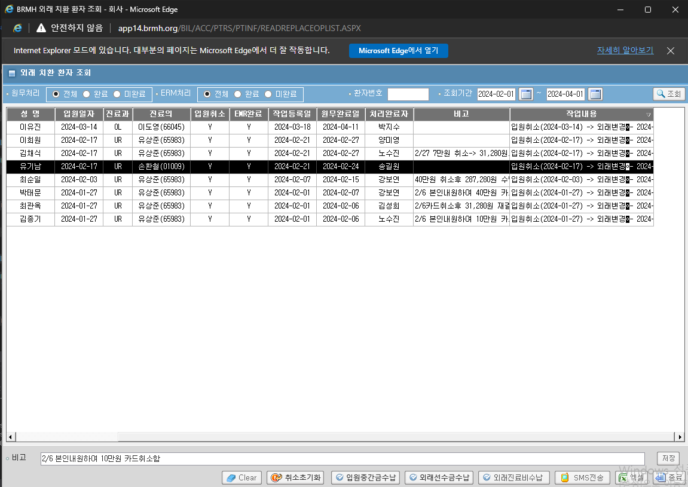
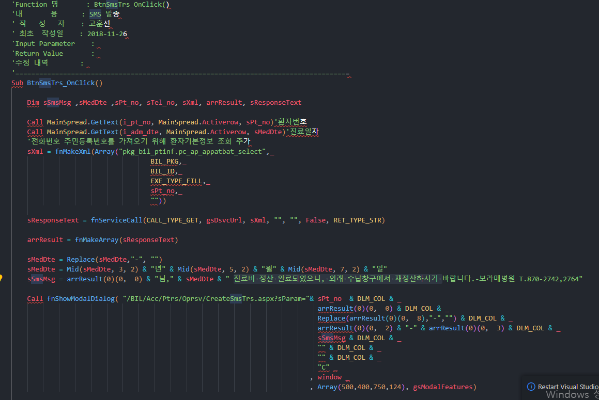

## 경로 정리

- 체크리스트등록 : HIS.PA.CORE.AC.PM.UI_/CheckListManagement


- 외래진료비수납 : AC_HIS.PA.AC.PC.OP.UI_/OtptMedCostReceivePaymentMng.xaml_O


- 외래선수금수납 = 외래예약금수납?? : AC_HIS.PA.AC.PC.OP.UI_/ReservationAmountReceivePaymentManagementO


- 입원중간금수납 = 중간금수납?? : AC_HIS.PA.AC.PC.OP.UI_/ReservationAmountReceivePaymentManagementI


## 문법
- insert 문 사용할 때 썼던 거
```sql
  :IN_PT_NO
, :IN_PACT_ID
, :IN_CTN_TGPT_INPT_DT
, :IN_CTN_TGPT_SEQ
, :IN_TRAN_RMK
, :IN_CMPT_WK_CMPL_YN
, :IN_CMPT_WK_CMPL_DT
, :IN_PRO_WK_STF_NO
, :IN_PRO_DTM
, :IN_BOBD_PT_NO
, :IN_BIND_DTM
, :IN_BIND_STF_NO
, :IN_FSR_STF_NO
, :IN_FSR_DTM
, :IN_FSR_PRGM_NM
, :IN_FSR_IP_ADDR
, :IN_LSH_STF_NO
, :IN_LSH_DTM
, :IN_LSH_PRGM_NM
, :IN_LSH_IP_ADDR
```

- 연결할 때 사용한 문법
```cs
if (sender.Equals(btnPopup1))/* 외래진료비수납 */
            {
                
                if ((pt_no_cell.Content as TextBlock).Text.Length == 8)
                {
                    UserControlBase userControlBase = this.OnLoadMenuAfterFindingDuplicationMenu("AC_HIS.PA.AC.PC.OP.UI_/OtptMedCostReceivePaymentMng.xaml_O");
                    ((userControlBase as dynamic).FindName("uc_ptno") as HIS.PA.CORE.UI.PACodeAsk).SelectedTextCode = (pt_no_cell.Content as TextBlock).Text;
                }
                else
                { 
                    pop = base.OnLoadPopupMenu("AC_HIS.PA.AC.PC.OP.UI_/OtptMedCostReceivePaymentMng.xaml_O");
                }
            }
            else if (sender.Equals(btnPopup2))/* 외래선수금수납 = 외래예약금수납? */
            {
                          
                if ((pt_no_cell.Content as TextBlock).Text.Length == 8)
                {
                    UserControlBase userControlBase = this.OnLoadMenuAfterFindingDuplicationMenu("AC_HIS.PA.AC.PC.OP.UI_/ReservationAmountReceivePaymentManagementO");
                    ((userControlBase as dynamic).FindName("uc_txtPtNo") as HIS.PA.CORE.UI.PACodeAsk).SelectedTextCode = (pt_no_cell.Content as TextBlock).Text;
                }
                else 
                {
                    pop = base.OnLoadPopupMenu("AC_HIS.PA.AC.PC.OP.UI_/ReservationAmountReceivePaymentManagementO");
                }

            }
            else if (sender.Equals(btnPopup3)) /* 입원중간금수납 = 중간금수납? */
            {
                 
                if ((pt_no_cell.Content as TextBlock).Text.Length == 8)
                {
                    UserControlBase userControlBase = this.OnLoadMenuAfterFindingDuplicationMenu("AC_HIS.PA.AC.PC.OP.UI_/ReservationAmountReceivePaymentManagementI");
                    ((userControlBase as dynamic).FindName("uc_txtPtNo") as HIS.PA.CORE.UI.PACodeAsk).SelectedTextCode = (pt_no_cell.Content as TextBlock).Text;
                }
                else 
                {
                    pop = base.OnLoadPopupMenu("AC_HIS.PA.AC.PC.OP.UI_/ReservationAmountReceivePaymentManagementI");

                }
            }
```
### System.OutOfMemoryException 에러 확인
- ASP.NET 메모리 부족 문제
    1. RAM의 양은 의 OutOfMemoryException가능성에 영향을 미치지 않습니다. 

이유가 아마도 중간금수납 화면에 가면, 체크리스트가 자동으로 뜨나 보다.

## SMS 연결


- [ASIS 경로](http://app14.brmh.org/BIL/ACC/PTRS/PTINF/READREPLACEOPLIST.ASPX)에서 문구 확인
    - 0000년 00월 00일 ___님 진료비 정산 완료되었으니, 외래 수납창구에서 재정산하시기 바랍니다.-보라매병원 T.870-2742,2764

    - 필요정보 : 진료일자 / 환자번호 / 전화번호? 




## EAM 
- 외래치환환자조회
- AC_HIS.PA.AC.PI.PS.UI_/SelectOtptReplacePatientAsk
- HIS.PA.AC.PI.PS.UI
- SelectOtptReplacePatientAsk.xaml
- HISFILE01/CM/MenuICON/PA/d715e76f-366e-4621-b85f-5ad4e5d8ee32.png


## 추가 수정

- 비고/작업내용은 좌측 정렬
    > 처리

- 작업내용 여러줄일 때, 한 줄만 보이게 + 가져다 대면 햅틱 보이게
    > 처리

- 10건 조회 됐다 알림 빼라
    > 처리
- 초기화 알림 빼라
    > 처리
- 여러줄 스크립되는 거 빼라
    > 처리


환자를 치환해달라 하면
체크리스트에 넣어주는 프로시저가 필요하다


> 01961221 ACPPRRDE 스테이징 체크리스트 값 변경한 인원