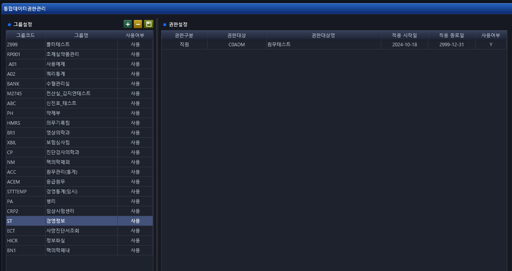
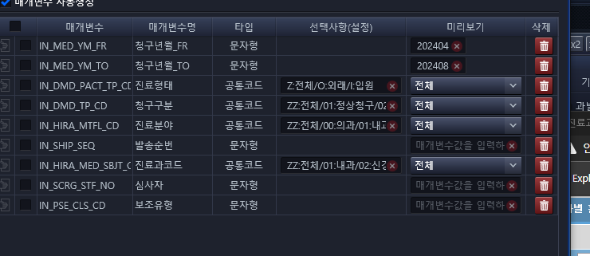

# 통합데이터관리
- 김태운 책임님 : 이 화면이 필요한 이유가 
    - 통계 데이터 만 있으면 되고, 굳이 화면을 만들 필요 없는 화면들은 
    - 쿼리만 변환해줄테니, 통합데이터관리 화면에서 조회 만 해서 확인해라


```
ASIS에서 화면 구현이 불필요한, 단순 통계성 조회 화면들은 쿼리 만 변환해서 
통합데이터관리 화면에, 
아래 쉐어포인트 경로의 엑셀파일을 참고하여, 각 파트별로 필요한 부분 작성

ㄱ. 쉐어포인트 경로 :
        4.개발관리 -> 02.솔루션구축 -> 11.경영통계
ㄴ. 파일명 : ★ 붙임. HIS경영통계-EMR경영정보 구현 관련 검토내역-송부 2024-1017.xlsx
ㄷ. 화면 : 통합데이터관리 화면
```

Bestcare 2.0 / 통합데이터관리 화면
- ID : C0ADM
- PASS : 보라매1


- [파일 URL](http://bcdevsp.brmh.org/_layouts/15/start.aspx#/4/Forms/AllItems.aspx?RootFolder=%2F4%2F02%2E%EC%86%94%EB%A3%A8%EC%85%98%EA%B5%AC%EC%B6%95%2F11%2E%20%EA%B2%BD%EC%98%81%ED%86%B5%EA%B3%84&FolderCTID=0x0120009D3AE4E89BA5DB46A18E66BD0F4715B6&View=%7BF17EA07C%2DAF20%2D4C9F%2D99A5%2DEEC33A0A9F7B%7D)


## 전체 톡방 메세지
```
베스트케어 통합데이터관리 화면에, 아래 쉐어포인트 경로의 엑셀파일을 참고하여, 각 파트별로 필요한 부분 작성 부탁드립니다.

ㄱ. 쉐어포인트 경로 :
        4.개발관리 -> 02.솔루션구축 -> 11.경영통계
ㄴ. 파일명 : 
    ★ 붙임. HIS경영통계-EMR경영정보 구현 관련 검토내역-송부 2024-1017.xlsx
ㄷ. 화면 : 통합데이터관리 화면
```
- 파트장님께 이런 식으로 보내도 되겠냐 말씀 드렸더니, 팀장님이 알아서 하신다고, 신경쓰지 않아도 된다고 하심


## 상위 메뉴 추가하는 방법
- 통합데이터권한관리
    

- 디렉토리 조회 쿼리(XMED로 해야함)
    ```SQL
    SELECT *  FROM MOOPTMMD
    WHERE ROWNUM < 100
      AND MENU_NM LIKE '%경영정보%'
    ORDER BY LSH_DTM DESC;
    ;

    SELECT * FROM MOOPTQMD WHERE ROWNUM <10;
    ```

- 디렉토리 삽입 쿼리
    ```SQL

    INSERT /* HIS.MC.CM.CO.CR.SaveIntgRsltMgmt.InsertTreeViewList */
          INTO MOOPTMMD
             (
               GRP_CD               /*그룹코드*/
             , MENU_CD              /*메뉴코드*/
             , MENU_NM              /*메뉴명*/
             , CTG_LVL_TP_CD        /*분류레벨구분코드*/
             , UPR_MENU_CD          /*상위메뉴코드*/
             , FLDR_YN              /*폴더여부*/
             , FSR_DTM              /*최초등록일시*/
             , FSR_STF_NO           /*최초등록직원번호*/
             , FSR_PRGM_NM          /*최초등록프로그램명*/
             , FSR_IP_ADDR          /*최초등록IP주소*/
             , LSH_DTM              /*최종변경일시*/
             , LSH_STF_NO           /*최종변경직원번호*/
             , LSH_PRGM_NM          /*최종변경프로그램명*/
             , LSH_IP_ADDR          /*최종변경IP주소*/
             )
        VALUES
             (
               :GRP_CD
           , (SELECT :UPR_MENU_CD || '-' || NVL(TO_CHAR(MAX(TO_NUMBER(nvl(REPLACE(MENU_CD, UPR_MENU_CD || '-', ''), 0))) + 1),1)
    	           FROM MOOPTMMD				--입력될 MENU_CD를 상위메뉴로 변경하고 최초폴더생성시 값이 없어서 NVL처리 후 최대값을 가져와서 1씩 추가하는 방식
    	          WHERE GRP_CD = :GRP_CD
    	            AND UPR_MENU_CD = :UPR_MENU_CD  --TEST555-5
    	            AND CTG_LVL_TP_CD != 1)		--최상위 폴더일때 제외해야함
             , :MENU_NM
             , :CTG_LVL_TP_CD
             , :UPR_MENU_CD
             , :FLDR_YN
             , :HIS_LSH_DTM
             , :HIS_STF_NO
             , :HIS_PRGM_NM
             , :HIS_IP_ADDR
             , :HIS_LSH_DTM
             , :HIS_STF_NO
             , :HIS_PRGM_NM
             , :HIS_IP_ADDR
             )

    ```
 
## 엑셀파일 내용 
1. 14+5+8+4+5
27 _ 


팀장님 원무보험 통합데이터 관리에 통계쿼리 추가 건, 현재 34/36 남았는데, 지금 속도로 다음 주 수요일까지 가능할 거 같습니다.

- His.Com.Mis.Pts.Pts.Sql.xml


- [ 환자수통계 ]
    - 진료과별 환자종류별 진료실적
    - 진료과별 환자종류별 입원/외래환자수
    - 진료과별 지역별 의사별/실외래환자수 
    - 진료과별 지역별 의사별/2010,11년 수납기준환자수
    - 지역별 의사별/과별 신환/초진/재진 외래환자수
    - 지역별 입원환자수
    - 진료과별 의사별 환자현황
    - 진료과별 연령별/성별 환자수
    - 진료과별 일자별 외래/입원 환자현황
    - 진료과별 환자종류별 입원/퇴원 환자수
    - 의사별 환자종류별 입원/퇴원 환자수
    - 병동별 환자종류별 입원/퇴원 환자수
    - 진료과별 병동별 병상이용율
    - 진료과별 병동별 병상회전율


- [ 진료과별 병동별 인실별 병상이용율 ]
    - 진료과별 인실별 병상이용율
    - 병동별 인실별 병상이용율
    - 인실별 재원환자
    - 병동별 진료과별 병상이용현황
    - 월별 예약 수진현황
    - 유입경로별 외래환자수


- [ 진료수입통계 ]
    - 환자종류별 수입금 발생내역
    - 환자종류별 수납금 내역
    - 진료과별 진료구분별 진료수입
    - 진료과별 진료행위별 수입금
    - 진료과별 환자종류별 진료수입
    - 진료과별 행위별 재료비 수입금
    - 병동별 행위별 재료대 수입금
    - 진료과별 의사별 수입금
    - 진료과별 의사별 수입금2
    - 진료비감면현황

- [ 진료실적세부통계 ]
    - 환자보험별 종별 진료실적
    - 외래진료과별신환초재진 진료실적
    - 수가별 수익
    - 시간외 및 공휴일 진료실적
    - 수술장 시간외 및 공휴일 진료실적
    - 진료과별 상병건수
    - 의사별 상병건수

- [ 지원부분통계 ]

- [ 물리치료실 ]
    - 전년도대비 치료실적
    - 환자구분별 치료실적
    - 진료구분별 치료실적
    - 진료과별 치료건수
    - 진료형태별 치료실적
    - 종목별 진료단위별 치료실적
    - 종목별 일별 치료실적
    - 종목별 월별 치료실적

- [ 방사선과 ]
    - 전년도대비 검사실적
    - 환자구분별 검사실적
    - 방사선과 진료형태별 검사실적 출력
    - 방사선과 종목별 진료과별 검사건수 출력
    - 진료형태별 검사실적
    - 종목별 진료단위별 촬영건수
    - 종목별 검사실적
    - 검사실별 검사실적
    - 검사실별 환자수 열람(일,월,년보)
    - 토요일 판독조회

- [ 병리과 ]
    - 전년도대비 검사실적
    - 환자구분별 검사실적
    - 진료형태별 검사실적
    - 병리과 종목별 진료과별 검사건수 출력
    - 진료형태별 검사실적 출력
    - 종목별 진료단위별 검사건수
    - 종목별 검사실적 열람
    - 종목별 환자구분별 검사실적

- [ 핵의학과(체내) ]
    - 전년도대비 검사실적(체내)
    - 환자구분별 검사실적(체내)
    - 진료형태별 검사실적(체내)

- [ 핵의학과(체외) ]
    - 전년도대비 검사실적(체외)
    - 환자구분별 검사실적(체외)
    - 진료형태별 검사실적(체외)

- [ 특수검사실 ]
    - 전년도대비 검사실적
    - 환자구분별 검사실적
    - 진료형태별 검사실적
    - 진료과별 검사건수
    - 특수검사실 종목별 검사실적 열람
    - 진료형태별 검사실적
    - 종목별 진료단위별 검사실적
    - 종목별 일별 검사실적
    - 종목별 월별 검사실적
    - 종목별 환자구분별 검사실적
    - 의사별/검사코드별 검사실적
    - 기간별 검사실적 출력2

- [ 수술장통계 ]
    - 수술실적 과별 통계
    - 수술실적 의사별 통계
    - 마취실적 과별 통계(진료)
    - 재수술통계(진료)
    - 과별 수술실 이용률 (진료)
    - 과별 수술실 이용률 (구)
    - 요일별 수술통계
    - 진료과별 방별 수술건수(전체)

- [ 진단검사의학과 ]
    - 전년도대비 검사실적
    - 진료형태별 검사실적
    - 종목별 검사실적 열람
    - 환자구분별 검사실적
    - 위탁검사 실적 출력
    - 종목별 진료단위별 검사건수

- [ 마감통계 ]
    - 전년대비실적
    - 환자유형별집계
    - 진료형태별집계
    - 검사내역별진료과실적
    - 검사내역별일별실적
    - 월별실적

- [ 원시통계 ]
    - 토요일 판독조회
    - 특검 의사별/검사코드별 검사실적
    - TAT분석

- [ 상세자료 ]
    - 외래환자 상세 자료
    - 외래진료 수입 상세 자료
    - 입원진료 수입 상세 자료
    - 연입원환자 상세자료
    - 재원환자 상세 자료
    - consult 통계
    - 진료과별 의사별 일진료시간
    - 토요일 진료통계
    - 토요일 진료통계_상세
    - 응급실 경유 환자 현황
    - 응급실 경유 수술건수
    - 응급실 체류시간
    - 진료총괄표

- [ 원무보고 ]
    - 월간입원현황
    - 월간외래현황
    - 월간진료비 수익현황
    - 월간 장기재원 환자현황
    - 월간진료과별 신환환자
    - 월간서울대병원 MRI의뢰현황
    - 주간진료현황
    - 주간병상가동률
    - 주간입원환자현황
    - 일별입원 환자현황
    - 주요지역 환자종류별 신환환자수
    - 월간 진료현황
    - 일일의료수입현황
    - 발생주의관련 집계표


## 텔레그램 메세지
이지케어텍 보라매 박수현 파트장님, [2024-10-18 오후 1:17]
용록책임... 이제 하나씩 추가만 하면 될꺼 같아요...

이지케어텍 보라매 박수현 파트장님, [2024-10-18 오후 1:17]
통합데이터관리에  폴더 생성했습니다


- Tip. 타입을 지정할 수 있다.



퇴원구분
1:입원환자(실입원)/2:입원환자(실입원)과별배분/3:퇴원환자(실퇴원)/4:퇴원환자(실퇴원)과별배분/5:재원환자(연입원)/6:총재원수(연퇴원)

7:퇴원평균재원일/8:퇴원평균재원일(과별배분)

연람구분
1:연보/2:월보


연월 or 연도

월보일 때, 사용

나이구분
1:65세이상/2:65세미만/3:전체


```sql
 /***********************************************************************************
        *    서비스이름      : pc_sel_pts02_income035
        *    최초 작성일     : 2010.12.06
        *    최초 작성자     : 이강준
        *    Description     : 지역별 입원환자수
        *    Input Parameter :
        *                      1.in_fyyyymm =>시작일자
        *                      2.in_tyyyymm =>종료일자
        *                      3.in_look    =>열람구분 '1':연보  '2':월보
        *                      4.in_gubun   =>구    분 '1':실입원  '2':연인원     2011.01월 추가함
        *    페이지ID        :
        ***********************************************************************************/

        procedure pc_sel_pts02_income035( in_fyyyymm	 in	varchar2
                                         ,in_tyyyymm	 in varchar2
        								 ,in_look        in varchar2
        								 ,in_gubun		 in varchar2
         		                         ,out_cursor	 out returncursor )
        is
            wk_cursor returncursor;
        begin
			if in_gubun = '1' then
				BEGIN
		            open wk_cursor for
	    	        select
	                   case when grouping(area_cd) = 0 then
	                             nvl((select csubcd_nm from cccodest where ccd_typ = '260'  and c_cd = area_cd),area_cd)
	                        else '합계'
	                   end                                                          "지역"
	                  ,sum(adm_hapgae  )                                            adm_hapgae
	                  ,sum(adm_bohum   )                                            adm_bohum
	                  ,sum(adm_boho    )                                            adm_boho
	                  ,0                                                            adm_boho2
	                  ,sum(adm_hangyer )                                            adm_hangyer
	                  ,sum(adm_sanjae  )                                            adm_sanjae
	                  ,0                                                            adm_sanjae2
	                  ,sum(adm_general )                                            adm_general
	                  ,sum(adm_traffic )                                            adm_traffic
	                  ,sum(adm_gita    )                                            adm_gita
	              from
	                  (
	                   select
	                          wk_key                                                       area_cd
	                         ---------------------------------------------------------------------------
	                         -- 입원실환자수
	                         ---------------------------------------------------------------------------
	                         ,sum(day_cnt4)                                                adm_hapgae
	                         ,sum(
	                              case when pattype in ('B1','B2','B6','BB') then day_cnt4
	                                   else 0
	                              end
	                             )                                                         adm_bohum
	                         ,sum(
	                              case when pattype in ('E1','E2','E6')      then day_cnt4
	                                   else 0
	                              end
	                             )                                                         adm_boho
	                         ,sum(
	                              case when pattype in ('E8')                then day_cnt4
	                                   else 0
	                              end
	                             )                                                         adm_hangyer
	                         ,sum(
	                              case when pattype in ('SA','SB','SP')      then day_cnt4
	                                   else 0
	                              end
	                             )                                                         adm_sanjae
	                         ,sum(
	                              case when pattype in ('AA')                then day_cnt4
	                                   else 0
	                              end
	                             )                                                         adm_general
	                         ,sum(
	                              case when pattype in ('TA')                then day_cnt4
	                                   else 0
	                              end
	                             )                                                         adm_traffic
	                         ,sum(
	                              case when pattype in ( 'B1','B2','B6','BB'
	                                                    ,'E1','E2','E6'
	                                                    ,'E8'
	                                                    ,'SA','SB','SP'
	                                                    ,'AA'
	                                                    ,'TA'
	                                                   )                     then 0
	                                   else day_cnt4
	                              end
	                             )                                                         adm_gita
	                         ,'1'                                                          gubun
	                     from apstatmt2
	                    where med_dte in
	                                      (
	                                       select  end_dte
	                                         from
	                                             (
	                                              select
	                                                     distinct
	                                                     case when in_look in ('1','2') then
	                                                               case when last_day(to_date(substr(in_fyyyymm,1,4)||lpad(rownum,2,'0')||'01','yyyymmdd')) <= trunc(sysdate) -1  then
	                                                                         last_day(to_date(substr(in_fyyyymm,1,4)||lpad(rownum,2,'0')||'01','yyyymmdd'))
	                                                                    else
	                                                                         trunc(sysdate) -1
	                                                               end
	                                                         else
	                                                               to_date(in_fyyyymm,'yyyymmdd')
	                                                     end       end_dte
	                                                    ,row_number() over(partition by rownum order by rownum) rank
	                                                from dict
	                                               where rownum <= 12
	                                             )
	                                        where end_dte between case in_look
	                                                                   when '1' then
	                                                                        case when last_day(to_date(in_fyyyymm||'0101','yyyymmdd')) < trunc(sysdate)-1  then
	                                                                                  last_day(to_date(in_fyyyymm||'0101','yyyymmdd'))
	                                                                             else
	                                                                                  trunc(sysdate)-1
	                                                                        end
	                                                                   when '2' then
	                                                                        case when last_day(to_date(in_fyyyymm||'01','yyyymmdd')) < trunc(sysdate)-1  then
	                                                                                  last_day(to_date(in_fyyyymm||'01','yyyymmdd'))
	                                                                             else
	                                                                                  trunc(sysdate)-1
	                                                                        end
	                                                                   when '3' then
	                                                                        to_date(in_fyyyymm,'yyyymmdd')
	                                                                   else
	                                                                        to_date(in_fyyyymm,'yyyymmdd')
	                                                              end
	                                                          and case in_look
	                                                                   when '1' then
	                                                                        case when last_day(to_date(in_fyyyymm||'1201','yyyymmdd')) < trunc(sysdate)-1  then
	                                                                                  last_day(to_date(in_fyyyymm||'1201','yyyymmdd'))
	                                                                             else
	                                                                                  trunc(sysdate)-1
	                                                                        end
	                                                                   when '2' then
	                                                                        case when last_day(to_date(in_tyyyymm||'01','yyyymmdd')) < trunc(sysdate)-1  then
	                                                                                  last_day(to_date(in_tyyyymm||'01','yyyymmdd'))
	                                                                             else
	                                                                                  trunc(sysdate)-1
	                                                                        end
	                                                                   when '3' then
	                                                                        to_date(in_fyyyymm,'yyyymmdd')
	                                                                   else
	                                                                        to_date(in_tyyyymm,'yyyymmdd')
	                                                              end
	                                      )
	                      and dtl_typ = 'M03'
	                      and patsite = 'I'
	                      and age_typ = '1'
	                    group by
	                             wk_key
	                  )
	             group by
	                      rollup(area_cd)
	             having  sum(adm_hapgae) != 0
	             order by
	                      area_cd;
	            END;
	  		ELSE
	  			BEGIN
    		        open wk_cursor for
		            select
	                   case when grouping(area_cd) = 0 then
	                             nvl((select csubcd_nm from cccodest where ccd_typ = '260'  and c_cd = area_cd),area_cd)
	                        else '합계'
	                   end                                                          "지역"
	                  ---------------------------------------------------------------------------
	                  -- 재원연입원실환자수
	                  ---------------------------------------------------------------------------
	                  ,sum(jae_hapgae  )                                            jae_hapgae
	                  ,sum(jae_bohum   )                                            jae_bohum
	                  ,sum(jae_boho    )                                            jae_boho
	                  ,0                                                            adm_boho2
	                  ,sum(jae_hangyer )                                            jae_hangyer
	                  ,sum(jae_sanjae  )                                            jae_sanjae
	                  ,0                                                            jae_sanjae2
	                  ,sum(jae_general )                                            jae_general
	                  ,sum(jae_traffic )                                            jae_traffic
	                  ,sum(jae_gita    )                                            jae_gita
	              from
	                  (
	                   select
	                          wk_key                                                       area_cd
	                         ---------------------------------------------------------------------------
	                         -- 재원연입원실환자수
	                         ---------------------------------------------------------------------------
	                         ,sum(jespcrsv_cnt)                                            jae_hapgae
	                         ,sum(
	                              case when pattype in ('B1','B2','B6','BB') then jespcrsv_cnt
	                                   else 0
	                              end
	                             )                                                         jae_bohum
	                         ,sum(
	                              case when pattype in ('E1','E2','E6')      then jespcrsv_cnt
	                                   else 0
	                              end
	                             )                                                         jae_boho
	                         ,sum(
	                              case when pattype in ('E8')                then jespcrsv_cnt
	                                   else 0
	                              end
	                             )                                                         jae_hangyer
	                         ,sum(
	                              case when pattype in ('SA','SB','SP')      then jespcrsv_cnt
	                                   else 0
	                              end
	                             )                                                         jae_sanjae
	                         ,sum(
	                              case when pattype in ('AA')                then jespcrsv_cnt
	                                   else 0
	                              end
	                             )                                                         jae_general
	                         ,sum(
	                              case when pattype in ('TA')                then jespcrsv_cnt
	                                   else 0
	                              end
	                             )                                                         jae_traffic
	                         ,sum(
	                              case when pattype in ( 'B1','B2','B6','BB'
	                                                    ,'E1','E2','E6'
	                                                    ,'E8'
	                                                    ,'SA','SB','SP'
	                                                    ,'AA'
	                                                    ,'TA'
	                                                   )                     then 0
	                                   else jespcrsv_cnt
	                              end
	                             )                                                         jae_gita
	                         ---------------------------------------------------------------------------
	                         ,'1'                                                          gubun
	                     from apstatmt2
	                    where med_dte in
	                                      (
	                                       select  end_dte
	                                         from
	                                             (
	                                              select
	                                                     distinct
	                                                     case when in_look in ('1','2') then
	                                                               case when last_day(to_date(substr(in_fyyyymm,1,4)||lpad(rownum,2,'0')||'01','yyyymmdd')) <= trunc(sysdate) -1  then
	                                                                         last_day(to_date(substr(in_fyyyymm,1,4)||lpad(rownum,2,'0')||'01','yyyymmdd'))
	                                                                    else
	                                                                         trunc(sysdate) -1
	                                                               end
	                                                         else
	                                                               to_date(in_fyyyymm,'yyyymmdd')
	                                                     end       end_dte
	                                                    ,row_number() over(partition by rownum order by rownum) rank
	                                                from dict
	                                               where rownum <= 12
	                                             )
	                                        where end_dte between case in_look
	                                                                   when '1' then
	                                                                        case when last_day(to_date(in_fyyyymm||'0101','yyyymmdd')) < trunc(sysdate)-1  then
	                                                                                  last_day(to_date(in_fyyyymm||'0101','yyyymmdd'))
	                                                                             else
	                                                                                  trunc(sysdate)-1
	                                                                        end
	                                                                   when '2' then
	                                                                        case when last_day(to_date(in_fyyyymm||'01','yyyymmdd')) < trunc(sysdate)-1  then
	                                                                                  last_day(to_date(in_fyyyymm||'01','yyyymmdd'))
	                                                                             else
	                                                                                  trunc(sysdate)-1
	                                                                        end
	                                                                   when '3' then
	                                                                        to_date(in_fyyyymm,'yyyymmdd')
	                                                                   else
	                                                                        to_date(in_fyyyymm,'yyyymmdd')
	                                                              end
	                                                          and case in_look
	                                                                   when '1' then
	                                                                        case when last_day(to_date(in_fyyyymm||'1201','yyyymmdd')) < trunc(sysdate)-1  then
	                                                                                  last_day(to_date(in_fyyyymm||'1201','yyyymmdd'))
	                                                                             else
	                                                                                  trunc(sysdate)-1
	                                                                        end
	                                                                   when '2' then
	                                                                        case when last_day(to_date(in_tyyyymm||'01','yyyymmdd')) < trunc(sysdate)-1  then
	                                                                                  last_day(to_date(in_tyyyymm||'01','yyyymmdd'))
	                                                                             else
	                                                                                  trunc(sysdate)-1
	                                                                        end
	                                                                   when '3' then
	                                                                        to_date(in_fyyyymm,'yyyymmdd')
	                                                                   else
	                                                                        to_date(in_tyyyymm,'yyyymmdd')
	                                                              end
	                                      )
	                      and dtl_typ = 'M03'
	                      and patsite = 'I'
	                      and age_typ = '1'
	                    group by
	                             wk_key
	                  )
	             group by
	                      rollup(area_cd)
	             having  sum(jae_hapgae) != 0
	             order by
	                      area_cd;
	             END;
	  		END IF;

             out_cursor := wk_cursor;

        exception
               	when others then
                   	 raise_application_error(-20500,'pc_sel_pts02_income035 오류!' || chr(13) || 'err_cd = '|| sqlcode || chr(13) || ' ' || sqlerrm);
       	end pc_sel_pts02_income035;

```