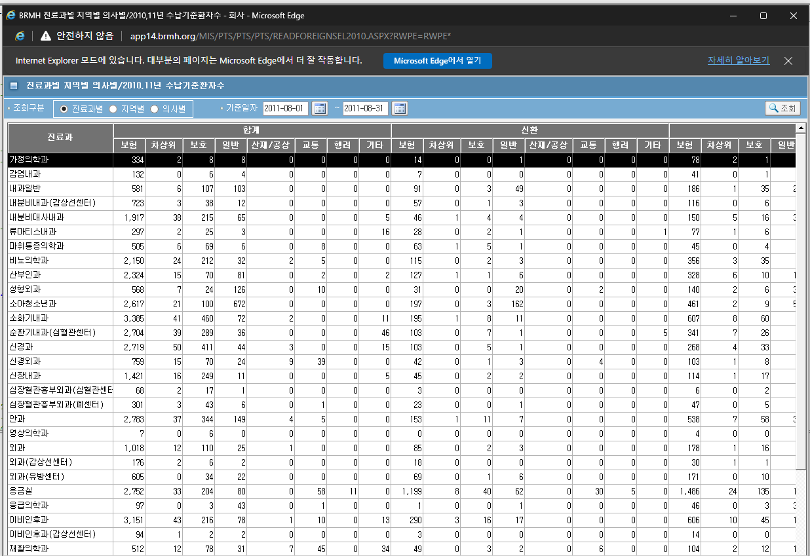
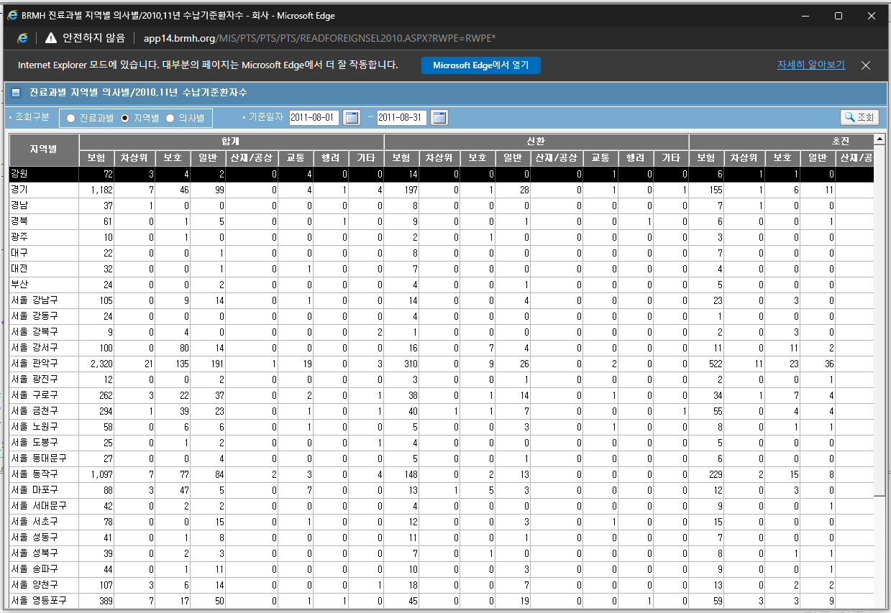
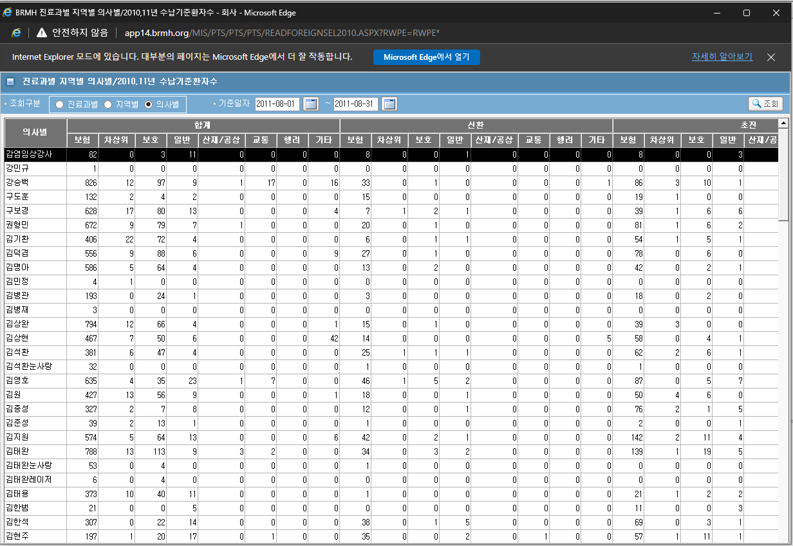
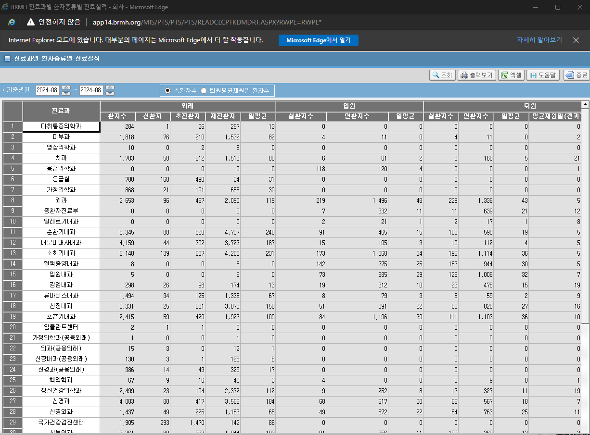
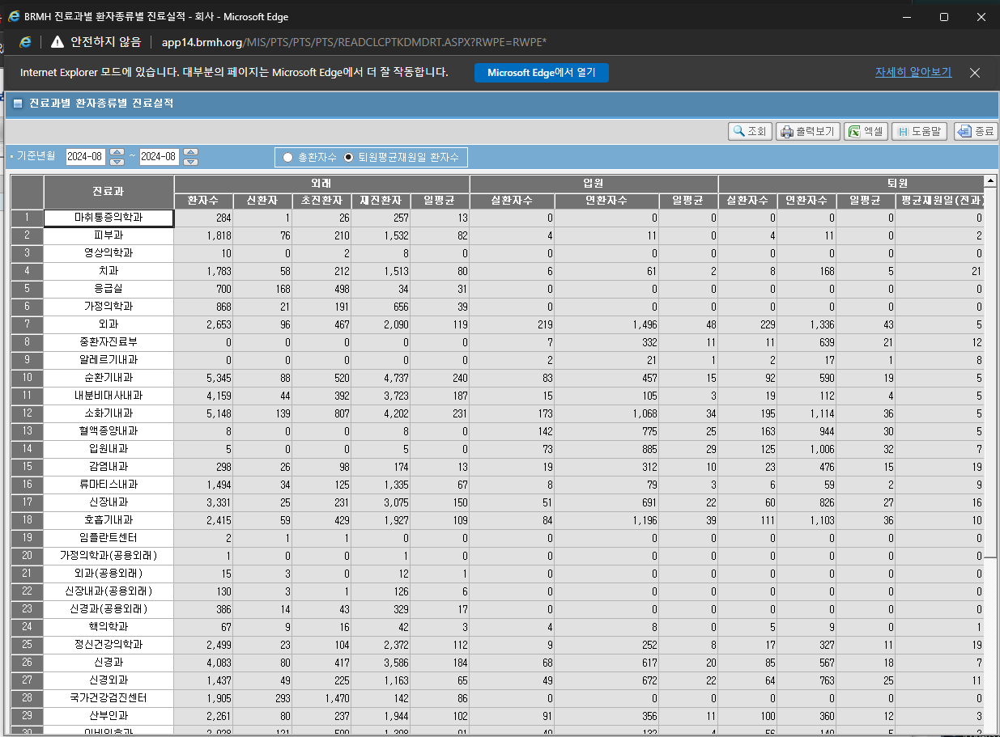
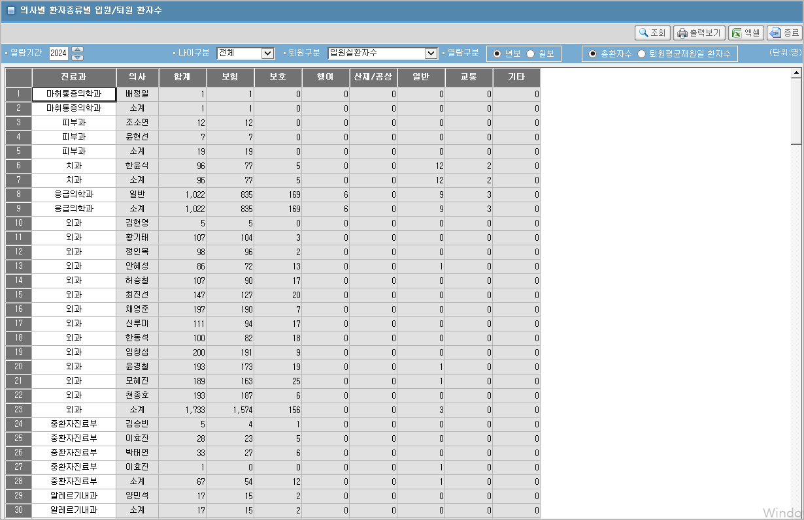
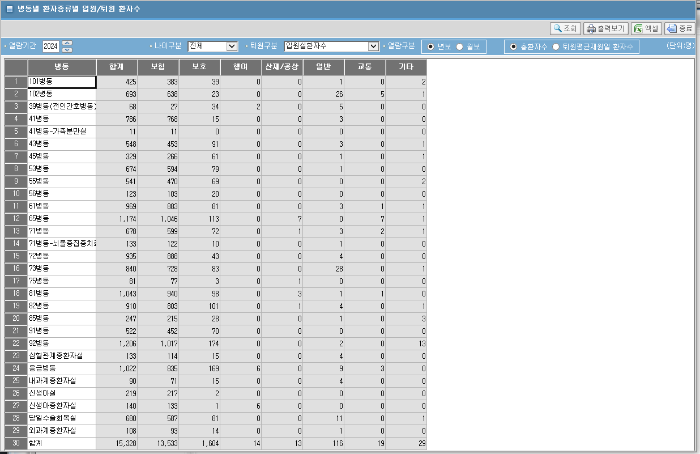

## 진료과별 지역별 의사별+2010,11년 수납기준환자수

- 2024-10-31-진료과별 지역별 의사별+2010,11년 수납기준환자수(진료과별)
    
> 완료<strong style="color:red">2024-10-30</strong>

- 2024-10-31-진료과별 지역별 의사별+2010,11년 수납기준환자수(지역별)
    
> 눈아픔

- 2024-10-31-진료과별 지역별 의사별+2010,11년 수납기준환자수(의사별)
    
> 눈아픔

## 진료과별 환자종류별 진료실적
- 
    - 총환자수
        
    
    - 퇴원평균재원일 환자수
        
    
    - /MIS/PTS/PTS/PTS/READCLCPTKDMDRT.ASPX

    - pkg_mis_pts_pts_pts02.pc_sel_pts02_income019_new
        - 화면과 주석이 다름

> 완료<strong style="color:red">2024-11-01</strong>

## 의사별 환자종류별 입원/퇴원 환자수
- 
    - 총환자수
        

        - /MIS/PTS/PTS/PTS/READDTPTKDYYIRTHPTCT.ASPX  
        - pkg_mis_pts_pts_pts02.pc_sel_pts02_income917  /  Pk_Pts.Pts_S917(pc_sel_pts02_income917_new)

        - in_look_typ
            - 상급병원 중증도 관리리스트 er99

            - 산부인과 ogob

        - 퇴원구분
            - 1:입원실환자수(등록최초과)/2:재원연환자수(전과반영)/3:재원실환자수(전과반영)/4:퇴원실환자수(최종과)/5:퇴원실환자수(전과반영)/6:퇴원연환자수(최종과)/7:퇴원연환자수(전과반영)    
    
    > 완료<strong style="color:red">2024-11-01</strong>

    - 퇴원평균재원일 환자수
        - 퇴원구분
            - 8:최종과(퇴원연환자/퇴원실환자)/9:전과반영(퇴원연환자/퇴원실환자)
        - 열람구분
            - 1:연보/2:월보/3:일보
        - 조회시작일자
        - 조회마감일자(월보,일보)
        - 나이구분
            - 3:전체/1:65세이상/2:65세미만
        - 고정값 1

    > godigka

## 병동별 환자종류별 입원/퇴원 환자수
- 
    

    - /MIS/PTS/PTS/PTS/READRMPTKDYYIRTHPTCT.ASPX
    - pkg_mis_pts_pts_pts02.pc_sel_pts02_income022  /  Pk_Pts.Pts_S908(pkg_mis_pts_pts_pts02.pc_sel_pts02_income022_new)

    - 퇴원구분
        - 1:입원실환자수(등록최초과)/2:재원연환자수(전과반영)/3:재원실환자수(전과반영)/4:퇴원실환자수(최종과)/5:퇴원실환자수(전과반영)/6:퇴원연환자수(최종과)/7:퇴원연환자수(전과반영)

    - 퇴원구분
        - 8:최종과/9:전과반영
