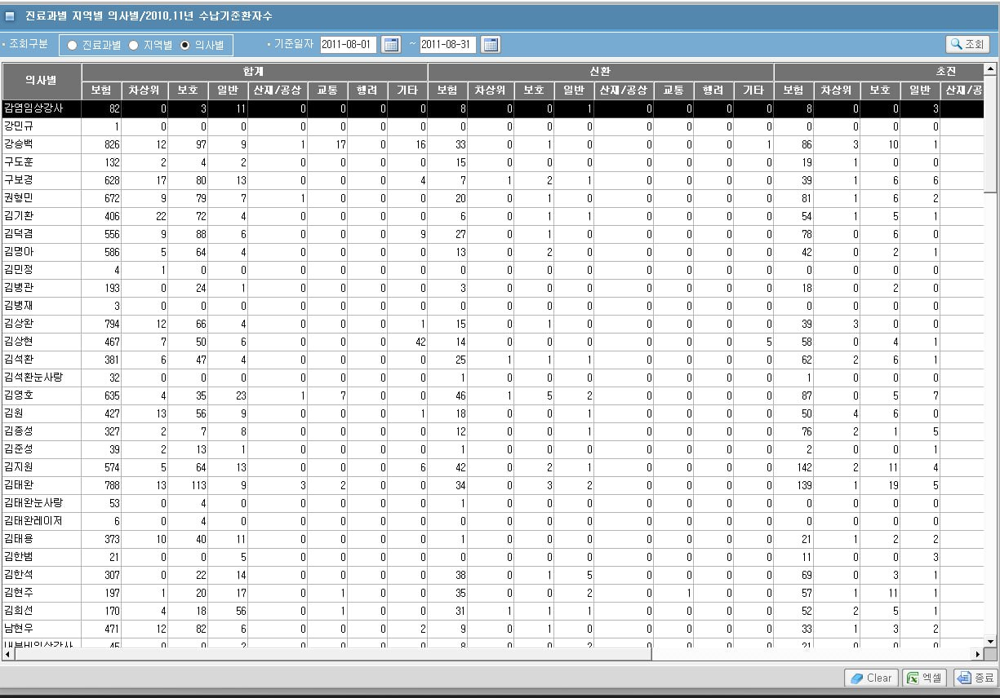
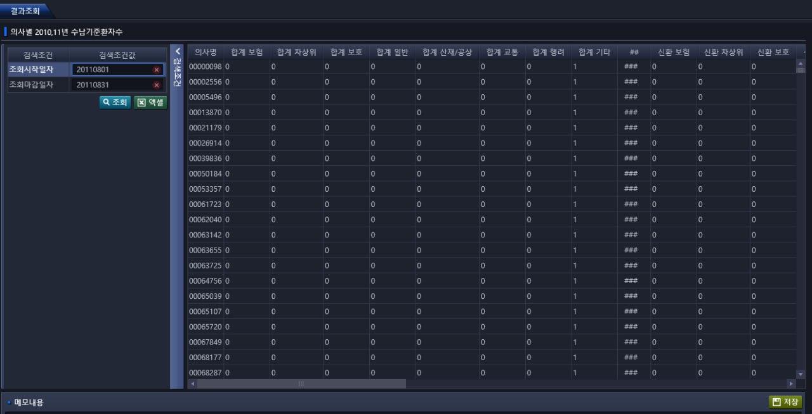
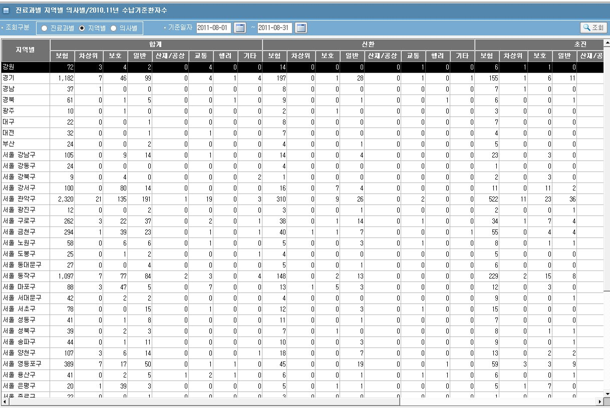
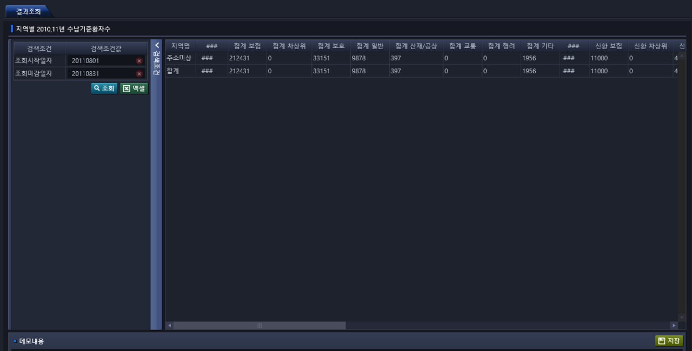
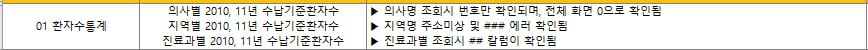

# 2024-11-21-팀장님_통합데이터관리데이터불일치건

- 

    - 작업하고  24년 8월 데이터로  ASIS하고확인하세요..

    - 

- 의사명이  ??????
- 구분자 ###값 지우기

    - 
    - 
    - 

- 차상위가 값이 안 나온다.

- 화면 
    - pkg_mis_pts_pts_pts04.pc_sel_pts04_income001

## 처리내역
- 화면
    - 의사별 2010,11년 수납기준환자수
        - 값 안 나옴
        - 구분자 ### 제거        
    
    
    - 지역별 2010,11년 수납기준환자수
        - 구분자 ### 제거
    
    
    - 진료과별 2010,11년 수납기준환자수
        - 구분자 ### 제거

