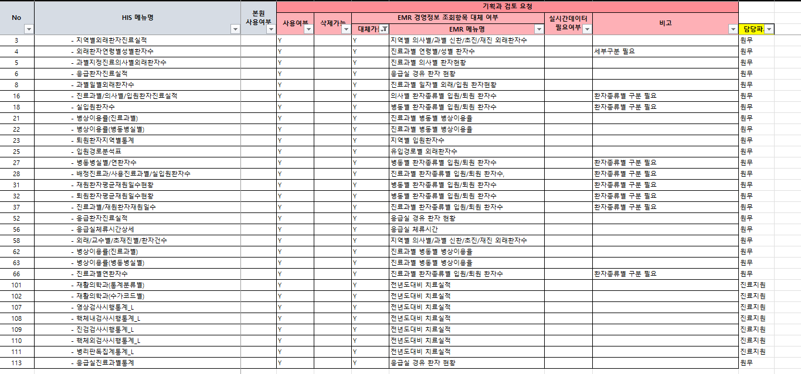

# 안되는 화면 찾기
파트장님 설명에 따르면, 선생님들이 조회가 안된다고 했다. 그래서 확인해보니 정말 그렇다. -> 서울대에서 가져온 화면이라 안될 이유가 없는데 안된다.

데이터가 쌓으는 곳을 확인해봐라, 모르겠으면 동명 책임한테 말해라.

- 안되는 화면들의 원인 찾기

- 언제까지? : 다음 주

## 파일 위치
```
쉐어포인트 경로
4.개발관리 -> 02.솔루션구축 -> 11.경영통계

파일명 : 붙임. 경영통계 관련 기획과 검토 결과 
```



- 예시 화면 : 지역별외래환자진료실적

## 안되는 화면들
- 지역별외래환자진료실적
- 외래환자연령별성별환자수
- 과별지정진료의사별외래환자수
- 응급환자진료실적
- 과별일별외래환자수
- 진료과별/의사별/입원환자진료실적
- 실입원환자수
- 병상이용률(진료과별)
- 병상이용률(병동병실별)
- 퇴원환자지역별통계
- 입원경로분석표
- 병동병실별/연환자수
- 배정진료과/사용진료과별/실입원환자수
- 재원환자평균재원일수현황
- 퇴원환자평균재원일수현황
- 진료과별/재원환자재원일수
- 응급환자진료실적
- 응급실체류시간상세
- 외래/교수별/초재진별/환자건수
- 병상이용률(진료과별)
- 병상이용률(병동병실별)
- 진료과별연환자수
- 재활의학과(통계분류별)
- 재활의학과(수가코드별)
- 영상검사시행통계_L
- 핵체내검사시행통계_L
- 진검검사시행통계_L
- 핵체외검사시행통계_L
- 병리판독집계통계_L
- 응급실진료과별통계


