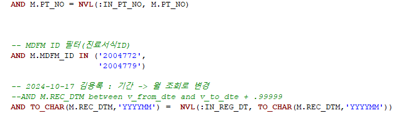
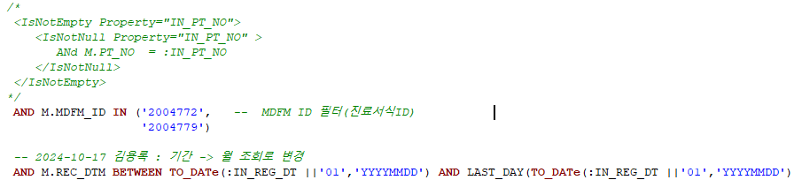

# 인덱스 설명
- 내가 기존에 짰던 쿼리를 보면 아래 처럼 짰는데, 1. NVL은 속도가 느리다. 2. TO_CHAR()문법으로 감싸게 되면 인덱스를 안타 속도가 느리다. 
    - 
    ```sql
    AND M.PT_NO = NVL(:IN_PT_NO, M.PT_NO)
    AND TO_CHAR(M.REC_DTM,'YYYYMM') =  NVL(:IN_REG_DT, TO_CHAR(M.REC_DTM,'YYYYMM'))
    ```
> nvl로 환자번호를 감싸서 인덱스를 안 타니까 느리다는 건가?

- 그래서 변경해준 쿼리는 환자번호는 ibats로 처리
    - 
    ```SQL
    <IsNotEmpty Property="IN_PT_NO">
        <IsNotNull Property="IN_PT_NO" >
           ANd M.PT_NO  = :IN_PT_NO
        </IsNotNull>
    </IsNotEmpty>
    AND M.REC_DTM BETWEEN TO_DATe(:IN_REG_DT ||'01','YYYYMMDD') AND LAST_DAY(TO_DATe(:IN_REG_DT ||'01','YYYYMMDD'))
    ```


- 호태 책임님꼐서 말씀하시길
    - 인덱스는 MRDDRECM에 내용 4천만권을 다 가져오지 않고, 그 데이터 만 찝어온다. / 잡고있다.
    - 어딘가에서 먼저 타고 가져온다.
> 인덱스를 신경 써서 짜면, 원하는 결과 값을 더 빠르게 가져올 수 있다.


## ALL_IND_COLUMNS 테이블에서 COLUMN_NAME 일렬로 나열해라
- 인덱스 조회 쿼리
    ```sql
    SELECT
        TABLE_NAME, INDEX_NAME
       ,LISTAGG(COLUMN_NAME,',') WITHIN GROUP (ORDER BY COLUMN_POSITION) AS COLUMN_NAME
    FROM ALL_IND_COLUMNS 
    WHERE TABLE_NAME = 'MRDDRECM'
    GROUP BY  TABLE_NAME, INDEX_NAME
    ORDER BY TABLE_NAME, INDEX_NAME
    ```


