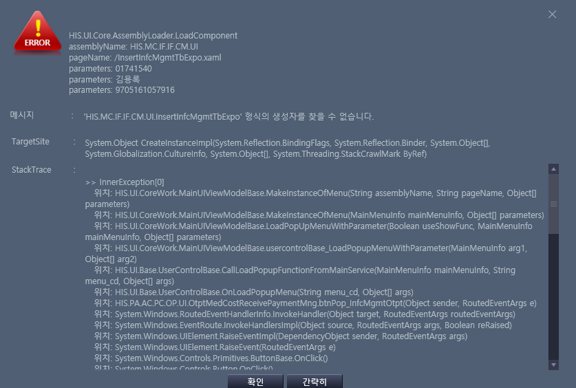
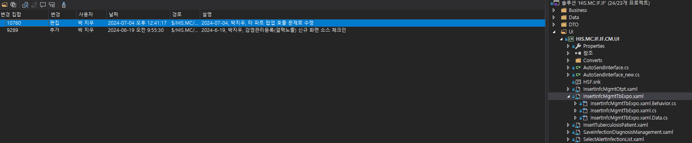

# 환자외래비수납화면결햑버튼애러
- 2024-09-24에 재강책임님이 시켜 감염관리결핵 추가했는데
버튼 에러난다고 한다. 

- 확인하고 수정

- 외래진료비수납 : HIS.PA.AC.PC.OP.UI.OtptMedCostReceivePaymentMng.xaml




## 확인


확인해 보니 외래비수납 화면은 정상적이다. 환자 만 안 넣으면 잘 열린다.

그럼 보내는 화면에서 안 받았나 보다.
- 아래 처럼 받아야 겠다.
    
    ```cs
    /// ---------------------------------------------------------------------
    /// <summary>
    /// name         : ModifyData
    /// desc         : 남부해바라기응급키트사용및의뢰현황조회 데이터를 수정
    /// author       : 김용록 
    /// create date  : 2024-08-26 오전 10:33:32
    /// update date  : 
    /// </summary>
    /// ---------------------------------------------------------------------
    private void ModifyData(string PatientType)
    {
        if (PatientType == "U")
        {
            foreach (SelectOneStopSEL_OUT Item in grdList.SelectedItems.Cast<SelectOneStopSEL_OUT>().ToList())
            {
                Item.IN_JOBTYPE = PatientType;
                PopUpBase pop = base.OnLoadPopupMenu("AC_HIS.PA.AC.PI.PI.UI_/OnestopMedicalReferMng", Item as SelectOneStopSEL_OUT);
                dynamic model = ((pop.GetContent()) as UserControlBase);
                pop.WindowStartupLocation = WindowStartupLocation.CenterScreen;
                pop.Owner = Window.GetWindow(this);
                pop.Show();
            }
        }
        else {
            PopUpBase pop = base.OnLoadPopupMenu("AC_HIS.PA.AC.PI.PI.UI_/OnestopMedicalReferMng");
            pop.WindowStartupLocation = WindowStartupLocation.CenterScreen;
            pop.Owner = Window.GetWindow(this);
            pop.Show();
        }
    }
    ```


- HIS.MC.IF.IF.CM.UI/InsertInfcMgmtTbExpo.xaml
    - 감염관리 : AC_HIS.PA.AC.PE.PS.UI_/InsertInfcMgmtOtpt.xaml
    - 감염관리(결핵) : AC_HIS.PA.AC.PE.PS.UI_/InsertInfcMgmtTbExpo.xaml

- 아 MC 확인할 수 없어서 은선이한테 부탁스,,,

    


PopUpBase pop = base.OnLoadPopupMenu("AC_HIS.PA.AC.PC.OP.UI.OtptMedCostReceivePaymentMng")


## 박지우 책임님 텔레
안녕하세요 박지우 책임님
원무에 김용록 책임이라고 합니다!

바쁘신데 죄송합니다. 다름이 아니라 저희 쪽 외래진료비수납 화면에서 감염관리등록(외래) 화면과 동일하게 감염관리등록(결핵노출) 화면을 팝업으로 호출합니다!

환자 조회 없이 보낼 땐, 잘 나오는 반면에
환자 조회 후에(환자번호,환자이름,주민번호), 화면을 호출 하면 생성자를 찾을 수 없다는 오류문이 나오는데

감염관링등록(외래) 화면과 감염관리등록(결핵노출) 화면이 받는 값이 다른 지 여쭤봐도 될까요?

- HIS.MC.IF.IF.CM.UI/InsertInfcMgmtTbExpo.xaml


연결/image_2024-09-24_16-24-07.png)


## 박지우 책임님 답장 
PopUpBase pop = OnLoadPopupMenu("AC_HIS.PA.AC.PE.PS.UI_/InsertInfcMgmtTbExpo.xaml", PT_NO,PT_NM,SSN1,PACT_TP_CD);

파라미터 
PT_NO : 환자번호
PT_NM : 환자명
SSN1 : 주민번호 -> 앞자리 여섯개만 조회할 거임 형식은 앞자리 6개만 존재하면 됨
PACT_TP_CD:  수진구분  (O,I,E)


- uc_ptno.model.SelectPatientInfoOutObj.PACT_TP_CD 만 추가하면 될 거 같다.

## 형준 책임님이 수정 중이셔서
```cs
// 2024-10-21 김용록 : 감염관리(결핵) 파라미터 PACT_TP_CD:  수진구분  (O,I,E) 추가
pop = base.OnLoadPopupMenu("AC_HIS.PA.AC.PE.PS.UI_/InsertInfcMgmtTbExpo.xaml", uc_ptno.model.SelectPatientInfoOutObj.PT_NO, uc_ptno.model.SelectPatientInfoOutObj.PT_NM, uc_ptno.model.SelectPatientInfoOutObj.PT_RRN.Substring(0,6) , uc_ptno.model.SelectPatientInfoOutObj.PACT_TP_CD );
```

추가해달라고 메세지 보내놨다.