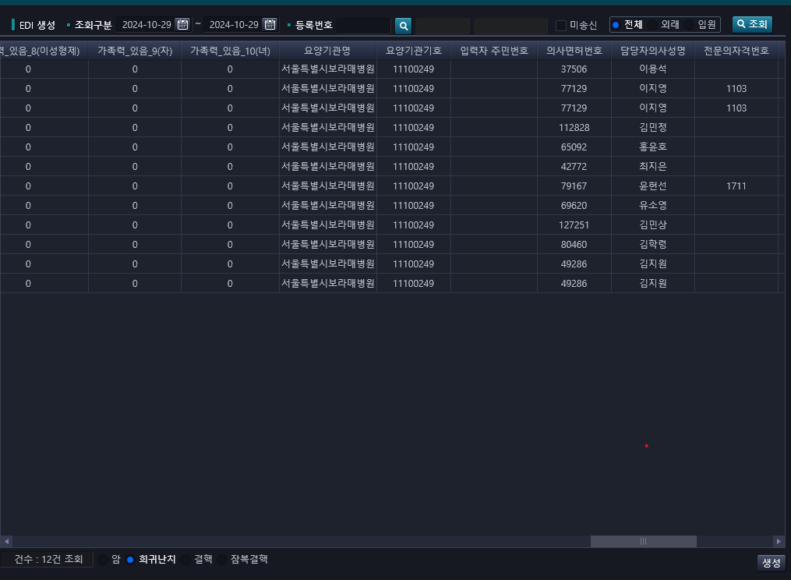

## 보낸 메일 1

01744625 문현준 환자 10월 24일 EDI 전송 건, 다시 반송돼서 전달드립니다.

- 반송사유 : CT검사지 첨부 후, 재전송 요망

이상입니다.

## 보낸 메일 2

1. 수정 후 전송 

    01550334 권소정 
    - 산부인과 / V162(D35.2) / 황규리
    - 반송사유 : 확진일자 상이
    작성해준 신청서에 확진일자가 (2024-06-12)인데, (2024-10-28)로 수정해서 올렸습니다.

    00066791 나영자
    - 신장내과 / V001(N18.5) / 김지영
    - 반송사유 : 확진일자 상이
    작성해준 신청서에 확진일자가 (2020-05-11)인데, 요양기관정보마당에서 확인해보니 이미 V001로 (2024-10-25)부터 산정특례 받고 있어 신청하지 않았습니다.

    00839278 김수진
    - 반송사유 : 담당의사전문과목 상이(한글로 만 입력)
    혈액종양내과(암센터) -> 혈액종양내과 로 변경 후, 요양기관정보마당 사이트에서 신청해드렸습니다.

    00950770 임동혁
    - 반송사유 : 기타 필수항목 누락
    입력자주민번호가 비어있어, 용양기관정보마당에서 환자 주민번호 앞자리로 수정 후, 전송 

2. 반송 사항 
    01204150 김외연
    - 신청일자 : 2024-10-28
    - 병명 : V193(C22.1) / 이재원 / 외과
    - 반송사유 : 의사면허번호 종류 상이함

    016112054 이해정아기
    - 신청일자 : 2024-10-26
    - 반송사유 : 주민등록번호 상이
    알고 계시 듯, 제가 매일 조회해서 정상 주민번호 발급되는 거 확인 후 처리 후, 보고해 드리겠습니다.

## 누락 환자 건

1. 암
    - 00104944 정고송 -> 재등록 확인
    - 01744625 문현준 -> 죄송합니다. 되어있는 거 확인했습니다.
    - 00938514 박정갑 -> 재등록 확인

    - 01725167 박영민 -> 반송사유 : 의료급여 기등록건>지사로 문의
    - 00953094 송인욱 -> 의사정보(변윤환/115341) 및 신청일자(2024-10-25) 변경 후, 전송

    - 01625243 이용운 -> 재등록 확인

2. 희귀/난치
    - 00433007 한건 -> 반송사유 : 의료급여 기등록건>지사로 문의

아 ㅣ삽라 ㅇ여기 숨어 있었네

## 현석 책임님께 말해야 할 거
- 2024-10-29, 요양기관정보마당에서 신청
    - 00839278 김수진 -> 정상승인 확인
    - 00950770 임동혁 -> 정상승인 확인
    - 00953094 송인욱 -> 정상승인 확인

## 전하림 선생님 여쭤볼거
   - 01725167 박영민 -> 반송사유 : 의료급여 기등록건>지사로 문의
   신청일자 발행일자 변경

- 공동 문제    
    - 암으로 신청 시, 단체 입력자 주민번호 없음
       

    - 희귀도 마찬가지
       

## 2024-10-29 수요일 신청 건 메일

신청일이 29일 건 중 
암/희귀난치/잠복결핵 건에서는 반송이 없었고, 
결핵 환자 (01596826 장호덕)
- 반송사유 : EDI 접수자료 기접수건이 존재함

추가적으로 신청일(2024-10-14)에 주민번호 상이했던 (01993356 손선진아기 -> 박이솜) 환자 주민번호와 이름 갱신된 거 확인돼서 신청했는데 반송됐습니다.
- 반송사유 : EDI 접수자료 등록 신청일자 상이함(신청일부터 전산등록일이 14일 경과)

신청일자 유효기간이 2주로 알고있어서 14일 그대로 넣었는데, 승인일이 30일이라 반송된 거 같습니다. 신청일 변경하고 신청해도 될지 문의드립니다.

## 메일 내용 관련해서 ## 
메일 내용 중에 (00950770 임동혁) 반송사유가 기타 필수항목 누락이었던 건 같은 경우 요양기관정보마당에서 입력자주민번호가 "필수 값"이 아니었는데, ktedi로 신청할 때, 입력자주민번호가 없으면 문서를 불러 올 수 없습니다. 이런 경우 "환자 주민번호 앞자리"나 "000000"으로 대체해도 되는지 문의드립니다.

"반송내역 자체 판단 -> 수정 전송으로 인한 문제 발생시 책임지셔야 합니다." 숙지했으니 반송 시, 수정 없이 즉각적으로 전하림 선생님께 문의 드리겠습니다.

감사합니다.

> 안내하는 담당자지 전산은 모른다.

## 2024-10-29 목요일 신청 건 메일

