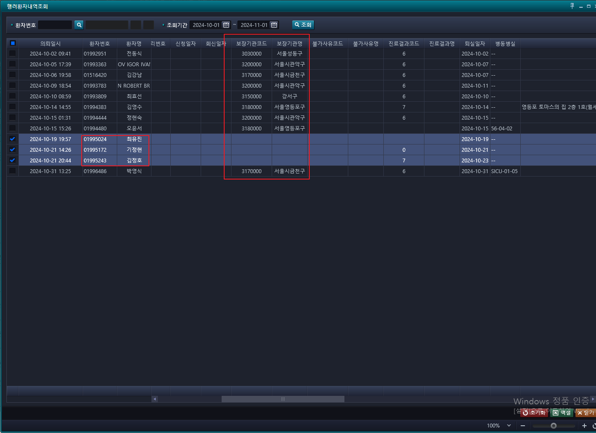
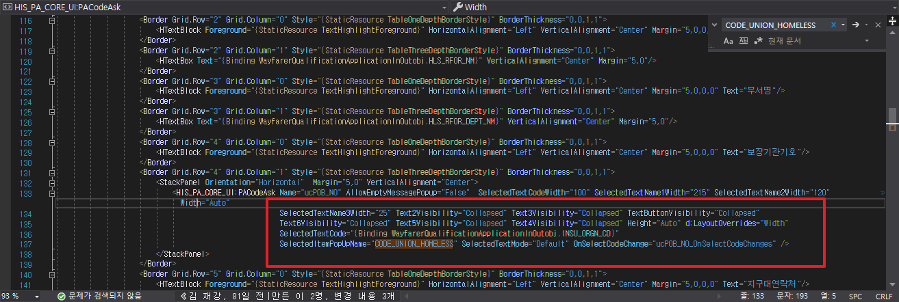
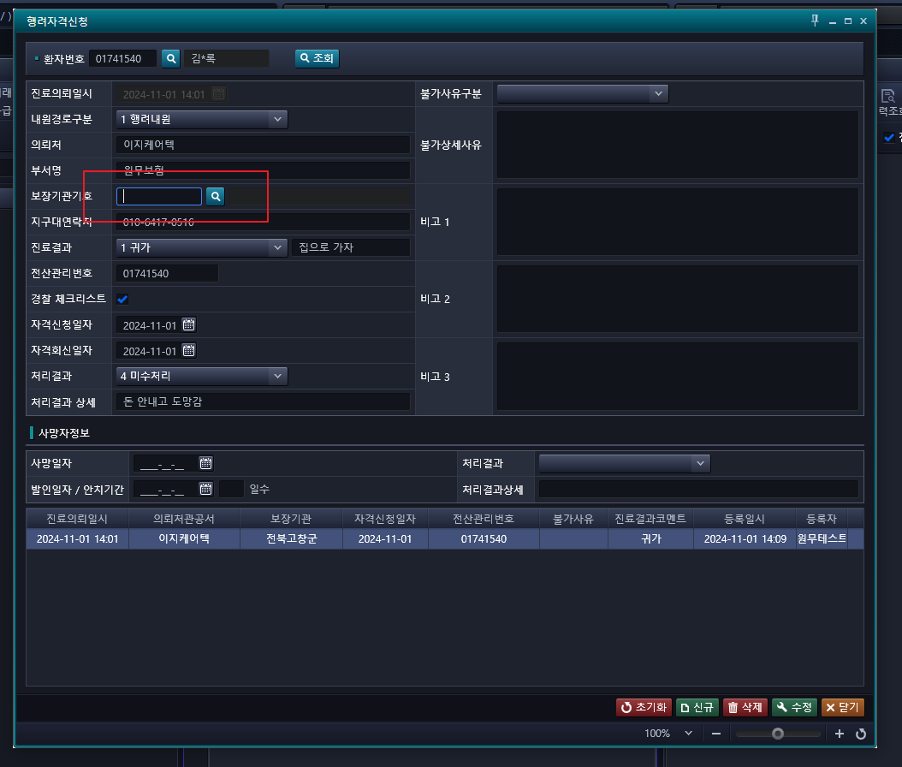

## 32번 행려환자내역조회

- 241029)수정 완료 된 건. [행려환자신청]화면에서 모든 내용을 저장 후에 보장기관기호 등이 화면에 저장 되지 않음.

- 01995024 최유진 0001274459811
- 01995172 기정현 6905291622111
- 01995243 김정호

- pipi WayfarerQualificationApplication.xaml.Behavior.cs 수정
    - 보험자기관코드 강제로 바인딩 시킴 
    - 자믈에서 CODE_UNION_HOMELESS 에러나는데 변경 후 실행

    

    
    - 저장은 잘 되는데, 여기 바인딩이 안되네, 이 상태로 수정했으면 안 나왔겠다.
