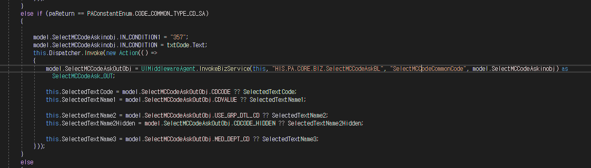
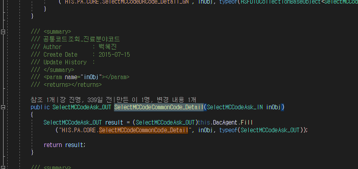
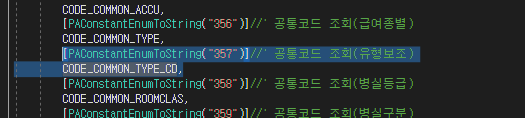
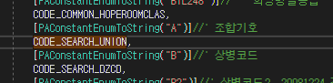
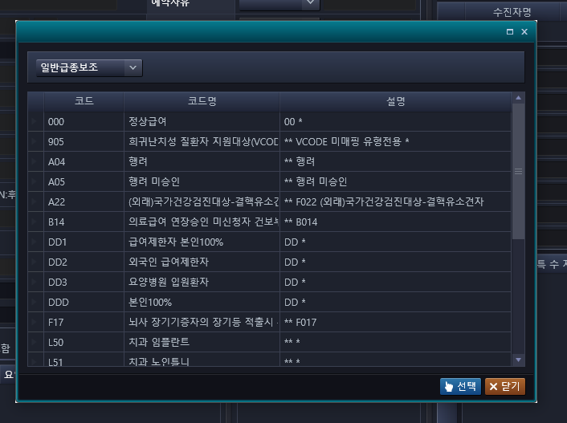

# 
## 유형보조 화면 검색기능 요청.

- ex)계약처코드에는 검색 기능 있음."	
- 박주양	
- 241025)진행 예정


```cs
<HIS_PA_CORE_UI:PACodeAsk 
Name="ucPSE_CLS_CD" 
AllowEmptyMessagePopup="False" 
Margin="5,0,0,0" 
SelectedTextCodeWidth="35" 
SelectedTextName1Width="170" 
SelectedTextName2Width="120" 
Width="Auto" 
SelectedTextName3Width="25" 
Text2Visibility="Collapsed" 
Text3Visibility="Collapsed" 
TextButtonVisibility="Collapsed" 
Text6Visibility="Collapsed" 
Text5Visibility="Collapsed" 
Text4Visibility="Collapsed" 
Height="Auto" 
d:LayoutOverrides="Width"
SelectedTextCode="{Binding Path=SelectAnewPatientRegACPPRPIDInOutObj.PSE_CLS_CD, Mode=TwoWay, UpdateSourceTrigger=PropertyChanged}" 

SelectedItemPopUpName="CODE_COMMON_TYPE_CD" 
SelectedTextCodeMaxLength="3" 

KeyUp="ucPSE_CLS_CD_KeyUp" 
SelectedTextMode="AlphaNumeric" 
OnSelectCodeChange="ucPSE_CLS_CD_OnSelectCodeChanges" />
```
- pop.Content = HIS.UI.Core.AssemblyLoader.LoadComponent("HIS.PA.CORE.AC.PM.UI", "CommonCodePopupAsk");
    - 여기 보면 2는 검색 기능이 없고 얘는 있음
        - HIS.PA.CORE.AC.PM.UI.CommonCodePopupAsk2




- BIZ : HIS.PA.CORE.BIZ.SelectMCCodeAskBL / SelectMCCodeCommonCode

    


- BIZ : HIS.PA.CORE.DAC.SelectMCCodeAskDL / SelectMCCodeCommonCode
- EQS : HIS.PA.CORE.SelectMCCodeCommonCode


- UI : HIS.PA.CORE.UI.UTIL.PAConstantEnum.cs

    

    

    


- BEHAVIOR에 3249번째 줄 참고

```CS
                    else if (PAConstantEnum.CODE_DZCD == paReturn
                       || PAConstantEnum.CODE_COMMON_NATION == paReturn)  //2016-04-28 정종우 추가.  요청자 이항범. )                        
                    {
                        if (PAConstantEnum.CODE_DZCD == paReturn)
                        {
                            PopUpBase pop = new PopUpBase();
                            pop.Content = HIS.UI.Core.AssemblyLoader.LoadComponent("HIS.PA.CORE.AC.PM.UI", "CommonCodePopupAsk");
                            (pop.Content as dynamic).model.Constant = PAConstantEnum.CODE_SEARCH_DZCD2.ToString();
                            (pop.Content as dynamic).model.CODEGUBN = SelectedItemEnumProperty;
                            (pop.Content as dynamic).model.CODEGTEXT = SelectedIsNullValue(SelectedTextCode);
                            pop.Width = 460;
                            pop.Height = 400;
                            if (!onTheHPopUp)
                                ControlHelper.PositionSetting(pop, this);
                            else
                            {
                                pop.Topmost = true;
                                ControlHelper.PositionSetting(pop, this, true);
                            }

                            if (!string.IsNullOrEmpty(CommonCodePopupAskCDCODE))
                                (pop.Content as dynamic).CDCODE = CommonCodePopupAskCDCODE;

                            if (!string.IsNullOrEmpty(CommonCodePopupAskCDVALUE))
                                (pop.Content as dynamic).CDVALUE = CommonCodePopupAskCDVALUE;

                            if (!string.IsNullOrEmpty(PassingReference))
                            {
                                this.Dispatcher.BeginInvoke(DispatcherPriority.Send, (System.Threading.ThreadStart)delegate
                                {
                                    (pop.Content as dynamic).TxtCode().Text = PassingReference;
                                    ControlHelper.ControlAutomationPeer((pop.Content as dynamic).BtnPopupSearch());
                                });
                            }

                            pop.ShowDialog();

                            if ((pop.Content as dynamic).model.SelectCommonCodePopupAsk != null)
                            {
                                this.Dispatcher.Invoke(new Action(() =>
                                {
                                    this.SelectedTextCode = (pop.Content as dynamic).model.SelectCommonCodePopupAsk.CDCODE ?? SelectedTextCode;
                                    this.SelectedTextName1 = (pop.Content as dynamic).model.SelectCommonCodePopupAsk.CDVALUE ?? SelectedTextName1;
                                }));
                            }

                            if (OnSelectedCommonCodePopupAsk2Change != null)
                                OnSelectedCommonCodePopupAsk2Change((pop.Content as dynamic).model.SelectCommonCodePopupAsk);
                        }
                    }


                    else if (PAConstantEnum.CODE_MEDDEPT_DETAIL == paReturn)
                    {
                        PopUpBase pop = new PopUpBase();
                        pop.Content = HIS.UI.Core.AssemblyLoader.LoadComponent("HIS.PA.CORE.AC.PM.UI", "CommonDetailMEDDEPTPopup");

                        pop.Width = 450;
                        pop.Height = 400;
                        if (!onTheHPopUp)
                            ControlHelper.PositionSetting(pop, this);
                        else
                        {
                            pop.Topmost = true;
                            ControlHelper.PositionSetting(pop, this, true);
                        }

                        if (!string.IsNullOrEmpty(PassingReference))
                        {
                            this.Dispatcher.BeginInvoke(DispatcherPriority.Send, (System.Threading.ThreadStart)delegate
                            {
                                (pop.Content as dynamic).TxtDtlmeddeptcdControl().Text = PassingReference;
                            });
                        }

                        pop.ShowDialog();

                        //this.Dispatcher.BeginInvoke(DispatcherPriority.Send, (System.Threading.ThreadStart)delegate
                        //{
                        if ((pop.Content as dynamic).model.SelectedMCCodeDetailOutObj != null)
                        {
                            this.Dispatcher.Invoke(new Action(() =>
                            {
                                this.SelectedTextCode = (pop.Content as dynamic).model.SelectedMCCodeDetailOutObj.DTL_MED_DEPT_CD ?? SelectedTextCode;
                                this.SelectedTextName1 = (pop.Content as dynamic).model.SelectedMCCodeDetailOutObj.DTL_MED_DEPT_NM ?? SelectedTextName1;
                                this.SelectedTextName4 = (pop.Content as dynamic).model.SelectedMCCodeDetailOutObj.BLNG_MED_DEPT_CD ?? SelectedTextName4;
                                this.SelectedTextName3 = (pop.Content as dynamic).model.SelectedMCCodeDetailOutObj.CTR_DEPT_CD ?? SelectedTextName3;
                            }));
                        }
                        //});

                        //});
                        //}).Start();
                    }

```


```CS

                    else if (PAConstantEnum.CODE_COMMON_TYPE_CD == paReturn)
                    {
                        PopUpBase pop = new PopUpBase();
                        pop.Content = HIS.UI.Core.AssemblyLoader.LoadComponent("HIS.PA.CORE.AC.PM.UI", "CommonCodePopupAsk");

                        pop.Width = 450;
                        pop.Height = 400;
                        if (!onTheHPopUp)
                            ControlHelper.PositionSetting(pop, this);
                        else
                        {
                            pop.Topmost = true;
                            ControlHelper.PositionSetting(pop, this, true);
                        }

                        if (!string.IsNullOrEmpty(PassingReference))
                        {
                            this.Dispatcher.BeginInvoke(DispatcherPriority.Send, (System.Threading.ThreadStart)delegate
                            {
                                (pop.Content as dynamic).TxtDtlmeddeptcdControl().Text = PassingReference;
                            });
                        }

                        pop.ShowDialog();

                        //this.Dispatcher.BeginInvoke(DispatcherPriority.Send, (System.Threading.ThreadStart)delegate
                        //{
                        if ((pop.Content as dynamic).model.SelectedMCCodeDetailOutObj != null)
                        {
                            this.Dispatcher.Invoke(new Action(() =>
                            {
                                this.SelectedTextCode = (pop.Content as dynamic).model.SelectedMCCodeDetailOutObj.DTL_MED_DEPT_CD ?? SelectedTextCode;
                                this.SelectedTextName1 = (pop.Content as dynamic).model.SelectedMCCodeDetailOutObj.DTL_MED_DEPT_NM ?? SelectedTextName1;
                                this.SelectedTextName4 = (pop.Content as dynamic).model.SelectedMCCodeDetailOutObj.BLNG_MED_DEPT_CD ?? SelectedTextName4;
                                this.SelectedTextName3 = (pop.Content as dynamic).model.SelectedMCCodeDetailOutObj.CTR_DEPT_CD ?? SelectedTextName3;
                            }));
                        }
                        //});

                        //});
                        //}).Start();
                    }

```





this.Dispatcher.Invoke(new Action(() =>
                {
                    model.SelectMCCodeAskOutObj = UIMiddlewareAgent.InvokeBizService(this, "HIS.PA.CORE.BIZ.SelectMCCodeAskBL", "SelectMCCodeCommonCode", model.SelectMCCodeAskinobj) as SelectMCCodeAsk_OUT;

                    this.SelectedTextCode = model.SelectMCCodeAskOutObj.CDCODE ?? SelectedTextCode;
                    this.SelectedTextName1 = model.SelectMCCodeAskOutObj.CDVALUE ?? SelectedTextName1;

                    this.SelectedTextName2 = model.SelectMCCodeAskOutObj.USE_GRP_DTL_CD ?? SelectedTextName2;
                    this.SelectedTextName2Hidden = model.SelectMCCodeAskOutObj.CDCODE_HIDDEN ?? SelectedTextName2Hidden;

                    this.SelectedTextName3 = model.SelectMCCodeAskOutObj.MED_DEPT_CD ?? SelectedTextName3;
                }));

## 다시 
진짜 EQS
- HIS.PA.CORE.SelectCommonCodePopupTYPECD