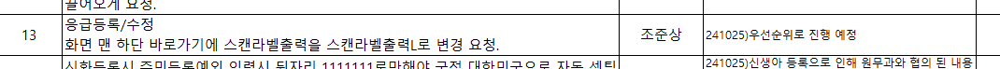
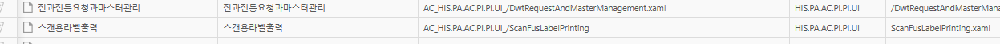
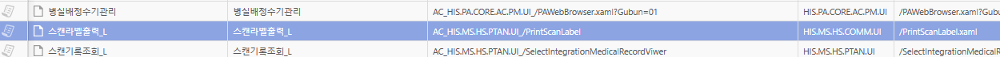
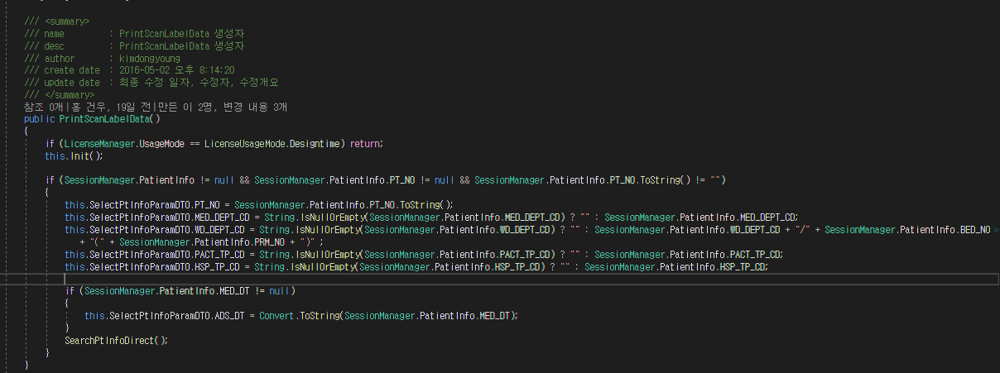
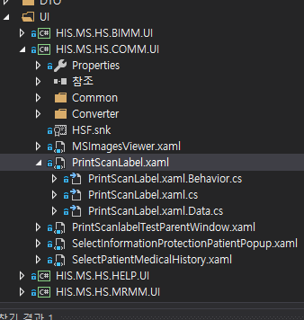
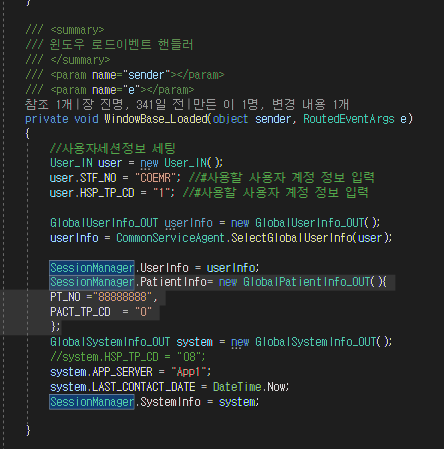

# 


- 응급등록/수정
- AC_ERCOMN_HIS.PA.AC.PE.AP.UI_/EmergencyAnewMng

## EAM 팝업 URL 확인

- 스캔용라벨출력
    
    - 
    - AC_HIS.PA.AC.PI.PI.UI_/ScanFusLabelPrinting

- 스캔라벨출력_L
    
    - 
    - AC_HIS.MS.HS.PTAN.UI_/PrintScanLabel


## 화면 확인

- 

- 

재강 책임님한테 물어보니 세션 안에 값은 환자 조회하고 그냥 보내면 자동으로 들어간다고 함


## 방법1
```cs
SessionManager.PatientInfo= new GlobalPatientInfo_OUT(){
            PT_NO ="88888888",
            PACT_TP_CD  = "O"
            };

```

- HIS.PA.CORE.MAIN.UI.DebugMain

    - 


- 내가 짠 코드 -> 메모리 오류로 확인을 못해 올리진 않았음
```cs

                            SessionManager.PatientInfo = new GlobalPatientInfo_OUT()
                            {
                                PT_NO = (pt_no_cell.Content as TextBlock).Text, // ucPt_no.SelectedTextCode,
                                PACT_TP_CD = "O"
                            };

                            pop = base.OnLoadPopupMenu("AC_HIS.MS.HS.PTAN.UI_/PrintScanLabel");

                            (pop.GetContent() as dynamic).ISPOPUP = true;
                            //(pop.GetContent() as dynamic).PTNO = this.ucPt_no.SelectedTextCode; // 환자번호

                            // (pop.GetContent() as dynamic).SCANLABELGB = 3; //선택진료라벨 호출
                            pop.WindowStartupLocation = WindowStartupLocation.CenterScreen;
                            pop.ShowDialog();

```


2번

입원 등록 --> 입워ㅗㄴ 지시 -?> 미래 일자가 있으면 
자동으로 가장 가까운걸로 선택

