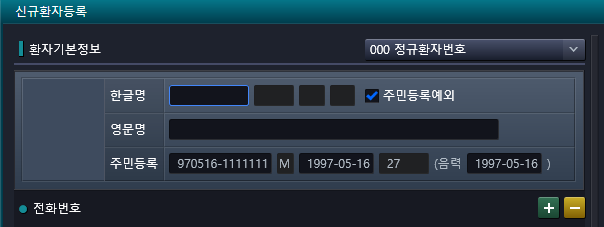

# 2024-11-13-동명책임_응급원무고도화5_신규환자국적
- 14번 

- 문의 내용 : 신환등록시 주민등록예외 입력시 뒷자리 1111111로만해야 국적 대한민국으로 자동 셋팅
    - 1000000으로 입력해도 국적 자동셋팅되게 요청.
    
    - 241025)신생아 등록으로 인해 원무과와 협의 된 내용으로 보임. 
    
    - 대신 5로 시작하는 주민등록번호도 대한민국으로 국적 표시되는 부분 수정하기로 함.

- 신규환자등록 화면
    - AC_HIS.PA.AC.PI.PI.UI_/AnewPatientRegistration
        - 
        - 

## 

- HIS.PA.CORE.UI.UTIL
    - CommonList.cs

- 신환 환자, 주민등록 예외 입력 시, 국적 경우의 수 추가(응급원무고도화 14번)

9705161111111

,"1000000"
,"2000000"
,"3000000"
,"4000000"
,"5000000"
,"6000000"
,"7000000"
,"8000000"
,"9000000"