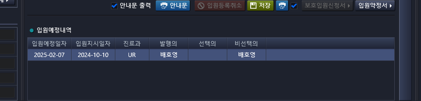
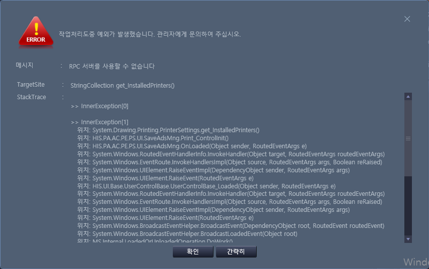

# 2024-11-13-동명책임_응급원무고도화6_입원등록수정다중예약
- 2반

- 요청 내용 : 입원등록/수정- 입원내역 
    - 입원 예약이 다중으로 있을시 미래날짜로 자동 셋팅->금일 입원내역으로 자동 셋팅
    - 입원지시가 여러개인 환자들의 경우 오늘로부터 가장 가까운 날짜로 세팅 요청, 일수가 같은 건 처리는 개발팀에서 임의설정 요청

- 화면
    - 입원등록/수정
    - AC_HIS.PA.AC.PE.PS.UI_/SaveAdsMng.xaml

## 

- 그리디 알고리즘으로 해결

## 추가 에러 확인

화면 실행할 때 발생하는 에러
