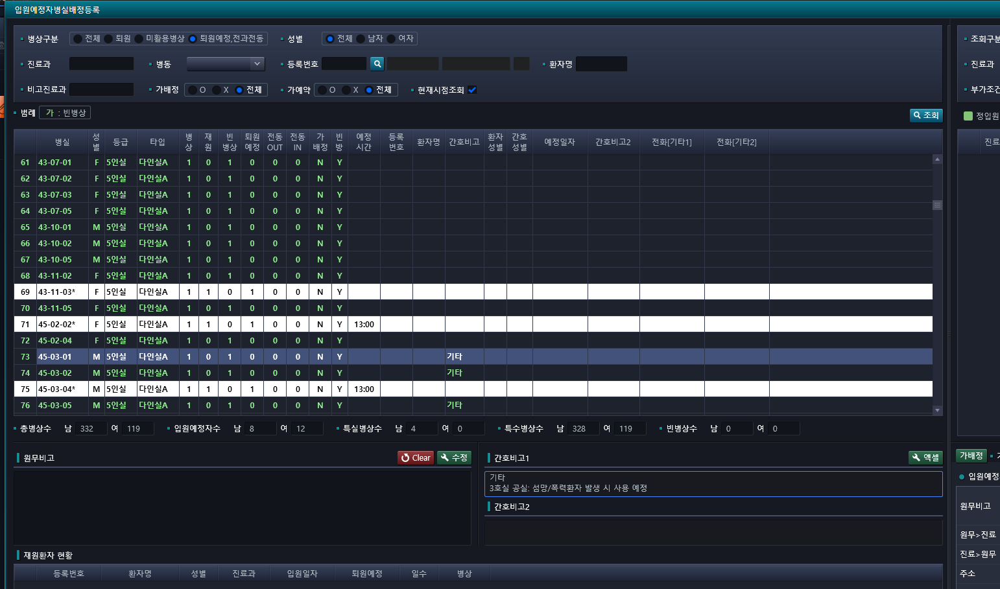

# 2024-11-18-동명책임_응급원무고도화7_응급화면개인정보동의서
## 이번주 응급원무 고도화
### 55번
- 화면정보 : 응급진료비수납
    - AC_HIS.PA.AC.PC.OP.UI_/EmergencyMedCostReceivePaymentMng.xaml
- 내용
    - 55  개인정보동의서 팝업 응급화면에도 구현
        - => 외래진료비 수납에 있음
        - AC_HIS.PA.AC.PC.OP.UI_/OtptMedCostReceivePaymentMng.xaml_O
    - 개인정보동의서 팝업 응급화면에도 구현


- 운영기 테스트 환자
    - 01998467 서명 안됨
    - 00725586 서명 됨

> 처리 완료


### 47번
- 내용
    - 입원
    - 다시서기번호 노숙인
    - 급여유형에 있음 / 다시서기 버튼이 있음
    
    - 외래랑 응급에 있는데 -> 입원은 자동으로 되게 해달라
     
    - 환기본정보변경

    - "응급진료비수납
    노숙인 다시서기번호 입력되어있는데 수납시 재입력해야되는것 수정요청.
    Ex) 01995243 김정호
    다시서기번호 환자기본정보에 입력되어있음. 수납화면에서는 다시서기번호 자동으로 안끌려오고 급여유형에서 돋보기버튼 눌러서 끌어와야함. 자동으로 입력되게 수정요청"
    - 241025)외래 화면은 지금으로 유지하고 응급화면은 요청주신대로 수정 진행예정
    
- 이거 화면 물어봐야 함    

> 외래진료비수납은 현석책임님이 수정 중(외래진료비수납이면 cs 26566 줄에 추가하면 될듯)
- ```cs
    SearchNextupNo();
    ```


### 19번
- 화면정보 : 입원예정자병실배정등록
    - DR_HIS.PA.AC.PE.PS.UI_/AdmissionExpectationPatientPatientRoomAssignmentRegistration.xaml
- 내용
    - "입원예정자병실배정등록
    간호비고에 기타로만 표기되어 한눈에 확인하기 어려움이에 기타가 아닌 입력해놓은 세부 내용이 클릭안해도 일정 부분까지 보이게 표기 요청.  ex) EMR"
    
    - 이게 뭔 소리냐

        - 
            - 기타에 개행 없애라


    - 241025) 간호화면에서 '기타' 선택 후 free text로 입력한 내용이 개행되어 보이지 않는 것으로 보여, 개행되지 않게 하거나 '기타'를 빼는 등의 방법 확인 해보시기로 함.
    
    