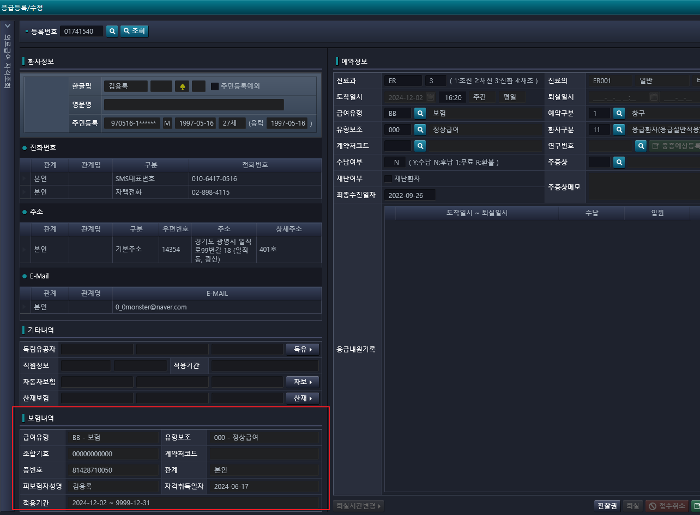
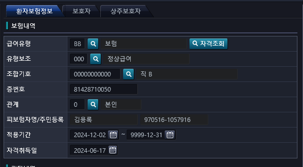
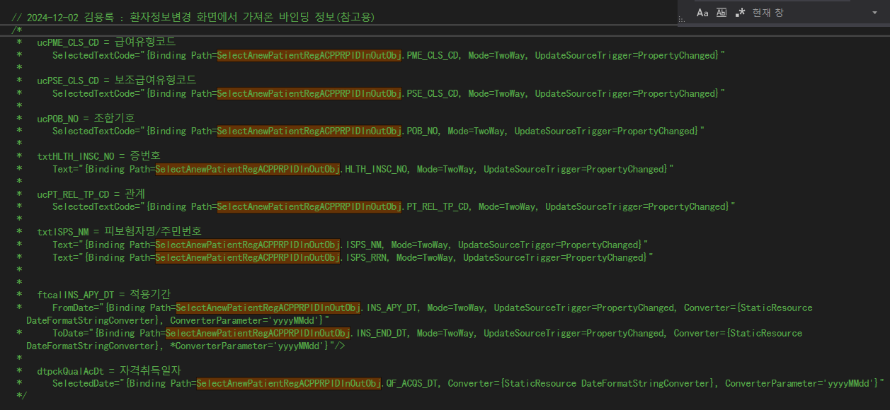

# 2024-11-29-현석책임_응급원무고도화_실시간자격조회

- 응급등록수정환자자격정보
- 내용
    - 응급등록수정 화면에 환자기본정보변경에 있는 자격조회 정보를 가지고 있게 해야한다.
        - 환자 번호가 조회 됐을 때 , 같이 그 정보에 대한 dto를 가지고 있으면 될 거 같음.

- 화면명 : AC_HIS.PA.AC.PE.AP.UI_/EmergencyAnewMng
    - 응급등록/수정

- 화면명 : AC_HIS.PA.AC.PI.PI.UI_/PatientBasicsInformationModification
    - 환자기본정보변경

- 해야할 일
    - 현재는 자격조회를 하려면, 환자기본정보 변경에 들어가서 자격조회 후 저장을 해야, 
        - 
    - 위 화면에 뿌려주는데, 그러지 말고 환자를 조회 했을 때, 가지고 있게 해달라.

- 환자정보변경의 자격조회
    - 
    - 산정특례 번호를 가지고 있진 않다.

## 2024-12-02 17:12 끝

- 수정항목
    - EmergencyAnewMng.xaml.Behavior.cs
    - EmergencyAnewMngData.cs

