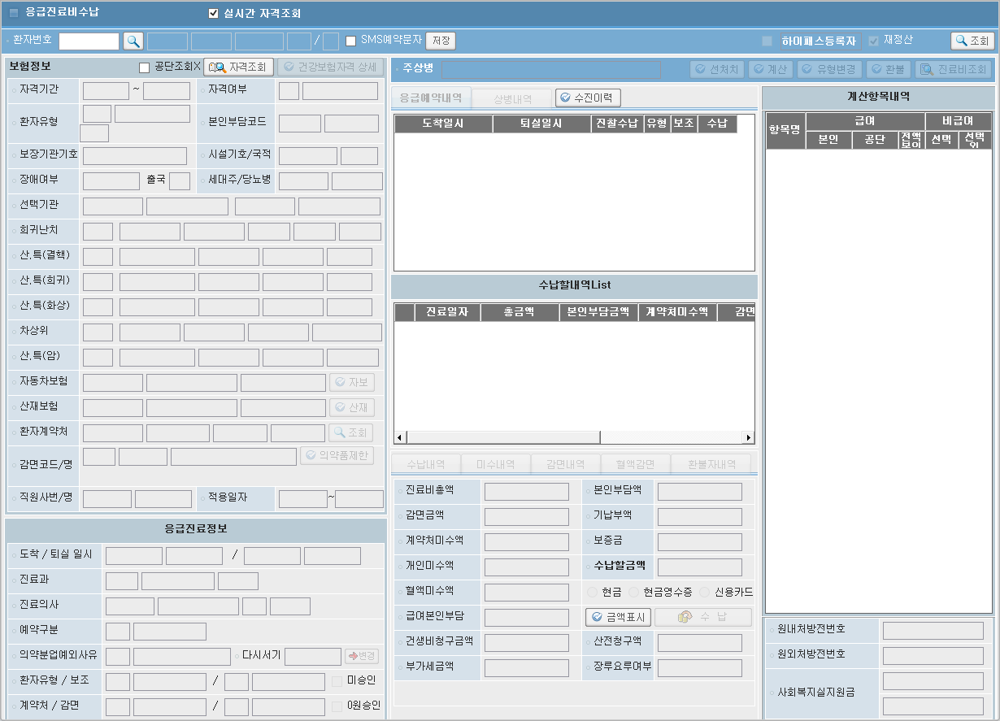

# 2024-12-16-동명책임_응급재내원경우의수추가
- 동명 책임님 
    1. 수가 마다 띄어주는 메세지가 달라져야 함
    2. ASIS 화면을 보고 분석해야함
        - 응급등록 , 응급진료비수납
## ASIS 화면 확인

- 응급환자 접수/수정
    - 
    - BIL/ACC/PTRS/EPRSV/CREATEERLNEUPD.ASPX
    - 재원여부에 따라 화면Mode 설정
        - ```vb
            '// 당일퇴원체크.. 2004.7.27. 추가
            If gsf_sModeChk = "Insert" Then

                sXml = fnMakeXml(Array("pkg_bil_eprsv.pc_ap_apemgrct_insertcheck"	,_
                                       BIL_PKG				,_
                                       BIL_ID				,_
                                       EXE_TYPE_FILL		,_
                                       TxtPatNo.value		,_
                                       "02",_
                                       ""))


                sResult = fnServiceCall(CALL_TYPE_GET, gsDsvcUrl, sXml, , "", false, RET_TYPE_STR)


                If gbErrorCatch Then
                    Exit Sub
                End If


                If Len(sResult) > 0 Then    '// 병동 당일퇴원.응급 당일퇴실 이면
                    Call fnShowXmlMessageBox("MPAM00095", "병동 또는 응급실에서 당일 퇴원(실)한 환자입니다!. 참조", MSG_TYPE_NONE)
                End If

            End If
            ```

- 응급진료비수납
    - 
    - BIL/ACC/CALS/OCALS/CREATEERDIPPAY.ASPX
    - 당일응급의료관리료,진료구역 관찰료가 당일 발생한 내역 체크
        - ```vb
            If (sKtasLvl = "4" or sKtasLvl = "5") or ((sKtasLvl = "1" or sKtasLvl = "2" or sKtasLvl = "3") and sErArea = "N")
            ```
            - KTAS 등급이 1~5
            - 진료구역여부가 N 

        - ```vb
            sXml = fnMakeXml(Array("pkg_bil_eprsv.pc_check_A6050"	,_
                                        BIL_PKG			    ,_
                                        BIL_ID				,_
                                        EXE_TYPE_FILL		,_
                                        sPt_no              ,_
                                        sArv_dtm   		    ,_
                                        sGubun              ,_  
                                        "")) 

        	sResponseText = fnServiceCall(CALL_TYPE_GET, "/BIL/ACC/PTRS/PTRS_DSVC.aspx", sXml, "", "", False, RET_TYPE_STR)

        	If gbErrorCatch Then : Exit Function

            arrResult = fnMakeArray(sResponseText)

            If sResponseText = "YY" Then
                Call fnShowXmlMessageBox("MPAM00000", "당일적용된 <br> 응급의료관리료,진료구역관찰료가 <br> 있습니다.", MSG_TYPE_NONE)
            ElseIf sResponseText = "NY" Then
                Call fnShowXmlMessageBox("MPAM00000", "당일적용된 <br> 진료구역관찰료가 있습니다.", MSG_TYPE_NONE)
            ElseIf sResponseText = "YN" Then   
                Call fnShowXmlMessageBox("MPAM00000", "당일적용된 <br> 응급의료관리료가 있습니다.", MSG_TYPE_NONE)    
            End If
            ```
        - 필요한 정보
            - 환자번호
            - 도착일시
            - 구분
                - 구분 의미
                    1. 외래부담률 환자 응급의료관리료만 체크
                    2. 입원부담률 환자 응급의료관리료,진료구역 관찰료 체크

    - pkg_bil_eprsv.pc_check_A6050
        - 아래 사진 쿼리를 보면 Y나 N을 마지막에 합쳐서 보내는 방식 
        - 
        - 당일 중, 수가코드가 A6050 인것 = Y
        - 정리
            - 화면에서 아래 경우일 때, 저 프로시저를 타는데
                - KTAS 등급이 1~5
                - 진료구역여부가 N 
                - 구분 2가지
                    1. 외래부담률 환자 응급의료관리료만 체크
                    2. 입원부담률 환자 응급의료관리료,진료구역 관찰료 체크

            - 프로시저에서
                - 응급의료관리료 만 체크되어 있으면, Loop 를 돌려 수가가 A6050인 걸 찾고 = Y
                - 응급의료관리료,진료구역관찰료 두개가 체크라면 = N

            - 결과적으로 메세지가
                - <strong style="color:red">YY</strong> : 당일적용된 <br> 응급의료관리료,진료구역관찰료가 <br> 있습니다.

                - <strong style="color:red">NY</strong> or <strong style="color:red">YN</strong> : 당일적용된 <br> 진료구역관찰료가 있습니다.
                    - 응급의료관리료 : 응급에 왔으니 관리해주는 요금?
                    - 진료구역관찰료 : 중증 구역이나 경증 구역에 따라 나누어지는 요금
            

        - 
        - 입원부담률 환자 응급의료관리료,진료구역 관찰료 체크 = N

## 우리 화면 로직 확인

- 응급진료비수납
    - ```c
        model.EmergencyMedCostReceivePaymentMng_01_OUT = UIMiddlewareAgent.InvokeBizService(this, "HIS.PA.AC.PC.OP.BIZ.EmergencyMedCostReceivePaymentMngBL", "EmergencyMedCostReceivePaymentMng_01", model.EmergencyMedCostReceivePaymentMng_01_IN) as HSFDTOCollectionBaseObject<EmergencyMedCostReceivePaymentMng_01_OUT>;
        ```
        - EQS : HIS.PA.AC.PC.OP.EMERGENCYMEDCOSTRECEIVEPAYMENTMNG_01


    - 응급접수내역 도착일시
    ACOPCALT 외래/응급처방계산에 수가코드가 A6050인 것