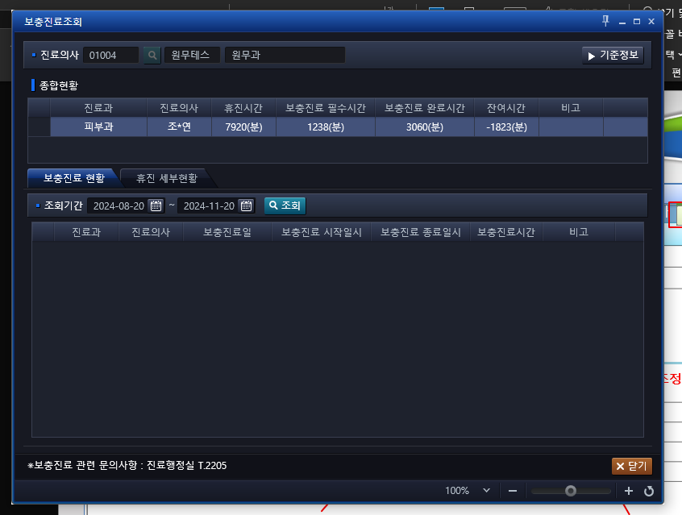

## 11월 12일까지 

보충진료등록 -> 

시간까지 조회해달라 / 테이블 화면 보기가 쉽지 않다.


## 11월 14일 추가

- 통계 쿼리
```sql

SELECT * FROM(
    SELECT
         ''      AS DEPT_NM
        ,''      AS STF_NM
        ,''      AS APY_STR_DTM
        ,''      AS APY_END_DTM
        ,''      AS DTM_SUM
     FROM DUAL
    UNION
    
    SELECT /*+ HIS.PA.AC.PE.SC.SelectDoctorPlusWork_Statistics */
    --    case grouping (APY_STR_DTM)
    --        when 0 then '0'
    --        when 1 then '1'
    --        when 2 then '2'
    --        else '44'
    --    end          as ss
    
        CASE WHEN GROUPING (MED_DEPT_CD||'['||FC_GET_DEPT_NM(MED_DEPT_CD)||']')=0
             THEN CASE WHEN GROUPING (DR_STF_NO)= 0
                       THEN CASE WHEN GROUPING (APY_STR_DTM)=0
                                 THEN CASE WHEN GROUPING (APY_END_DTM) =0
                                           THEN MED_DEPT_CD||'['||FC_GET_DEPT_NM(MED_DEPT_CD)||']'
                                           ELSE NULL
                                      END
             							      ELSE MED_DEPT_CD||'['||FC_GET_DEPT_NM(MED_DEPT_CD)||']'
                            END
                       ELSE NULL
                  END
             ELSE NULL
         END                                AS DEPT_NM                     /* 2.진료과 */
       ,CASE WHEN GROUPING (DR_STF_NO)=0
             THEN CASE WHEN GROUPING (APY_STR_DTM)= 0
                       THEN CASE WHEN GROUPING (APY_END_DTM)=0
                                 THEN DR_STF_NO
            								     ELSE  NULL
            								 END
            					 ELSE DR_STF_NO
            			 END
             ELSE NULL
        END                                 AS STF_NM                     /* 3.진료의사 */
        ,CASE WHEN GROUPING (DR_STF_NO)=0
              THEN CASE WHEN GROUPING (APY_END_DTM)=0
                        THEN TO_CHAR(APY_STR_DTM,'YYYY-MM-DD AM HH12:MI')
        					      ELSE NULL
                    END
              ELSE NULL
          END
                                        AS APY_STR_DTM                /* 4.보충진료시작일시 */


        ,CASE WHEN GROUPING (DR_STF_NO) =0
              THEN CASE GROUPING (APY_STR_DTM)
                        WHEN 0 THEN TO_CHAR(APY_END_DTM,'YYYY-MM-DD AM HH12:MI')
        								ELSE '합계'
        					  END
              ELSE NULL
          END                           AS APY_END_DTM                /* 5.보충진료종료일시 */
    
    
        ,  CASE WHEN GROUPING(DR_STF_NO) = 0
                     THEN CASE WHEN GROUPING (DR_STF_NO)= 0
                               THEN CASE WHEN GROUPING (APY_STR_DTM)=0
                                         THEN CASE WHEN GROUPING (APY_END_DTM)=0
                                                   THEN TO_CHAR(MAX(SPLM_MED_TM))
          								                         ELSE  NULL
          								                     END
          								                ELSE TO_CHAR(SUM(SPLM_MED_TM))
          								           END
          								      ELSE NULL
          								 END
                WHEN GROUPING(MED_DEPT_CD||'['||FC_GET_DEPT_NM(MED_DEPT_CD)||']')=1
                THEN  NULL

            END     AS DTM_SUM                                         /* 6.총보충시간 */
    
     FROM ACDPCSPD        /* 의사보충일정정보 테이블 */
          ACDPCTMD        /* 의사휴진시간정보 테이블 */
    WHERE (APY_STR_DTM BETWEEN TO_DATE(:IN_FROM_DT ,'YYYYMM')
                           AND last_day(TO_DATE(:IN_TO_DT ,'YYYYMM')) + .99999)
      and CNCL_DT is null
    
    group by rollup(  MED_DEPT_CD||'['||FC_GET_DEPT_NM(MED_DEPT_CD)||']'
                     ,DR_STF_NO
                     ,APY_STR_DTM
                     ,APY_END_DTM
                    )
    
    
    )
ORDER BY
      stf_nm
    , apy_str_dtm asc
```


```sql

SELECT /*+ HIS.PA.AC.PE.SC.SelectDoctorPlusWork */
    DR_SID		                                   AS DR_SID                     /* 1.구분 */
   ,MED_DEPT_CD||'['||FC_GET_DEPT_NM(MED_DEPT_CD)||']'
                                                 AS DEPT_NM                    /* 2.진료과 */

   ,DR_STF_NO||'['||FT_STF_INF(DR_STF_NO,'STF_NM')||']'
                                                 AS STF_NM                     /* 3.진료의사 */

   ,TO_CHAR(APY_STR_DTM,'YYYY-MM-DD AM HH12:MI') AS APY_STR_DTM                /* 4.보충진료시작일시 */
   ,TO_CHAR(APY_STR_DTM,'YYYYMMDDHH24MI')        AS OLD_APY_STR_DTM            /* 4-0.보충진료시작일시(update) */
   ,TO_CHAR(APY_END_DTM,'YYYY-MM-DD AM HH12:MI') AS APY_END_DTM                /* 5.보충진료종료일시 */
   ,TO_CHAR(APY_END_DTM,'YYYYMMDDHH24MI')        AS OLD_APY_END_DTM            /* 5-0.보충진료종료일시(update) */

   ,SPLM_MED_TM                                  AS SPLM_MED_TM                /* 6.보충분(테이블) */
   ,CASE WHEN SUBSTR(TO_CHAR(TRUNC((APY_END_DTM- APY_STR_DTM)*24*60)),-1,1) = '9'
              THEN TO_CHAR(ROUND(TRUNC((APY_END_DTM- APY_STR_DTM)*24*60),-1))
              ELSE TO_CHAR(TRUNC((APY_END_DTM- APY_STR_DTM)*24*60))
    END                                          AS SPLM_MED_TM2               /* 6-0.보충분(end-str) */


   ,CASE WHEN FLOOR(TO_NUMBER(SPLM_MED_TM)/60)<10
              THEN '0'||TO_CHAR(FLOOR(TO_NUMBER(SPLM_MED_TM)/60))
         WHEN FLOOR(TO_NUMBER(SPLM_MED_TM)/60)>10
              THEN TO_CHAR(FLOOR(TO_NUMBER(SPLM_MED_TM)/60))
         ELSE '00'
    END
    ||':'||
    CASE WHEN (TO_NUMBER(SPLM_MED_TM)-FLOOR(TO_NUMBER(SPLM_MED_TM)/60)*60)> 0
              THEN TO_CHAR(TO_NUMBER(SPLM_MED_TM)-FLOOR(TO_NUMBER(SPLM_MED_TM)/60)*60)
              ELSE '00'
    END                                          AS SPLM_MED_HH                 /* 6-1.보충시간(테이블) */


   ,CASE WHEN FLOOR((APY_END_DTM- APY_STR_DTM)*24) < 10 THEN '0'||TO_CHAR(FLOOR((APY_END_DTM- APY_STR_DTM)*24))
         WHEN FLOOR((APY_END_DTM- APY_STR_DTM)*24) > 10 THEN TO_CHAR(FLOOR((APY_END_DTM- APY_STR_DTM)*24))
         ELSE '00'
    END
    ||':'||
    CASE WHEN ((APY_END_DTM- APY_STR_DTM)*24*60) - (FLOOR((APY_END_DTM- APY_STR_DTM)*24)*60) > 0
             THEN TO_CHAR((CASE WHEN SUBSTR(TO_CHAR(TRUNC((APY_END_DTM- APY_STR_DTM)*24*60)),-1,1) = '9'
                                     THEN ROUND(TRUNC((APY_END_DTM- APY_STR_DTM)*24*60),-1)
                                     ELSE TRUNC((APY_END_DTM- APY_STR_DTM)*24*60)
                           END ) - (FLOOR((APY_END_DTM- APY_STR_DTM)*24)*60))
             ELSE '00'
     END                                          AS SPLM_MED_HH2               /* 6-2.보충시간(end-str) */


   ,SUP_MEMO                                      AS SUP_MEMO                   /* 7.기타 */
   ,TO_CHAR(FSR_DTM,'YYYY-MM-DD AM HH12:MI')      AS FSR_DTM                    /* 8.최초등록일시 */
   ,DR_STF_NO||'['||FT_STF_INF(FSR_STF_NO,'STF_NM')||']'
                                                  AS FSR_STF_NO                 /* 9.최초등록자 */

   ,TO_CHAR(LSH_DTM,'YYYY-MM-DD AM HH12:MI')      AS LSH_DTM                    /* 10.수정일자 */
   ,DR_STF_NO||'['||FT_STF_INF(LSH_STF_NO,'STF_NM')||']'
                                                  AS LSH_STF_NO                 /* 11.수정자 */

   ,TO_CHAR(SUM(TO_NUMBER(SPLM_MED_TM)) OVER (PARTITION BY :IN_DR_STF_NO))
                                                  AS SUM_SPLM_MED_TM            /* 12.남은휴진분 */
   ,CASE WHEN FLOOR((SUM(TO_NUMBER(SPLM_MED_TM)) OVER (PARTITION BY :IN_DR_STF_NO))/60)<10
              THEN '0'||TO_CHAR(FLOOR((SUM(TO_NUMBER(SPLM_MED_TM)) OVER (PARTITION BY :IN_DR_STF_NO))/60))
         WHEN FLOOR((SUM(TO_NUMBER(SPLM_MED_TM)) OVER (PARTITION BY :IN_DR_STF_NO))/60)>10
              THEN TO_CHAR(FLOOR((SUM(TO_NUMBER(SPLM_MED_TM)) OVER (PARTITION BY :IN_DR_STF_NO))/60))
         ELSE '00'
    END
    ||':'||
    CASE WHEN ((SUM(TO_NUMBER(SPLM_MED_TM)) OVER (PARTITION BY :IN_DR_STF_NO))-FLOOR((SUM(TO_NUMBER(SPLM_MED_TM)) OVER (PARTITION BY :IN_DR_STF_NO))/60)*60)> 0
              THEN TO_CHAR((SUM(TO_NUMBER(SPLM_MED_TM)) OVER (PARTITION BY :IN_DR_STF_NO))-FLOOR((SUM(TO_NUMBER(SPLM_MED_TM)) OVER (PARTITION BY :IN_DR_STF_NO))/60)*60)
         ELSE '00'
    END                                          AS SUM_SPLM_MED_TM2             /* 12-0.남은휴진시간 */
   ,NVL2(CNCL_DT,'Y','N')                        AS CNCL_DT                      /* 13.취소날짜 */
   ,CASE WHEN TM_UNIT_CD = 'AM' THEN '오전'
         WHEN TM_UNIT_CD = 'PM' THEN '오후'
         ELSE '종일'
    END                                          AS TM_UNIT_CD                   /* 14.오전오후구분 */
   --,:IN_CHECK_ALL || :IN_CHECK_SPLMMEDTM         AS EQSTESTCULMN                 /* EQS에서 테스트하기 위한 컬럼 */

FROM ACDPCSPD        /* 의사보충일정정보 테이블 */     
     ,(
        SELECT * FROM(
            SELECT
                 ''      AS DEPT_NM
                ,''      AS STF_NM
                ,''      AS APY_STR_DTM
                ,''      AS APY_END_DTM
                ,''      AS DTM_SUM
             FROM DUAL
            UNION
            
            SELECT /*+ HIS.PA.AC.PE.SC.SelectDoctorPlusWork_Statistics */
            --    case grouping (APY_STR_DTM)
            --        when 0 then '0'
            --        when 1 then '1'
            --        when 2 then '2'
            --        else '44'
            --    end          as ss
            
                CASE WHEN GROUPING (MED_DEPT_CD||'['||FC_GET_DEPT_NM(MED_DEPT_CD)||']')=0
                     THEN CASE WHEN GROUPING (DR_STF_NO)= 0
                               THEN CASE WHEN GROUPING (APY_STR_DTM)=0
                                         THEN CASE WHEN GROUPING (APY_END_DTM) =0
                                                   THEN MED_DEPT_CD||'['||FC_GET_DEPT_NM(MED_DEPT_CD)||']'
                                                   ELSE NULL
                                              END
                     							      ELSE MED_DEPT_CD||'['||FC_GET_DEPT_NM(MED_DEPT_CD)||']'
                                    END
                               ELSE NULL
                          END
                     ELSE NULL
                 END                                AS DEPT_NM                     /* 2.진료과 */
               ,CASE WHEN GROUPING (DR_STF_NO)=0
                     THEN CASE WHEN GROUPING (APY_STR_DTM)= 0
                               THEN CASE WHEN GROUPING (APY_END_DTM)=0
                                         THEN DR_STF_NO
                    								     ELSE  NULL
                    								 END
                    					 ELSE DR_STF_NO
                    			 END
                     ELSE NULL
                END                                 AS STF_NM                     /* 3.진료의사 */
                ,CASE WHEN GROUPING (DR_STF_NO)=0
                      THEN CASE WHEN GROUPING (APY_END_DTM)=0
                                THEN TO_CHAR(APY_STR_DTM,'YYYY-MM-DD AM HH12:MI')
                					      ELSE NULL
                            END
                      ELSE NULL
                  END
                                                AS APY_STR_DTM                /* 4.보충진료시작일시 */
        
        
        
                ,CASE WHEN GROUPING (DR_STF_NO) =0
                      THEN CASE GROUPING (APY_STR_DTM)
                                WHEN 0 THEN TO_CHAR(APY_END_DTM,'YYYY-MM-DD AM HH12:MI')
                								ELSE '합계'
                					  END
                      ELSE NULL
                  END                           AS APY_END_DTM                /* 5.보충진료종료일시 */
            
            
                ,  CASE WHEN GROUPING(DR_STF_NO) = 0
                             THEN CASE WHEN GROUPING (DR_STF_NO)= 0
                                       THEN CASE WHEN GROUPING (APY_STR_DTM)=0
                                                 THEN CASE WHEN GROUPING (APY_END_DTM)=0
                                                           THEN TO_CHAR(MAX(SPLM_MED_TM))
                  								                         ELSE  NULL
                  								                     END
                  								                ELSE TO_CHAR(SUM(SPLM_MED_TM))
                  								           END
                  								      ELSE NULL
                  								 END
                        WHEN GROUPING(MED_DEPT_CD||'['||FC_GET_DEPT_NM(MED_DEPT_CD)||']')=1
                        THEN  NULL
        
                    END     AS DTM_SUM                                         /* 6.총보충시간 */
            
             FROM ACDPCSPD        /* 의사보충일정정보 테이블 */
                  ACDPCTMD        /* 의사휴진시간정보 테이블 */
            WHERE (APY_STR_DTM BETWEEN TO_DATE(:IN_FROM_DT ,'YYYYMM')
                                   AND last_day(TO_DATE(:IN_TO_DT ,'YYYYMM')) + .99999)
              and CNCL_DT is null
            
            group by rollup(  MED_DEPT_CD||'['||FC_GET_DEPT_NM(MED_DEPT_CD)||']'
                             ,DR_STF_NO
                             ,APY_STR_DTM
                             ,APY_END_DTM
                            )
            
            
            )
        ORDER BY
              stf_nm
            , apy_str_dtm asc
     
     
     )

WHERE DR_STF_NO = :IN_DR_STF_NO
    <IsNotEmpty Property="IN_CHECK_ALL">
        <IsNotNull Property="IN_CHECK_ALL" >
           AND CNCL_DT IS NULL
        </IsNotNull>
    </IsNotEmpty>
    AND (NVL2(:IN_CHECK_SPLMMEDTM, NULL, SPLM_MED_TM) IS NULL)

    /* 2024-11-12 김용록 : 김현주 팀장님 요청사항 수정(기간 조회 조건 추가 / 화면 보기 어려움 등) */
    AND (APY_STR_DTM BETWEEN TO_DATE(:IN_FROM_DT ,'YYYYMMDD')
                         AND TO_DATE(:IN_TO_DT ,'YYYYMMDD') + .99999)


ORDER BY 4 DESC

```


     DR_SID
    ,DEPT_NM
    ,STF_NM
    ,APY_STR_DTM
    ,OLD_APY_STR_DTM
    ,APY_END_DTM
    ,OLD_APY_END_DTM
    ,DTM_SUM
    ,SPLM_MED_TM
    ,SPLM_MED_TM2
    ,SPLM_MED_HH
    ,SPLM_MED_HH2
    ,SUP_MEMO
    ,FSR_DTM
    ,FSR_STF_NO
    ,LSH_DTM
    ,LSH_STF_NO
    ,SUM_SPLM_MED_TM
    ,SUM_SPLM_MED_TM2
    ,CNCL_DT
    ,TM_UNIT_CD


## 2024-11-20

- 금요일 오후 진료 = 두배 메모
- 전체 조회 구분
- 총보충시간 / 남은휴진시간 값 불러오기
     > 처리

     - 진료 쪽 보충진료 화면 : DR_HIS.MC.CM.IM.DR.UI_/SelectDoctorSupplementalTreatment.xaml
          - 

     - ```CS
          DataItem item = new DataItem();

          item.add("IN_DOC_NO", inObj.IN_STF_NO);
          DataSet ds = this.DacAgent.ExecuteDataSet(CommandType.StoredProcedure, item, "HIS.MC.CM.IM.DR.SelectDoctorClosedScheduleCal", QueryType.QueryStore);
          HSFDTOCollectionBaseObject<SelectDoctorSupplementalTreatment_INOUT> result
                = ds.Tables[0].ToDTO(typeof(HSFDTOCollectionBaseObject<SelectDoctorSupplementalTreatment_INOUT>)) as HSFDTOCollectionBaseObject<SelectDoctorSupplementalTreatment_INOUT>;
          return result;

     ```


     - EQS : HIS.MC.CM.IM.DR.SelectDoctorClosedScheduleCal
     - XMED.PC_AP_HDLYTMTIME_CALC.PC_AP_CLOSEDTIME_CALC  객체는 존재하지 않습니다.


## 21일 김현주 팀장님 보고드릴 내용
1. 종일 선택 시, 오전/오후 중 비중이 높은 쪽으로 자동 변경
2. 보충진료기간에서 금요일+오후 선택 시, 2배 적용할 지 물어보는 알림팝업 생성
3. 하단에 진료 쪽 교수님들께서 보시는 휴진시간 통계 나오게 처리(+ 휴진시간과 보충진료 기준정보 pdf 버튼 추가)
4. 수정 후, 추가 수정/삭제하면 안되는 오류 처리
5. 보충진료기간 날짜가 변경됐다면, 신규로 넣을지, 수정을 할 지 물어보는 알림팝업 생성