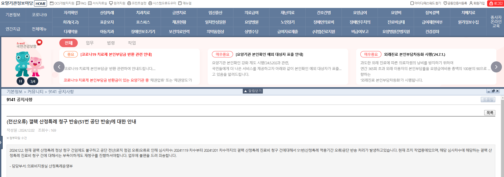

# 2024-11-13-EDI신청서작성알림오류
- 진단등록 / 시상병 작성 시에 산정특례 재등록 알림이 뜬다.

## 번외 성준책임님께 메세지
어제 EDI 반송 보고할 때 보낸 메일에
(01992633 오은빈아기 -> 오세리) 아기 환자

주민번호가 (244565-4240002)로 상이해서 반송인데,
외래진료비수납 화면에 보면 생년월일이 (2024-09-29)로 나오거든요

근데 이 정보로 (240929-4240002) 공단에서 자격조회를 해보면
안 나오는데, 이런 건 원무 쪽 누구한테 확인해달라고 여쭤봐야 하나요?

## 

- 정리
    - 심사차수 2024-11-19 부터 2024-12-01 차수까지의 결핵 산정특례 진료비 청구 건에 대해
        - 51번(산정특례 적용기간 오류)공단 반송 처리가 발생하고 있다.
        - 현재 조치 작업중이다.
        - 해당하는 결핵 산정특례 진료비 청구 건은 재청구 진행해야 한다.
        - 업무에 불편드려 죄송하다.