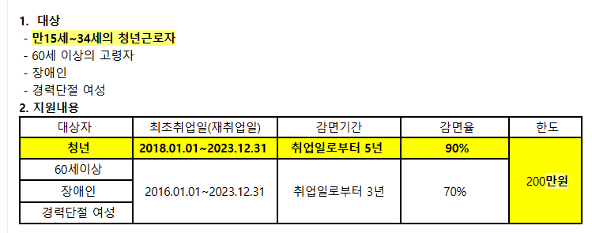
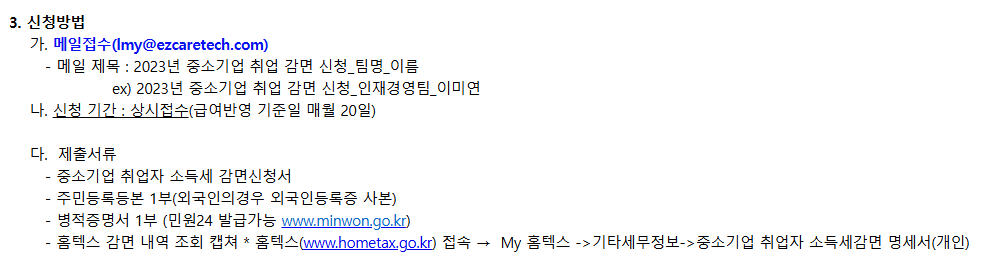

# 2024-11-13-미연책임_인사_종소기업소득세감면

- 메일내용
    - 중소기업 취업자 소득세 감면(조특법 제30조)제도를 안내
    - 중소기업의 취업을 활성화하고, 청년층과 노년층, 장애인과 경력단절 여성의 취업을 장려하기 위해 해당 대상자의 소득세를 감면해주는 제도입니다.

​
- 사진
    - 

    - 

    - 
        - 입사 기준으로 그 해 감면 된다는 거 같은데(입사일 ~ 12.31)

- 양식
    - 2023년 중소기업 취업 감면 신청_팀명_이름    
## 

