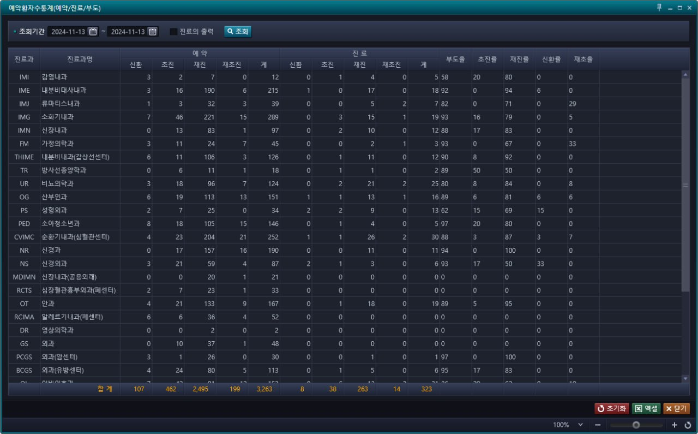
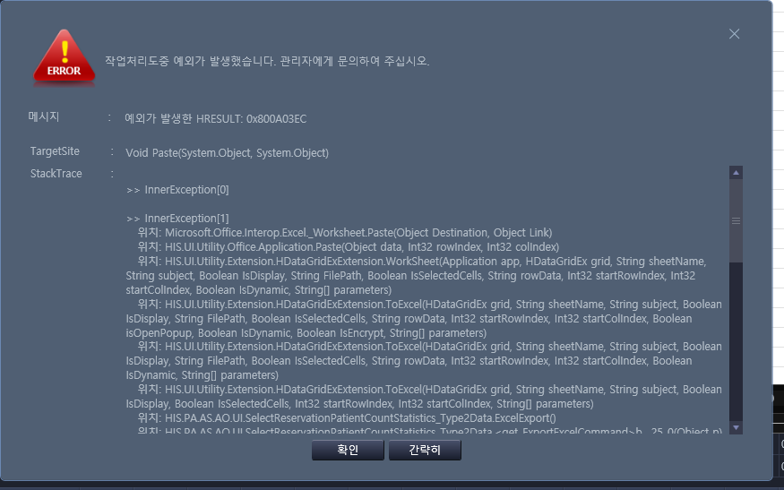

# 2024-11-13-파트장님_예약환자수통계기준문의
- 문의자 : 김채원 선생님
- 내용 : 이 통계에는 진료 예약만 카운트 되고, 비예약검사 예약일로 생기는 수진 이런건 카운트 안되는게 맞을까요?
- 
    - 화면 명 : 예약환자수통계(예약/진료/부도)
    - 경로 : AS_HIS.PA.AS.AO.UI_/SelectReservationPatientCountStatistics_Type2
    - SelectReservationPatientCountStatistics_Type2.xaml

- 추가적으로 엑셀 기능 안됨
    - 

## 

