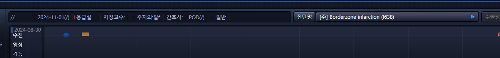
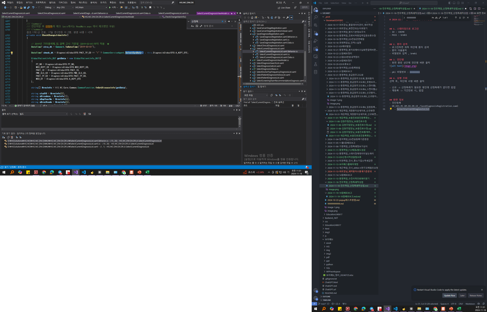

# 2024-11-18-민우책임_산정특례작성법


## 1. 스테이징으로 로그인
- ID : C0EMR
- PASS : brmh1


## 2. 환자 검색
- 로그인하면 좌측 하단에 환자 검색
- 환자 더블클릭
- 비밀번호 입력 , brmh1

## 3. 진단명
- 화면 중앙 상단에 진단명 버튼 클릭


- pki 비밀번호 : 88888888

### 전역정보조회

- 운영기 전역정보조회 비밀번호
    - !qhfkao1

## 4. 상병 조회
선택 후, 하단에 서명 버튼 클릭

- 신규 -> 산정특례가 필요한 병인데 산정특례가 없다면 팝업  
- 재등록 -> 기간만료 시, 팝업 


## 화면 정보
- 진단등록
- DR_HIS.MC.DM.DX.DR.UI_/SaveDiagnosisRegistration.xaml
    - SelectCurrentDiagnosisList
    - SelectCurrentDiagnosisViewModel.cs
        - CheckChangeJidanInfo();
        - HIS.MC.Core.Common.CommonFunction
            - HIS.MC.Core.BIZ.CommonFunctionBL
            - FT_MOO_GETSPECIALCASESTATUS
                - EQS : HIS.MC.Core.FT_MOO_GETSPECIALCASESTATUS
                    - ```sql
                        SELECT 
                        PKG_MOO_SRILRRNSCFSCINFASK.FT_MOO_GETSPECIALCASESTATUS(:PT_NO,:PME_CLS_CD,:MED_PACT_TP_CD,:MED_DEPT_CD,:MED_DT,:PACT_ID,:CHECK_DATE,:CALLBY) RESULT
                        FROM DUAL
                        ```
                        - xbil로 접속 : PACKAGE BODY XMED.PKG_MOO_SRILRRNSCFSCINFASK
                            - XMED.PKG_MOO_SRILRRNSCFSCINFASK.FT_MOO_GETSPECIALCASESTATUS_25
                            - XMED.PKG_MOO_SRILRRNSCFSCINFASK.FT_MOO_GETSPECIALCASESTATUS_26
                - 치매 : HIS.MC.Core.SelectDementiaSpecialCaseApplyInfo
