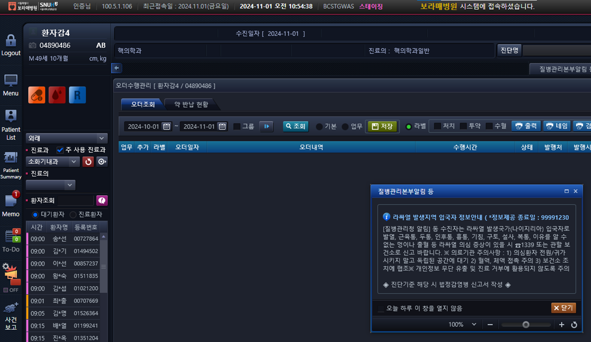
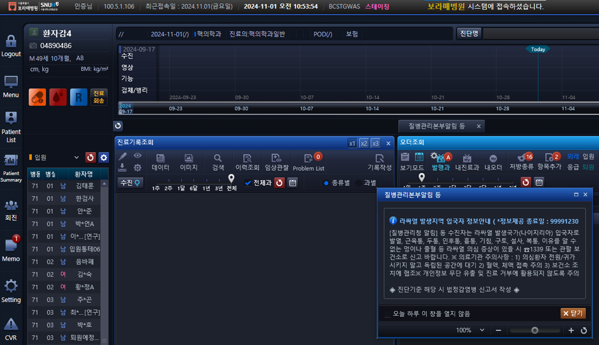
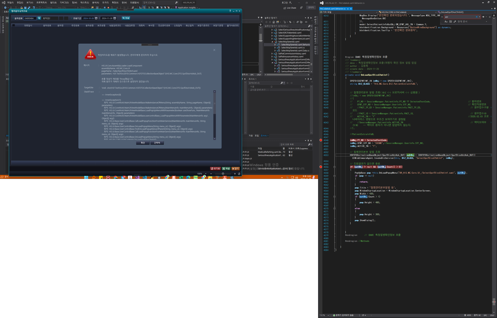

# 질병관리본부알림 팝업 추가
- 2024-11-25 환자검색 항목에 질병관리본부알림 팝업 추가


- 운영기 테스트 환자
    - 이지케어텍 보라매 신동명 책임님, [2024-11-28 오후 6:17]
        - 운영기테스트환자:01612155, 01971225

    - 이지케어텍 보라매 신동명 책임님, [2024-11-28 오후 6:17]
        - 질병관리본부알림팝업정보 테이블:MOODSPOP

- 스테이징 테스트 환자
    - 04890484(스크롤바없음),04890486(스크롤바있음)


- 세팅 방법
    - 아래 내용을 D:\HISSolutions\HIS\Deploy\Server 에 "hisploy"라는 파일에 넣어야 한다.
        ```
        [HIS]
        SEC_NO_FAIL_CNT=-1
        CRL_FAIL_YN=0
        CST_USR_ACCT_USE_DYS=-1
        PWD_CHG_PERIOD=90
        KimsServerIP=http://bckims.brmh.org:8088
        KimsCustID=PABRMH
        HSP_NO=11100249
        HSP_NM=서울대학교병원운영 서울특별시보라매병원
        HSP_TEL=02-870-2114
        HSP_SW_ENTP_CD=111002490000000000000000000000
        DurLogs=D:\LogTypes\DUR\
        DurLogsYN=Y
        ExceptionsYN=Y
        ```


## 내용
- 진료쪽 EQS : HIS.MC.Core.SelectRrnAndLcnsNo






```cs
using HIS.MC.Core.DTO;

#region (DUR) 특정질병확인정보 호출
/// <summary>
/// 특정질병확인정보 호출(여행자 확인 정보 알림 팝업)
/// </summary>
private void OnLoadSpcfDissCfmtInf()
{
    // 질병관리본부 알림 조회( BIZ <-> 브로커서버 <-> 심평원 )
    SPCFDISSCFMTINF_IN inObj = new SPCFDISSCFMTINF_IN()
    {
        PT_NO = SessionManager.PatientInfo.PT_NO,              // 환자번호
        CFMT_STF_NO = SessionManager.UserInfo.STF_NO,          // 확인직원번호
        PACT_TP_CD = SessionManager.PatientInfo.PACT_TP_CD,    // 원무접수구분코드
        PACT_ID = SessionManager.PatientInfo.PACT_ID,          // 원무접수ID
        ACTIVE_YN = "Y"  //2020.02.03 코로나바이러스 영향으로 무조건 보여주기로 결정됨
        //SessionManager.PatientInfo.ACTIVE_YN      // 엑티브여부 (Y/N)    -- 엑티브 환자가 아니면 팝업하지 않는다. 
    };

    // 질병관리본부 알림 조회
    HSFDTOCollectionBaseObject<SpcfDissHstAsk_OUT> outObj = (HSFDTOCollectionBaseObject<SpcfDissHstAsk_OUT>)UIMiddlewareAgent.InvokeBizService(this, "HIS.MC.Core.BIZ.PatientExtraInfoBL", "SelectSpcfDissCfmtInf", inObj);

    // 조회결과가 없으면 종료
    if (outObj != null && (outObj.Count() > 0))
    {
        PopUpBase pop = this.OnLoadPopupMenu("DR_HIS.MC.Core.UI_/SelectSpcfDissCfmtInf.xaml", outObj);
        if (pop == null)
        {
            return;
        }
        pop.Title = "질병관리본부알림 등";
        pop.WindowStartupLocation = WindowStartupLocation.CenterScreen;
        pop.Width = 430;
        if (outObj.Count > 1)
        {
            pop.Height = 480;
        }
        else
        {
            pop.Height = 300;
        }
        pop.ShowDialog();
    }
}
#endregion      // (DUR) 특정질병확인정보 호출
```


## 보낼 내용

```cs
inObj = new SPCFDISSCFMTINF_IN()
    {
        PT_NO = "00281407",//model.SelectPatientInfoOutObj.PT_NO, // 환자번호
        CFMT_STF_NO = "05290",//SessionManager.UserInfo.STF_NO,   // 확인직원번호
        PACT_TP_CD = "I",                                         // 원무접수구분코드
        PACT_ID = "MO00281407202410070000OT105290",               // 원무접수ID
        ACTIVE_YN = "Y"                                           //2020.02.03 코로나바이러스 영향으로 무조건 보여주기로 결정됨
        //SessionManager.PatientInfo.ACTIVE_YN                    // 엑티브여부 (Y/N)    -- 엑티브 환자가 아니면 팝업하지 않는다. 
    };


```
프로그램 : HIS.MC.Core.BIZ.PatientExtraInfoBL.SelectSpcfDissCfmtInf
           HIS.MC.Core.UI.SelectPatientExtraInfoData.OnLoadSpcfDissCfmtInf
EQS : HIS.MC.Core.SelectRrnAndLcnsNo


```
PT_NO : 00281407
STF_NO : 05290
ACTIVE_YN : Y
PACT_TP_CD : I
PACT_ID : MO00281407202410070000OT105290
```


```
PT_NO : 00141200
STF_NO : 01815
ACTIVE_YN : Y
PACT_TP_CD : I
PACT_ID : 0000009315
```


## 스테이징 에러

this.OnLoad를 base.OnLoad로 변경하니까 사라짐


## 2024-11-27-동명책임_화면에추가
CODE_PATIENTNO 찾아서 만든 거 추가

```cs
IsOnLoadSpcfDissCfmtInf="true"
```

- 체크인 명
    - 특정질병확인정보 호출 , CODE_PATIENTNO에 IsOnLoadSpcfDissCfmtInf="true" 추가

- 화면에 추가해야하는 부분

    - 외래접수
        - 외래환자예약/수정
        - C_HIS.PA.AC.PE.AP.UI_/OtptPtReservationRegistration
    - 응급접수
        - 응급등록/수정
        - AC_HIS.PA.AC.PE.AP.UI_/EmergencyAnewMng        
    - 전화예약
        - 전화예약/수정
        - C_HIS.PA.AC.PE.TE.UI_/TelephoneReservationRegistration
    - 입원접수
        - 입원예약/수정
        - AC_HIS.PA.AC.PE.PS.UI_/SaveAdsRsvMdf.xaml


    - 외래진료비수납
        - 외래진료비수납
        - AC_HIS.PA.AC.PC.OP.UI_/OtptMedCostReceivePaymentMng.xaml_O


