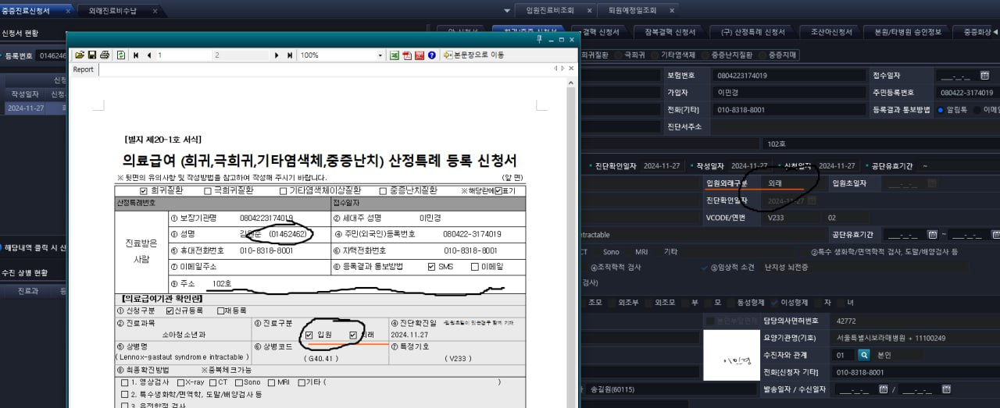
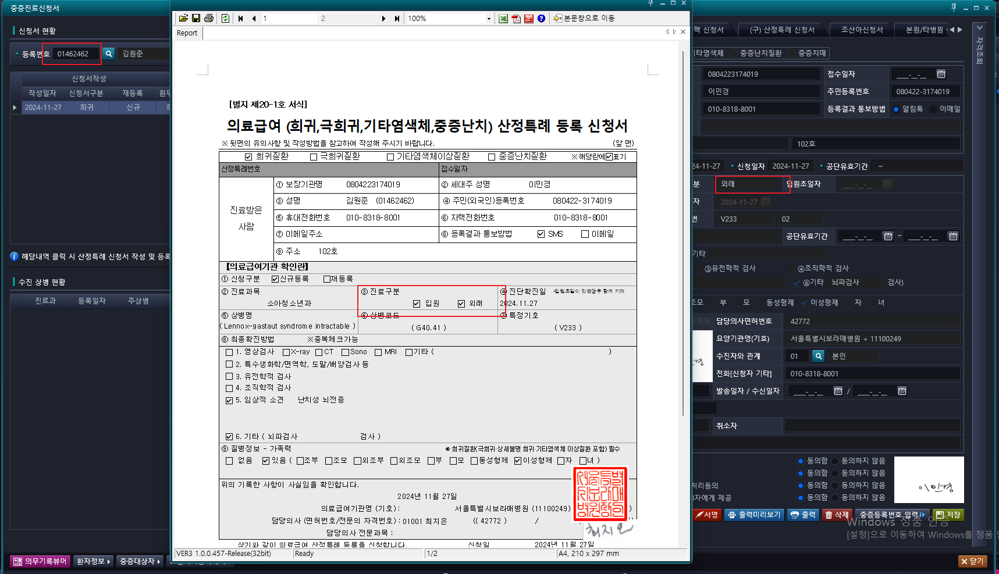

# 2024-11-29-현석책임_응급등록수정환자자격정보

- 내용
    - 중증진료신청서 화면에서 입원외래구분이 외래인데, 신청서에는 입원외래가 둘 다 찍혀 나오는 에러
    - 환자번호 : 01462462 김원준
    - 

- 화면명 : 중증진료신청서
    - 문제 확인 : 
    - AC_HIS.PA.AC.PI.PI.UI_/SeriousIllnessApplicationFormMng
## 발생 이유
- rexport 로 까보니까 바인딩 정보(입원.외래)가 서로 반대로 되어있었음
- 그리고 입원에 마지막이 1로 되어있어 I로 수정 -> 예전에 태훈책임님이 시켜서 내가했던 거 같은데 이거

> 처리 완료

- 중증진료신청서 화면, 외래입원 구분 필드 바인딩 오류 수정
    - PrintSerIneBoorPrt_2019_B.reb
    - PrintSerIneBoorPrt_2019_E.reb -> 이게 문제였는데 확인해보니 위에도 잘못되어 있음
