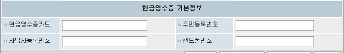

# 2024-12-04-동명책임_환자기본정보변경화면수정
- 환자기본정보 테이블에 수정한 항목을 환자정보변경 화면에 입력할 수 있게 항목 추가

- ASIS 화면 참고해서 진행
    - 현금영수증 기본 정보
    
    

- 화면명 : AC_HIS.PA.AC.PI.PI.UI_/PatientBasicsInformationModification
    - 환자기본정보변경

## 