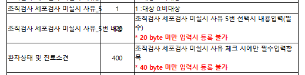

## 현석 책임님 말


이곳에 상세가 새로 생긴다는 것

- 암
- 미실시 사유 5번 기타
- 01 추가 

- 날짜 분기처리
- 0 11
-   12


## 중증신청서
중증신청서 화면은 acpprghd를 바라본다.

- acpprghd 컬럼명 : TH5_CNCR_HSTL_DTL_CNTE
    - 비주얼스튜디오에서 DTO는 TH5_CNCR_HSTL_ADJECTIVE_YN로 가져온다.

    - ```sql
        -- 2024-12-30 김용록 : 25년 개정으로 암, 검사 미실시 사유 상세 항목 추가
	    , CASE A.TH5_CNCR_HSTL_DTL_CNTE WHEN '1' THEN 'Y'
	                                    WHEN '2' THEN 'N'
	                                             ELSE 'N' 
	      END                   TH5_CNCR_HSTL_ADJECTIVE_YN
        ```


- 배포해야 하는 항목 
    - 참고
        - 서식관리 화면, 원소매핑 ID : 8055,8056
        - ```sql
            SELECT *
             FROM MRFMFCID
            WHERE 1=1
             AND MDFM_ID = '2002627'
             AND MDFM_FOM_SEQ = '2'
             AND MDFM_ELMT_ID IN ('8056', '8055')
            ```
    - 프로그램
        - UI
            - HIS.PA.AC.PI.PI.UI.SeriousIllnessApplicationFormMng.xaml
            - HIS.PA.AC.PI.PI.UI.SeriousIllnessApplicationFormMng.xaml.Behavior.cs
        
        - DTO
            - HIS.PA.AC.PI.PI.DTO.SeriousIllnessApplicationFormMngSub1_IN.cs
            - HIS.PA.AC.PI.PI.DTO.SeriousIllnessApplicationFormMngSub1_OUT.cs
            - HIS.PA.AC.PI.PI.DTO.SeriousIllnessApplicationFormMngEmr_OUT.cs

    - EQS
        - HIS.PA.AC.PI.PI.UPDSERIOUSILLNESSAPPLICATIONFORMMNG2_EMRUPDATE
        - HIS.PA.AC.PI.PI.INSSERIOUSILLNESSAPPLICATIONFORMMNG2
        - HIS.PA.AC.PI.PI.SelSeriousIllnessApplicationFormMng5
        - HIS.PA.AC.PI.PI.SelSeriousIllnessApplicationFormMng6

            - 스테이징 테스트 환자 : 01576075 
                - mdrc_id : 
                    - 500129765 -> 1 체크 
                    - 500129764 -> 2 체크
            - ```sql
                select * from MRFMFORM
                where mdfm_nm like '%산정특례%'
                  and mdfm_fom_seq = '2' ;

                select *
                  from MRDDRECM
                 where mdfm_id = '2002627'
                   and mdfm_fom_seq = '2' ;

                SELECT *
                 FROM MRFMFCID
                WHERE 1=1
                 AND MDFM_ID = '2002627'
                 AND MDFM_FOM_SEQ = '2'
                 AND MDFM_ELMT_ID IN ('8056', '8055');
                ```

    - 레스포트
        - 수정해야함
            - /HIS/Deploy/rebfiles/PA/PrintSerIneBoorPrt_CNCR_B.reb
            - /HIS/Deploy/rebfiles/PA/PrintSerIneBoorPrt_CNCR_E.reb 


