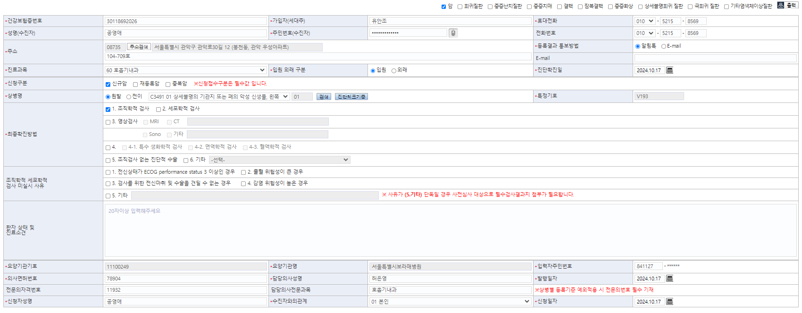

02-870-2771

# EDI 반송정리
## 24년 10월 7일 반송내역


### 태어난지 얼마 안된 아기(주민번호가 없어, 작성된 정보와 일치하지 않아 반송)

01995665 이혜정아기
- 조회일자 : 2024-10-27


01992353 한솔하아기
- 조회일자 : 2024-09-30
- 의사명 : 윤지혜/소아청소년과
- 병명 : 
> ㅇㅇ

01992618 손예주아기 
- 조회일자 : 2024-10-02
- 의사명 : 정지은/소아청소년과
> ㅇㅇ


01992633 오은빈아기
- 조회일자 : 2024-10-06
- 의사명 : 정지은/소아청소년과

01993952 이수연아기
- 2024-10-13
- 정지은/소아청소년과
- 반송 사유 : 태어난 지 얼마 안되어, 주민번호 상이


01993356 손선진아기
- 2024-10-14
- 담당의 : 정지은/소아청소년과/호흡보조필요
- 반송사유 : 주민등록번호 상이
> 01993356 박이솔 확인 <strong style="color:red">2024-10-29</strong>


### 의사면허번호 종류 상이

00953094 송인욱
- 조회일자 : 2024-10-03
- 의사명 : 이상형/신경외과
- 병명 : 암
- 반송 사유 : 의사면허번호 종류 상이함
의사면허번호는 '27000' 들어가 있는데 이 번호가 상이하다고 나옵니다. 확인이 필요합니다.
> 처리, <strong style="color:red">2024-10-29</strong>

### 등록된 상병코드 상이
01744625 문현준
- 조회일자 : 2024-10-01
- 의사명 : 최인실/혈액종양내과
- 병명 : 대장암
- 반송 사유 :  EDI 접수자료 등록 상병코드가 상이함
"첨부파일 필요"하다고 해서 제증명에서 조회해보니, 
산청특례 등록 신청서가 존재하기는 한데, 이 분은 저희가 신청하는게 맞나요?
아니면 기관에 환자 본인이 직접 신청해야 하나요?
> 전하림 선생님 처리 <strong style="color:red">2024-10-30</strong>


### 최종진단방법 상이
- 반송 사유 :  EDI 접수자료 최종진단방법확인 오류
최종진단방법에 대한 내용 없습니다. 확인 부탁드립니다. 
    + 정고송 환자는 (2024-10-21)에 암으로 받는 산정특례 만료이신데, 혹시 모르니 '중복암'인지 , '재등록'인지 '신규'인지 재확인 부탁드립니다. 

00104944 정고송
- 조회일자 : 2024-10-01
- 의사명 : 정현/비뇨기과
- 병명 : 전립선 암
> 전하림 선생님 처리 <strong style="color:red">2024-10-30</strong>


00938514 박정갑
- 조회일자 : 2024-10-02
- 의사명 : 정현/비뇨의학
- 병명 : 암


### 미실시 환자가 있는지 9월 확인
00805793 노희순
- 조회일자 : 2024-09-27
- 의사명 : 최인실/혈액종양내과
- 반송 사유 :  신청 구분이 상이하다. (중증암)
공단 조회 시, (2024-06-24)부터 중증암 산정특례를 이미 받는 분인데,
암 부위 별(암+중증암+중증암...)로 신청해야 하는 지, 
한 번만(암+중증암) 신청하면 되는 지,
확인이 필요합니다.


00563875 안미순 

01891858 박연화
- 조회일자 : 2024-09-16
- 병명 : 파키슨병
- 반송 사유 :  WEB EDI 진단확진일자가 재등록 기간과 맞지않음
산정특례 재등록은 "최초 등록일의 만료일(2024-10-20일)"의 3개월 전부터 가능한데, 
확진일자가 (2024-06-26)이라 너무 빠른 확진일자 때문에 안됩니다.


## 24년 10월 08일 금일 보고내용
### 암
01557191 정민수
- 의사명 : 문현종/흉부외과
- 병명 : 암
- 반송 사유 : 첨부파일 필요


## 24년 10월 10일 반송내역
### 암
00716411 이경선
- 정지봉 / 소화기내과
- 반송내역 : EDI 접수 불가(지사로 신청_판정오류 기등록건)
    - [데이터 입력 일자( 년월일-시분초)]
    - → 20241010-181554
    - 4412201018926


## 24년 10월 16일 반송
01993356 손선진아기
- 2024-10-14
- 담당의 : 정지은/소아청소년과/호흡보조필요
- 반송사유 : 주민등록번호 상이
> 01993356 박이솔 확인 <strong style="color:red">2024-10-29</strong>


## 24년 10월 18일 
### 암
00452102 심금순 
- 신청일자 : 2024-10-17
- 반송사유 : 기등록자
- 심금순 환자 (2024-09-19)일에 신청했던 분이 또 올라와 있는데, 확인부탁드립니다.



### 에러 확인(22일)
2024-10-17 00716051 공영애가 에러였다.
- 병명 : C34.91
- 에러 정리
    - 주민번호를 제외한 모든 정보가 안 보인다. 심지어는 처음 가입자부터 성명까지도 안 보인다.
- 전하림 선생님 : 02-870-2771
    - 뭐가 잘못됐는지, 액셀 건드린 거 확인해라.
    - EDI 바로 올라가진 않고 빌드를 몇개 쳐야한다(비즈메카) 
    - 4704292906211
    
> 노가다 타이핑으로 일단 신청 <strong style="color:red">2024-10-28</strong>


### 희귀/중증희귀
01191274 이순금
- 신청일자 : 2024-10-17
- 병명 : 이지영/ 신경과 / 파키슨병
- 반송사유 : 의료급여 기등록건>지사로 문의


### 잠복결핵
01925431 최애란
- 신청일자 : 2024-10-17
- 병명 : 잠복결핵
- 특이사항 : (2024-07-12)에 산정특례 만료가 된 환자인데, 확진일자를 (2024-07-14)로 주셨습니다.
- 반송사유 : 접수자료 등록 기등록자


## 24년 10월 21,22일
### 암
01725167 박영민
- 신청일 : 2024-10-22
- 병명 :이정훈 / 비뇨의학과 / 암(C61)
- 반송사유 : 의료급여 기등록건>지사로 문의
- 특이사항 : (2023-12-28)부터 암(C089)으로 받고있습니다. 
> 전하림 선생님 처리 <strong style="color:red">2024-10-30</strong>


### 희귀
01993420 김준열
- 신청일 : 2024-10-21
- 병명 : 김률 / 신경과 / 파킨슨병
- 반송사유 : EDI 접수자료 재신청 기등록자임

(2020-09-01)부터 (2025-08-31)까지 받는 산전특례가 있는데, 희귀는 재등록 기간부터 상병기호를 확인할 수 있어, 보라매 병원 이전 진료 기록도 없고, 확인 부탁드립니다.


### 성준책임님
2024-10-01 결핵에 변철호 환자 누락
> 성준 책임이 말해줘서 해결<strong style="color:red">2024-10-24</strong>


01744625 문현준
- 2024-10-24
- 암
- 보류해달라.
- 10월1일날 작성했는데 진료실에서 또입력해서 오늘날짜에 서명안된 중증신청서가 있어 수납이 안되서 오늘 서명 또하신케이스
> 캡처본으로 보냄, 처리 -> 결과 대기중 X -> 반송 -> 선생님이 하신듯<strong style="color:red">2024-10-29</strong>


01383279 전찬영 
- 2024-10-25
- 보류


## 24년 10월 23,24일 
### 에러 확인
00647315 김명가
- 2024-10-24 결핵
- 원인 : 공영애 에러라서 빼고 하려던 로직이 그대로 화요일 배포에 올라갔다.
- 22일 부터 24일까지 첫 번째 사람 누락이니까 찾기
- 희귀( 01365235 육영기 )
> 육영기, 김명가 처리 <strong style="color:red">2024-10-25</strong>

#### 18~24일까지 신청한 거에서 누락 찾기 
- 암
    - 00788184 남정례
    - 00897673 신종기
        - 비뇨기과 / 최종확진방법(항암호르몬치료) 못 불러옴
> 남정례, 신종기 처리 <strong style="color:red">2024-10-25</strong>

- 희귀 
    - 00523013 김공우
    - 01147716 서덕수
> 김공우, 서덕수 처리 <strong style="color:red">2024-10-25</strong>

- 잠복결핵
    - 01457594 이현진
> 이현진 처리 <strong style="color:red">2024-10-25</strong>


## 24년 10월 25일 심사팀 전하림 선생님

- 희귀
    - 00433007 한건 4501041101621 / V001 제신청 / EDI 접수자료 재신청 기등록자임
- 암
    - 01725167 박영민 5305211066815 /V193,C089 -> V193,C61 중복암 신청 건 / 의료급여 기등록건>지사로 문의
        - 의무기록뷰어에서 보면 신규암과 중복암을 중복 체크되어 있는데, 실제 사이트에서는 재등록과 중복암만 중복체크가 가능 


    - 00953094 송인욱 8106291068926 / (27000 이상형) 의사면허번호 종류 상이함
        > 십 다시 처리 <strong style="color:red">2024-10-29</strong>

    - 01744625 문현준 4910221448544
        - 5번 만 있을 경우, 첨부파일 필요
    > 캡쳐본으로 보냄 일단 처리 <strong style="color:red">2024-10-25</strong>

    - 00104944 정고송 4101221047126  / v193,C61
        - 재등록 못 불러옴, 6번 소견 못불러옴
    > 정고송 처리  <strong style="color:red">2024-10-25</strong>

    - 00938514 박정갑 3603291067320
        - 6번 소견 못 불러옴(또비뇨)
    > 박정갑 처리  <strong style="color:red">2024-10-25</strong>


    - 01625243 이용운 6511231533326 / V193,C61
        - 이미 정상 등록되어있음, 11.05에 반영예정
    > 이용운 처리  <strong style="color:red">2024-10-25</strong>


## 24년 10월 28일 메일 보낸 날
- 암
    - 01204150 김외연
        - 신청일자 : 2024-10-28
        - 병명 : V193(C22.1) / 이재원 / 외과
        - 반송사유 : 의사면허번호 종류 상이함


## ㅇㅇㅇㅇㅇㅇㅇㅇㅇ
- 재증명 관리 : AC_HIS.PA.AC.PE.CF.UI_/CertificatesTargetPersonAsk
- 의무기록뷰어 : POP_DR_HIS.MC.DR.RM.RV.UI_/SelectIntegrationMedicalRecordAsk.xaml


01913039 한경신 전송할 시점에는 무자격환자라 반송됬을거에요. 건강보험 자격 다시 취득해서 원무과 강보연선생님께서 다시 전송해달라는 요청이 왔습니다. 전하림선생님께 말씀 드리고 재전송하시면 될것같습니다!


## 2024-11-13

- 오류 확인
    - 허승범이 중복이라고 잘못 나온다.

12 18
희귀
- 01298566 박상유
    - 최종진단방법6번 선택시 내용입력
    - 담당의사전문과목 상이


- 00725586 이남희
    - 동일한 주민번호가 등록되어있습니다.
        - 발행일자 만 11알 / 13일 다름


SelectRecordListByDiagnosis


## 2024-11-18
- 오류
    - 6번 체크 했는데 값 못 불러옴 03 내시경검사


- 00517760 김옥자
    - 4404102056259
    - 2029.01.09
    - 2324004615
    - V223
    - 안과
    - M0590 -> M05909

- 01997130 정수금
    - 3810232094419
    - 2026.10.06
    - 2321106788
    - V201
    - 류마티스내과

- 01997130 정수금
- 00517760 김옥자

## 2024-11-19
- 9 /9 /2
    - ktEDI : 080-318-5306 / 1
    - 요양기관정보마당 : 1577-1000 / 2 / 2
    - 결핵 한 명 제외 수신 확인
## 2024-11-20
- 14 / 13 / 2

## 2024-11-21
- 15 / 32/ 2


## 2024-11-25
- 12 / 10 / 

- 가영책임 문의로 처리
```sql
select EDI_TRSM_YN, APY_END_DT, a.* from ACPPRGHD a
where pt_no = '0156075x'  ;
-- 01560758 이 환자는 산정특례 받지 않는데 ACPPRGHD에 존재, 신청 불가하여
-- 이 신청서는 x 처리
```

## 2024-11-26
- 11 / 16

## 2024-11-27

```sql
SELECT * FROM ACPPRGHD
WHERE PT_NO = '0028864x'; 
-- 00288645 이전 거에 산정특례번호 삽입
-- 이 신청서는 x 처리
```

## 2024-11-29
27일 28일 거 한 번에 신청

28 / 33 / 2

그 중 암과 희귀에 중복 한 명씩 있음
- 암 : 01967141
- 희귀 : 01615983
> 처리

- 반송
    - 01271006 이현주
    - 01615983 김수덕
        > 당일 처리
    - 01222936 시진서
    - 01967141 김병철
        > 당일 처리

- 이 날, 신청서가 중복이었던 환자(희귀)가 다수 있어 메일이 왔었음


## 2024-12-02
11-29 ~ 12-01 3일치

8 / 9 + 아기/ 2

-> 반송 없음
