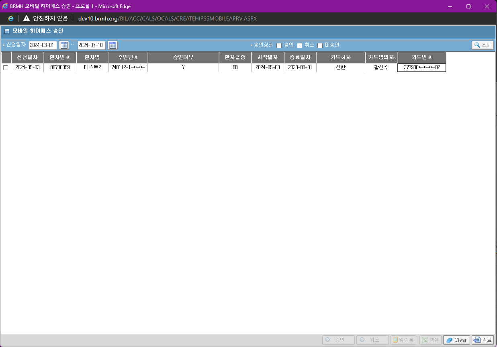
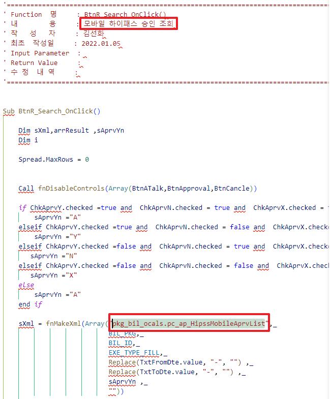
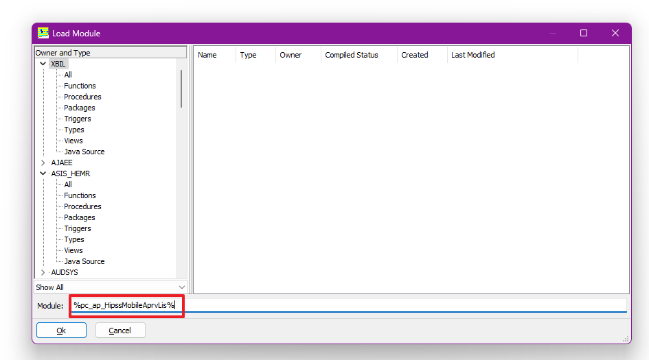
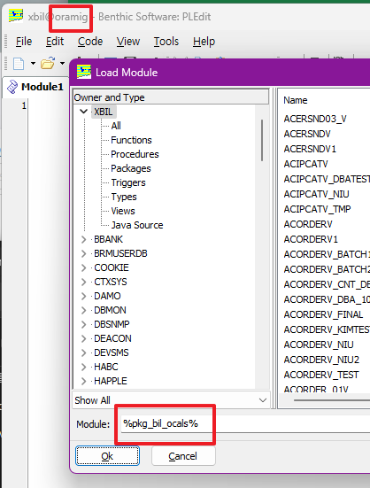
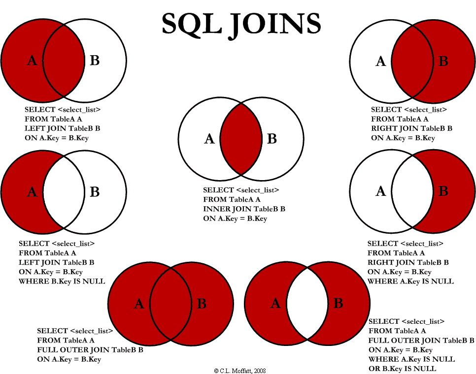

# Golden
## 단축키
- Ctrl + l : 서버 변경
- Ctrl + T : 대소문자 변경
- Ctrl + Shift + w : 작성중이던 SQL을 .GWP로 필드 저장
- Ctrl + Shift + E : Insert 모드로 진입
- F7 : 쿼리 한 줄 실행
- F5 :

## 서버 아이디
- ID : xbil
    - oramig : ASIS(PASS : x1234)
    - bcstg : 스테이징(PASS : ez123)
    - bcdev : 개발서버(PASS : ez123)
    - bcprd : 운영(PASS : Xbil2024!)


## 저장
저장할 때, ANCI를 utf8로 하지 않으면, 인코딩이 깨진다.


# SQL
## 테이블 명 참고
- TOBE
    - CCCCCLTC : 공통그룹코드(소분류)
    - CCCCCSTE : 공통그룹코드상세
    - PCTPCPAM : 환자정보
    - PDESMSAM : 직원기본
    - ACPETHCD : 하이패스카드등록정보
    - PDEDBMSM : 부서기본(과정보)
    - ACPSMSMM : 후원회원기본
    - SCBSMCMD : 후원금현황정보
    - SCBCMIWD : 사회사업초기면접정보
    - MOODIPCD : 환자수진일별진단정보

    - ACPPIHLD : 행려자격신청정보
    - ACPPEIPD : 입원수납정보
    - ACPPEIPS : 입원수납이력정보
    - ACPPEOPD : 외래수납정보
    - ACPPEOPH : 외래수납이력

    - ACPPRAAM : 입원접수기본
    - ACPPRCUM : 계약기관코드기본
    - ACPPRCOD : 사업장번호정보
    - ACPPRETM : 응급접수기본

    - ACPPROSD : ONESTOP진료의뢰서정보
- ASIS
    - CCCODEST(ASIS) : (TOBE : CCCCCSTE)
    - CCCODLTC(ASIS) :
    - APOPRSVT(ASIS) : (TOBE : ACPPRODM)
    - APEMGRCT(ASIS) : 응급접수내역 (TOBE : ACPPRETM)
    - APIPLIST(ASIS) : 입원접수(TOBE : ACPPRAAM)
    - ACOPPAYT(ASIS) : 응급/외래 수납(TOBE : ACPPEOPD)
    - ACIPPAYT(ASIS) : 입원 수납(TOBE : ACPPEIPD)
    - APCUSTMT(ASIS) : 계약처마스터(TOBE : ACPPRCUM)
    - APREQVAT(ASIS) : 행려작성신청서    
    - APUNIONT(ASIS) : 조합기호(TOBE : ACPPRCOD)
    - ACOPCALT(ASIS) : 외래/응급처방계산(TOBE : ACPPEOPH)
    - ACIPCATT(ASIS) : 입원처방계산(TOBE : ACPPEIPS)

    - APPOLTRT(ASIS) : 경찰트라우마 진료의뢰서
    - CCDEPART(ASIS) : 공통부서마스타(TOBE :PDEDBMSM)

    - APONESTT(ASIS) : ONE-STOP 진료의뢰서(TOBE : ACPPROSD)

### 매핑 정의서
ASIS에서 어떻게 변하는지, [쉐어포인트](http://bcdevsp.brmh.org/_layouts/15/start.aspx#/4/Forms/AllItems.aspx?RootFolder=%2F4%2F02%2E%EC%86%94%EB%A3%A8%EC%85%98%EA%B5%AC%EC%B6%95%2F02%2E%EB%A7%88%EC%9D%B4%EA%B7%B8%EB%A0%88%EC%9D%B4%EC%85%98%2F30%5F%EC%9B%90%EB%AC%B4%EB%B3%B4%ED%97%98%28PA%29&FolderCTID=0x0120009D3AE4E89BA5DB46A18E66BD0F4715B6&View=%7BF17EA07C%2DAF20%2D4C9F%2D99A5%2DEEC33A0A9F7B%7D)를 꼭 참고,,,

## 테이블 정보 조회
DH에서 검색하면 안에 새부 정보까지 알 수 있음

```sql
/*김재강 책임님*/
EXEC :COMN_GRP_CD_NM := '진료기록';

SELECT B.COMN_GRP_CD_NM, A.*
  FROM CCCCCSTE A
     , (SELECT COMN_GRP_CD, COMN_GRP_CD_NM
          FROM CCCCCLTC
         WHERE COMN_GRP_CD_NM LIKE '%'||:COMN_GRP_CD_NM||'%') B
 WHERE A.COMN_GRP_CD IN B.COMN_GRP_CD
 ORDER BY A.COMN_GRP_CD, A.SCRN_MRK_SEQ;
```
### 테이블 정보 조회하는 법(ORACLE)
- 01 OBJECT 조회
    ```sql
    SELECT *
    FROM ALL_OBJECTS
    WHERE OBJECT_NAME LIKE 'OBJECT명'
    ```
- 02 TABLE 조회
    ```sql
    SELECT *
    FROM ALL_TABLES
    WHERE TABLE_NAME LIKE 'TABLE명'
    ```
- 03 SYNONYM 조회
    ```sql
    SELECT *
    FROM ALL_SYNONYMS
    WHERE SYNONYM_NAME = 'SYNONYM명'
    ```
- 04 TABLE의 INDEX 정보
    ```sql
    SELECT * 
    FROM ALL_IND_COLUMNS
    WHERE TABLE_NAME = 'TABLE명'
    ```
- 05 TABLE의 COLUMN 정보
    ```sql
    SELECT * 
    FROM ALL_TAB_COLUMNS
    WHERE TABLE_NAME = 'TABLE명'
    ```
- 06 TABLE COMMENT 정보
    ```sql
    SELECT * 
    FROM ALL_TAB_COMMENTS
    WHERE TABLE_NAME = '명'
    ```
- 07 COLUMN COMMENT 정보
    ```sql
    SELECT *
    FROM ALL_COL_COMMENTS
    WHERE TABLE_NAME = 'TABLE명'
    ```


## 모바일하이패스 화면 승인 조회 쿼리
### asis 접속방법(엣지의 익스플로어 모드)
- [url](http://dev10.brmh.org/EMR/CCO/CCOMAN/login.aspx)

    

쿼리 작성 페이지로 이동 : [240710.sql](/SQL/240710.sql)
### 쿼리 필요 colunms 구상
- 신청일자
- 환자번호

- 환자명
- 주민번호

- 승인여부
- 환자급종

- 시작일자(첫 진료)
- 종료일자(마지막 진료)

- 카드회사
- 카드 명의자
- 카드번호

#### 필요 테이블
- pctpcpam : 환자정보
- ACPETHCD : 하이패스카드등록정보

### 암복화
페트라? 사용

- 카드 번호 : 100
- 주민번호 : 800

#### 암호화
```
pls_encrypt_b64_id(pt_no, 100)
```

#### 복호화
```
pls_decrypt_b64_id(card_no, 100)
```


## ASIS 쿼리 조회 방법
### 방법 1 PLEdit32 이용(추천)
- 인증번호 : EZCARETECHKOREA22982

예를 들어, '모바일하이패스' 캡쳐를 보면, 페이지.url이 있는데, ASIS를 설치하고, 그 부분을 참고해서, 경로를 Drill Down으로 찾아가면 된다.

-> 'CreateHipssMobileAprv.aspx' 라는 파일을 찾을 수 있다.
    


-> 화면에 있는 'pkg_bil_ocals.pc_ap_HipssMobileAprvList' 복사

-> (인증이 되어있는)'PLEdit32' 이라는 프로그램에서 Ctrl + D 를 한 후에 




-> 양 사이드에 SQL처럼 %를 붙여서 패키지명 'pkg_bil_ocals' 조회

-> 패키지 안에서 'pc_ap_HipssMobileAprvList' 조회

#### 주의

- ID : xbil
- PASS : x1234

입력 후, 단 시간 기다려야 붙을 수 있음. 곧 바로 조회되지 않았음.


### 방법 2 DH에서 EQS.DB2  이용
이 방법으로 조회는 가능하나, 복사가 안되며, Ctrl + F 안 먹어서 노가다로 찾아야 한다.

대신 Ctrl + A로 전체 복사 후, 텍스트에서 찾는 방법도 있다. -> Crtl + C 복사가 안된다.


## 기타 문법
### (+) 표시, 아우터 조인 outer join
```sql
and c.ccd_typ (+)= '996'
and c.c_cd    (+)= a.cncl_cd 
```

기준 테이블의 데이터를 누락 없이 모두 조회하고 참조 테이블의 값이 있을 경우 해당 값을 사용하기 위해서 사용한다.
    


## 값이 있으면 조회 아니면 전체 조회
[참고](https://lily03.tistory.com/5)했다.
```SQL
WHERE (

            (  :입력값1 IS NULL and :입력값2 IS NULL  )
            OR
            (
              :입력값1 IS NOT NULL AND (

                                                     ID = :입력값1
                                                   or ID = :입력값2
                                                   or ID= :입력값3
                                                          )
                     )

           )
```
