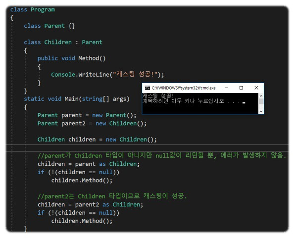

# Visual Studio
## 단축키
- 소문자 변환 : Ctrl + U
- 대문자 변환 : Ctrl + Shift + U
- 주석 : Ctrl + K + C
- 주석 해제 : Ctrl + K + U 

- 폴딩 사용 안함 : Ctrl + M + P
- 폴딩 펴기 : Ctrl + M + L

트 편집기>C#>일반> 자동랯핑

# Window
## 단축키 
- Window + C : Copilot 실행


# WPF
## 기타 단축 라이브러리 파일 위치
```
C:\Users\EZCARE\Documents\Visual Studio 2019\Templates
```


## 테스트 파일 만들기
```
- 이재강 책임
여담) 레퍼런스를 보고 읽기 전용도 항상 풀어줘야 함
여담) Main을 시작프로그램 설정 하고 난 뒤에 시작

여담) tns도 최신파일 가져오기 말고, 우클릭 -> 소스제어 -> 특정버전 가져오기

여담) 만약에 새로 만든 파일을 실행하고 싶다면, debug에서 임의이 카테고리를 추가해서 실행
```

- DebugMain.xaml에서 카테고리 만들어서 백도어


## 리스트
[](https://nomadcoder.tistory.com/entry/WPF-%EC%B4%88%EA%B0%84%EB%8B%A8-INotifyPropertyChanged-%EA%B5%AC%ED%98%84%ED%95%98%EA%B8%B0)


DB에서 out일 때, 많은 값을 받아와야 하니까 리스트로 받아도 되는데, In이라면, 굳이 안해도 됨

- 김태훈 책임 TIP : 받아 올 때, 표로 출력해야 하니 OUT이 LIST 형식으로 받아 올 수 있지만, **IN이 굳이 LIST일 필요는 없다**. 


## as 연산자
객체를 캐스팅 할 때 사용되는 연산자이다. 
- as연산자는 캐스팅에 성공하면 캐스트 결과를 리턴하고 캐스팅에 실패하면 null값을 리턴한다. 
- 클래스간 타입변환을 명시적으로 할 때, 컴파일에서 에러가 발생하지 않지만 프로그램을 실행하면 'InvalidCastException'이 발생하는 경우가 있다.

이러한 경우 as연산자를 사용하여 캐스팅한다면 프로그램 실행을 거치지 않고도 캐스팅이 성공유무를 확인할 수 있다.

[](https://dybz.tistory.com/94)

단, as연산자는 reference type간의 캐스팅에만 가능하다. (value type은 불가)


## xaml 표 만들기
인수가 보내준 경로 참고했음
```
HIS.PA.AI.IM.IR.UI.UncollectedInAmtDirectorInsSalaryMng.xaml
```


## xaml에서 'x:Name'와 'Name' 차이는?
- 네임스페이스 : 

    x:Name은 XAML 네임스페이스(xmlns:x="http://schemas.microsoft.com/winfx/2006/xaml")의 일부로, <strong style="color:red">XAML 문서 내에서 요소에 고유한 이름을 지정</strong>합니다. 반면 Name은 일반적인 속성으로 UI 요소에 이름을 부여합니다.

- 사용 범위 : 
    
    x:Name은 모든 XAML 요소에서 사용될 수 있으며, <strong style="color:red">코드 비하인드에서 요소를 참조하는 데 주로 사용</strong>됩니다. Name은 특정 컨트롤 및 시나리오(예: 스타일 및 데이터 바인딩)에서 주로 사용됩니다.

- 플랫폼 호환성 :  

    x:Name은 WPF, UWP 등 다양한 XAML 기반 플랫폼에서 사용할 수 있지만, Name은 WPF에 주로 사용됩니다.

- 결론

    일반적으로 <strong style="color:red">XAML에서 요소에 이름을 지정하고 코드 비하인드에서 참조하려는 경우 x:Name을 사용하는 것이 더 일반적</strong>이며 호환성이 높습니다. 그러나 특정 컨트롤에서 스타일이나 데이터 바인딩을 위한 식별자가 필요한 경우 Name을 사용할 수 있습니다.


## xaml 설정

디자이너, 실시간 반응형 화면 보이게 하려면, 설정에서 xaml를 검색한 후 설정해주면 된다.


## 이전 소스코드와 비교
기록보기 -> Ctrl + 마우스 -> 마우스 우클릭 -> 비교 


## 네임스페이스에 없습니다 에러

```
<UserControl.DataContext>
    <local:HipassMobileApprovalMngData />
</UserControl.DataContext>
```