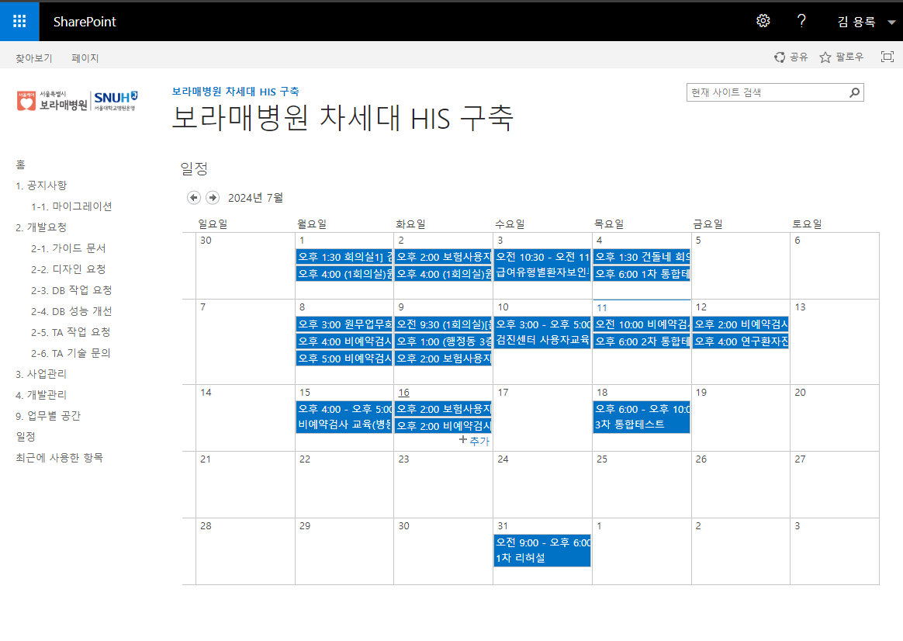
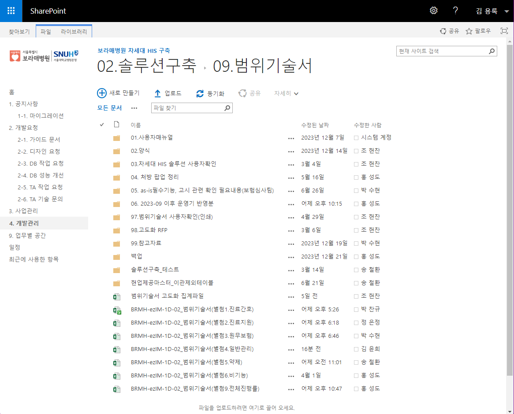
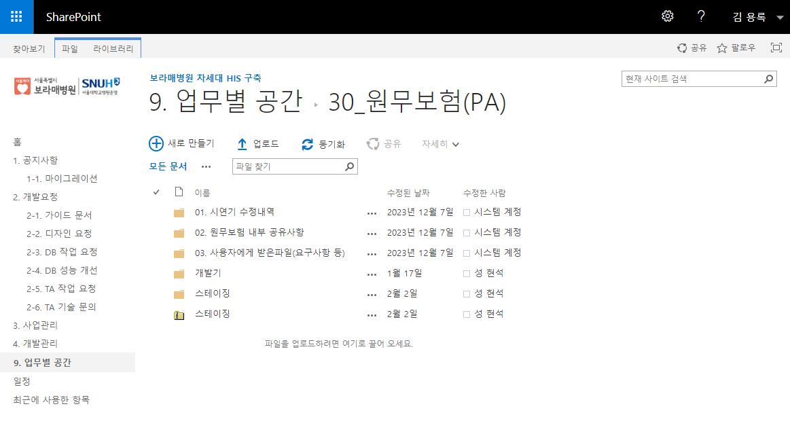
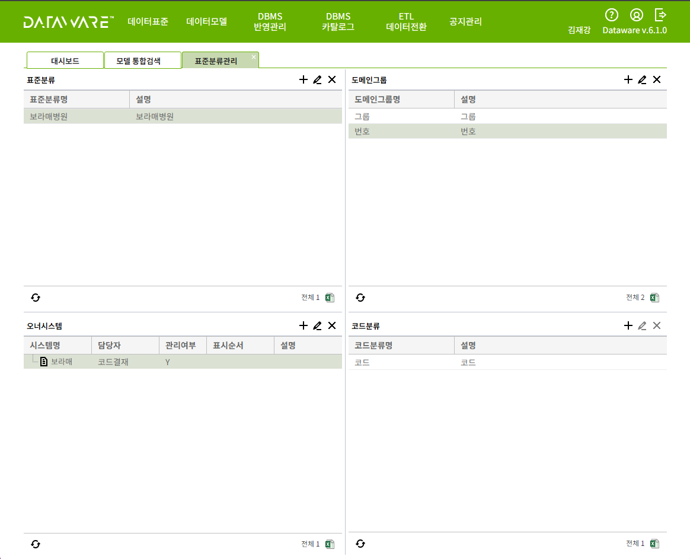
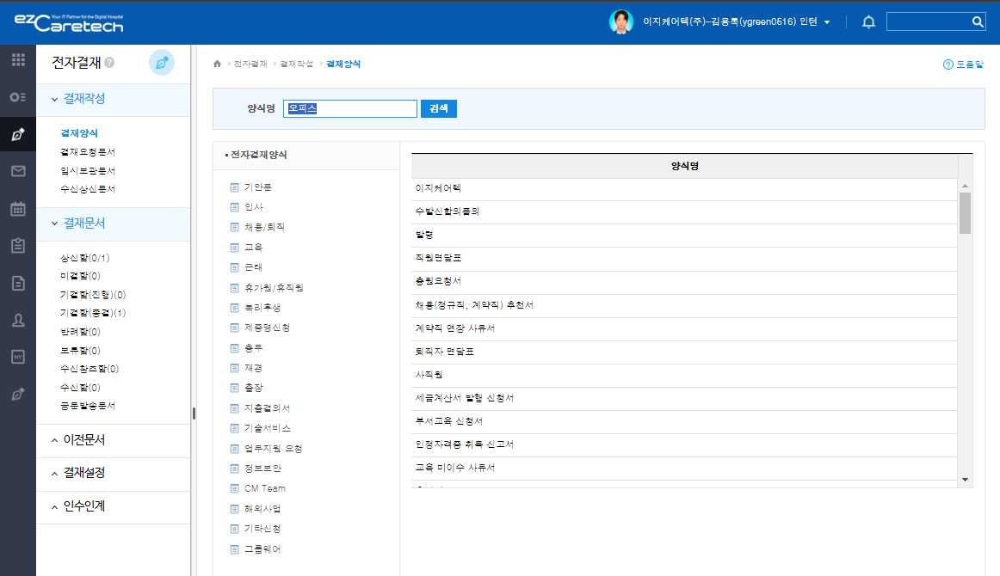
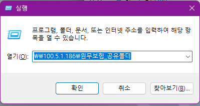

# 인수인계
## 네트워크 연결
```
제어판 -> 네트워크 및 인터넷 -> 네트워크 연결 -> 속성 눌러서 아래 내용 기입 -> 설정 클릭
```
- 고정 IP : 100.5.1.103(용록)
- 서브넷마스크 : 255.255.252.0
- 게이트웨이 : 100.5.1.1
- dns1 : 100.100.103.31
- dns2 : 100.100.103.32


## 기타 참고파일
[보라매병원 식단](https://www.brmh.org/board_manage/list.do?site=001&user_code=003006000)

### 김태훈 책임님
- [쉐어포인트](http://bcdevsp.brmh.org/default.aspx)
  - ID : bestcare \ (본인이름 영어) 
    - bestcare\kimyongrok
  - PW : 1234qwer!
  
  


- [09.범위기술서](http://bcdevsp.brmh.org/_layouts/15/start.aspx#/4/Forms/AllItems.aspx?RootFolder=%2F4%2F02%2E%EC%86%94%EB%A3%A8%EC%85%98%EA%B5%AC%EC%B6%95%2F09%2E%EB%B2%94%EC%9C%84%EA%B8%B0%EC%88%A0%EC%84%9C&FolderCTID=0x0120009D3AE4E89BA5DB46A18E66BD0F4715B6&View=%7BF17EA07C%2DAF20%2D4C9F%2D99A5%2DEEC33A0A9F7B%7D)
  


- [업무별 공간(원무보험)](http://bcdevsp.brmh.org/_layouts/15/start.aspx#/9/Forms/AllItems.aspx?RootFolder=%2F9%2F30%5F%EC%9B%90%EB%AC%B4%EB%B3%B4%ED%97%98%28PA%29&FolderCTID=0x0120004AE2AF6AAE47A943844845D479150052&View=%7B30EA659C%2D2187%2D4095%2D8B8E%2D0DC06857E3CE%7D)
  


### 이재강 책임님
- [데이터 조회](http://10.102.122.140:8080/login.action)
  - ID : ez_kimjaegang
  - PASS : Ezcare12#
  
  


## 컴퓨터 세팅

- [개발표준정의서](pdf/BRMH_ezIM_1D_91_개발표준정의서별첨1_개발환경구성가이드_231212.pdf)에 따라 차례대로 따라하면 된다.

### TNS & GAC 설정
#### DLL
- DLL 파일 생성
  ```
  cd "C:\app\client\EZCARE\product\19.0.0\client_32\odp.net\bin\4"
  
  OraProvCfg.exe /action:gac/providerpath:Oracle.DataAccess.dll

  ```

- 위에서 실패했다면
  ```
  OraProvCfg.exe /action:gac /providerpath:C:\app\client\EZCARE\product\19.0.0\client_32\odp.net\bin\4\Oracle.DataAccess.dll
  ```


- DLL 파일 확인(둘 중 하나)
  ```
  C:\Windows\Microsoft.NET\assembly\GAC_32\Oracle.DataAccess\v4.0_4.122.19.1__89b483f429c47342

  C:\Windows\Microsoft.NET\assembly\GAC_32\Oracle.DataAccess\v4.0_4.112.3.0__89b483f429c47342
  ```
  이 안에 HSF나 HIS로 시작하는 디렉토리 여러개 생성됐으면 됨


- 환경변수 설정(안해도 될 거 같기도)
  ```
  ORACLE_HOME
  C:\app\client\EZCARE\product\19.0.0\client_32
  ```

#### ORA
ORA 파일 위치
```
\\bcdevfile.brmh.org\Teamshare\01.Software\01.Oracle\Oracle19cX86
```
ORA를 복사해서 옮겨야 DB서버에 연결이 됨


- tns 파일 경로
  ```
  cd "C:\app\client\EZCARE\product\19.0.0\client_32\network\admin"
  ```
  여기 안에 .ora 파일이 있어야 함

- tns 확인
  ```
  tnsping bcdev
  ```

- 제공된 ORA 파일에 운영기가 없음(내가 하나 추가해뒀음)


### 오피스 설치(김태훈 책임님)
- 그룹웨어에서 전자결제로 전송

  

#### 메일 도착(3일 정도 걸렸음, 240711)
- 사용자 이름 : ygreen0516@ezcaretech.com

- 임시 암호 : Q/407844978118av
 


### EQS(HISSolistions/HIS/Tools)
- EQS 설정 시, EQS가 있는 위치(TFS 매핑 위치/HIS/Tools/...)에서 'EQS.exe.Config' 파일의 sever3를 주석처리 해야한다.

#### EQS 활용
- 특정 화면의 쿼리 조회
- Spring으로 치면 DB서버로 쿼리문을 날리기 위한 xml 파일 느낌

  ```
  Spring 기준으로 보면
    Web Server
      View -> Controller -> (Service) -> Model

    WAS

    DB Server
  ```

  ```
  WPF는
    Aplication
      View(UI,xaml,cs) -> VM(BIZ) -> Model(DATA 정의, DCT 호출, EQS 쿼리) 

    WAS

    DB Server
  ```


#### 에러 발생
GAC 단계를 제대로 끝내야 EQS가 붙는다.

EQS 로그인 정보
- 로그인 ID : AD 계정 ID -> kimyongrok
- 패스워드 : 1

#### GAC 등록 확인
```
cd "D:\HISSolutions\HIS\Tools"

develop_update.bat
```

#### 로그인 중 오류 발생
```
하나 이상의 오류가 발생했습니다.
파일이나 어셈블리 'Oracle.DataAccess, Version=4.122.19.1, Culture=neutral, PublicKeyToken=89b483f429c47342' 또는 여기에 종속되어 있는 파일이나 어셈블리 중 하나를 로드할 수 없습니다. 지정된 파일을 찾을 수 없습니다.
```
해결 방법은 GAC 경로 확인해봐야 한다.

#### 해결 방안 2(보안에 걸리니 X)
무적권한 줘버리기
```
chmod -R 777 HISSolutions/
```
- 원인: 
  
  WMI 공급자가 WMI 네임스페이스에 등록되었고, LocalSystem 계정을 사용하도록 설정되었습니다. 이 계정은 높은 권한을 가지고 있으며, 공급자 코드가 올바르게 구현되지 않은 경우 권한 상승 공격의 위험이 있습니다.
- 해결 방법: 

  공급자가 LocalSystem 보안 컨텍스트가 아닌 다른 보안 컨텍스트(예: NetworkServiceHost)를 사용하도록 설정된 버전을 공급자로부터 얻는 것이 좋습니다. 이는 대부분의 WMI 공급자가 클라이언트의 보안 컨텍스트를 가장하여 요청된 작업을 수행해야 하기 때문에 필요합니다.

- 검증: 

  시스템 관리자에게 이 경고 메시지를 통해 권한 상승 공격의 가능성을 알리기 위한 것입니다. 이 문제를 해결하려면 공급자 코드의 품질과 테스트에 대한 적절한 검토가 필요합니다.


이 문제가 발생한 이유는 Linux 시스템에서 chmod -R 777 명령을 사용하여 디렉토리와 하위 파일들에 대한 권한을 모두 열어준 후, Windows 환경에서 보안 문제를 유발했기 때문입니다. chmod -R 777 명령은 모든 사용자에게 읽기, 쓰기, 실행 권한을 부여하여 보안 위험을 초래할 수 있습니다.


#### 마지막 확인(로그인 이벤트 필터링)
Security 로그를 선택한 상태에서 오른쪽 패널에서 Filter Current Log(현재 로그 필터링)를 클릭합니다.

  Event ID 필드에 다음 이벤트 ID를 입력합니다:
  - 4624: 성공적인 로그온 이벤트
  - 4625: 실패한 로그온 이벤트
  - 4647: 사용자가 로그오프한 이벤트
  - 4672: 특권 사용과 관련된 로그온 이벤트


### DH
테이블이나 컬럼 정보, 쿼리에 대한 정보를 상세 확인할 수 있다.


### 골든(SQL)
- ID : xbil
- PASS : ez123

SQL Developer가 아닌 Golden 이라는 소프트웨어를 사용하여 조회

### 골든 키
Golden.6 : TEAM LZ0!-145066
PLEdit.6 : TEAM LZ0!-15337
EZCARETECHKOREA22982


## 공유폴더 연결
### 접속 안될 시
-[공유폴더 해결방안 url](https://mypcinfo.tistory.com/6) 참고
```
윈도우키(Alt,Ctrl사이) + R 를 눌러서 gpedit.msc 라고 치고 엔터친다.

로컬 컴퓨터 정책 -> 컴퓨터 구성 -> 관리 템플릿 -> 네트워크 -> Lanman 워크스테이션의 보안되지 않은 게스트 로그온 사용을 사용함으로 변경하면 해당 공유폴더에 접근 가능하다. 
```

### 공유폴더 접속
- 공유폴더 위치
  ```
  \\100.5.1.186\원무보험_공유폴더
  ```
- ID/PW: (본인이름 영어)  / 1234qwer!

  

## EAM
### EAM 로그인 정보
- 로그인 ID : HISXX (xx는 파트)
  - HISPA
- 패스워드 : 11111

### EAM 활용
- EAM에서 메뉴 관리에는 한 화면의 참조나 상세 경로 정보가 한글로 들어있어, Drill Down으로 분석할 때 좋다.

<br/>

<br/>

<br/>

<br/>

<br/>

# 개발
## Brstcate 스테이징 접속?
```
로컬 -> 개발기(개발서버, TFS) -> 스테이징(검증서버) -> 운영기(운영서버)
```

- ID : C0ADM
- PASS : brmh1

[스테이징 정리](240709_스테이징.md)


## 시작 프로그램 설정
```
C:\Users\EZCARE\AppData\Roaming\Microsoft\Windows\Start Menu\Programs\Startup
```